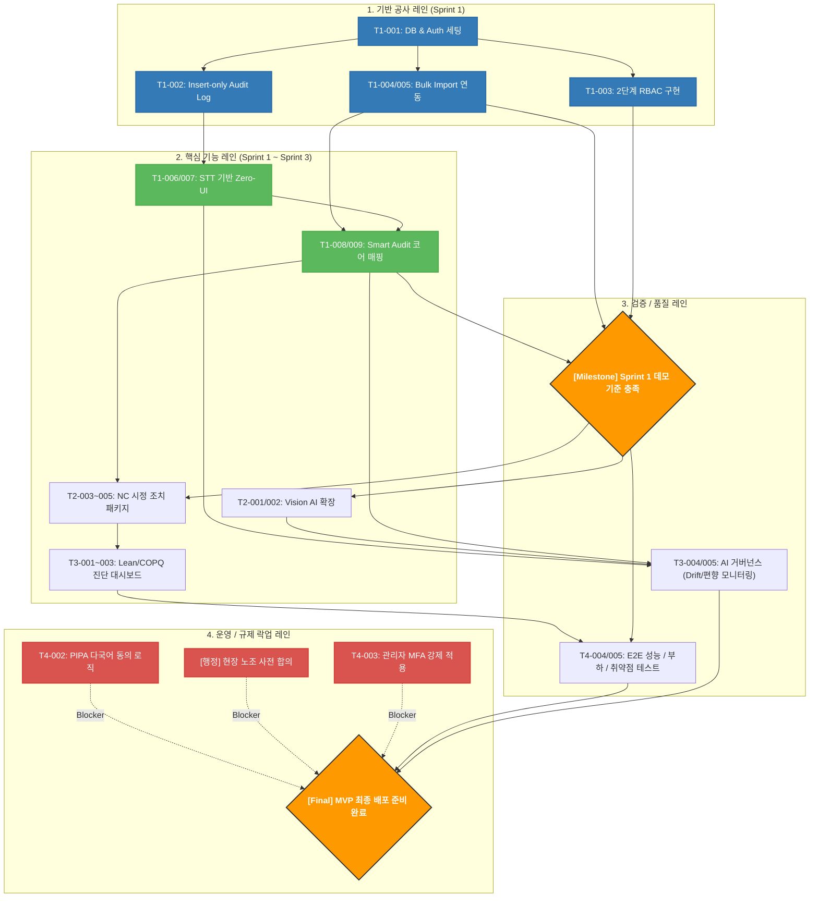

# 작업 의존관계 다이어그램 (TASK DEPENDENCY DIAGRAM) v1.0

## 1. 문서 목적
본 문서는 `01_TASK_LIST_v1.md`에 정의된 개발 작업 간의 선후행 관계와 병렬 개발 구조를 시각화한 의존관계 문서이다. 
이 문서의 주된 목적은 프로젝트의 병목(Bottleneck) 구간인 Critical Path를 명확히 식별하고, FE/BE/AI 팀 간의 병렬 작업 가능성을 극대화하며, MVP 배포를 가로막는 규제 및 운영 락업 조건을 명시하는 것이다. 이 문서는 향후 진행될 기능, API, 데이터, UI 명세서 등 세부 문서 작성의 논리적 순서를 결정하는 기준이 된다.

---

## 2. 의존관계 작성 원칙

### 표 1. 의존관계 작성 원칙
| 원칙 | 설명 | 적용 이유 |
| :--- | :--- | :--- |
| **기반 선행주의** | 시스템 인프라(DB, Auth) 및 공통 정책(RBAC, Audit Log)이 최우선 선행 노드로 위치한다. | 데이터 무결성과 접근 권한이 확보되지 않은 상태에서 기능 개발 시 전면 재작업이 발생하기 때문. |
| **Critical Path 분리** | "Sprint 1 데모 기준"을 달성하기 위한 필수 경로를 다른 후속 작업과 엄격히 분리하여 묘사한다. | 한정된 리소스 내에서 프로젝트의 생사결단이 걸린 초기 코어를 방어하기 위함. |
| **락업 조건 분리** | 기능 개발 완료와 무관하게 시스템 오픈을 차단하는 요소(PIPA, MFA, 노조합의 등)를 별도 레인으로 분리하여 거대한 관문(Gate)으로 표기한다. | 개발이 끝나도 법적/규제적 이유로 배포가 중단되는 치명적 리스크를 예방하기 위함. |

---

## 3. 전체 의존관계 요약
본 프로젝트의 의존관계는 크게 4개의 레인(Lanes)으로 구성된다.
1. **기반 공사 레인**: DB/Auth 설정부터 데이터를 받기 위한 최소 조건(Audit Log, Bulk Import, RBAC) 완성까지의 흐름.
2. **핵심 기능 레인**: Zero-UI(음성/비전) 수집부터 Smart Audit, NC 시정, Lean 진단으로 이어지는 비즈니스 로직 확장 흐름.
3. **검증/품질 레인**: Sprint 1 데모 달성 검증 후, E2E/부하 테스트 및 AI 모델에 대한 편향/Drift 거버넌스 검증 흐름.
4. **운영/규제 레인**: 코딩과는 별개로 움직이지만 시스템 릴리즈 시점에 모든 기능을 막아설 수 있는 법률 및 보안 통제 흐름.

---

## 4. Sprint별 의존관계 전략

### 표 2. Sprint별 의존관계 전략
| Sprint | 핵심 목표 | 선행 필수 작업 | 병렬 가능 작업 | 막히면 전체가 지연되는 작업 |
| :--- | :--- | :--- | :--- | :--- |
| **Sprint 1** | 기반 및 코어 E2E 시연 | DB/Auth 세팅, Supabase 프로비저닝 | FE 기반 UI 레이아웃, AI STT 프롬프트 작성 | DB/Auth 초기 설계 (이후 모든 작업의 블로커) |
| **Sprint 2** | NC 시정 및 Vision AI 연동 | Smart Audit 매핑 성공, STT 파이프라인 안정화 | Vision AI 프롬프트 ↔ NC 시정 트래킹 UI | Smart Audit 출력 결과의 데이터 구조(Schema) |
| **Sprint 3** | Lean/COPQ 진단 및 AI 거버넌스 | NC/Audit 누적 데이터(최소 7일) 수집 상태 | AI Model Card 검증 ↔ COPQ 대시보드 UI | 4대 낭비 환산 산식(DB/API)의 확정 |
| **Sprint 4** | 안정화 및 배포 락업 해제 | 앞선 모든 기능의 프리즈(Feature Freeze) | PIPA 동의 폼 개발 ↔ E2E 성능 부하 테스트 | 현장 노조 합의 및 보안 취약점 해소 |

---

## 5. 핵심 Critical Path

### 표 3. Critical Path
| 순서 | 작업 | 선행조건 | 왜 Critical인가 | 지연 시 영향 |
| :---: | :--- | :--- | :--- | :--- |
| **1** | DB / Auth 인프라 세팅 | 없음 | 데이터 저장소와 유저 식별자 미비 시 앱 구동 불가 | 전 직군(FE/BE/AI) 개발 중단 |
| **2** | Insert-only Audit Log | DB / Auth | 데이터 발생 전 무결성 로깅 정책이 세팅되어야 함 | 규제 미달성으로 인해 테스트 데이터 전면 무효화 |
| **3** | Bulk Import 기능 | Audit Log | 기초 제품/공정 데이터가 없으면 AI 매핑 테스트 불가 | STT 및 Audit 기능 테스트 데이터 기아 상태 발생 |
| **4** | STT Zero-UI + Smart Audit | Bulk Import | 프로젝트의 북극성 지표(10분 내 리포트 산출) 달성의 코어 | Sprint 1 데모 시연 불가 |
| **5** | Sprint 1 데모 | 위 4가지 | 이후 확장 기능(NC, Lean)의 구조적 베이스라인 역할 | Sprint 2, 3 로드맵 전면 중단 |

---

## 6. 병렬 가능 작업군

### 표 4. 병렬 가능 작업군
| 작업군 | 병렬 가능한 이유 | 충돌 가능성 | 담당 역할 |
| :--- | :--- | :--- | :--- |
| **[DB 설계] ↔ [UI 레이아웃]** | 데이터 인터페이스(JSON 스키마)만 약속하면 FE는 Mock 데이터로 화면 컴포넌트 조립 가능. | 필드 명명 규칙(Snake vs Camel case) 불일치 | BE, FE |
| **[AI STT 프롬프트] ↔ [모바일 UI]** | AI 로직은 Vercel AI SDK 단독 테스트로 진행 가능하며, UI는 마이크 권한 연동만 별도로 수행 가능. | AI API 응답 시간 지연 대비 UI의 로딩/스트리밍 상태 처리 누락 | AI, FE |
| **[PIPA 동의 UI] ↔ [모니터링 세팅]** | 법률 화면 개발은 기능 개발과 독립적이며, Ops의 Vercel Analytics/Datadog 연동과 겹치지 않음. | 없음 | FE, Ops |

---

## 7. 리스크가 큰 선후행 관계

### 표 5. 리스크가 큰 선후행 관계
| 작업 | 리스크 | 영향도 | 예방 방안 |
| :--- | :--- | :--- | :--- |
| **Smart Audit → Vercel Timeout** | 대형 PDF 변환/매핑 시 서버리스 타임아웃(60초)에 막혀 노드 진행이 끊김 | 높음 | AI SDK Edge Streaming을 통한 연결 유지 및 클라이언트 렌더링(html2pdf) 위임 |
| **기능 개발 완료 → 노조 합의** | 앱이 완벽해도 합의 지연 시 배포 관문을 통과할 수 없음 | 매우 높음 | 개발과 별개 트랙으로 DPO 및 경영진이 프로젝트 착수와 동시에 합의 진행 |
| **STT Zero-UI → Vision AI** | 멀티모달 프롬프트 하나에 너무 많은 의존성을 두면 둘 다 품질 저하 발생 | 중간 | STT 파이프라인을 완전히 안정화한 후, 별개의 프롬프트 분기나 별도 모델로 Vision 연동 시작 |

---

## 8. Mermaid 의존관계 다이어그램

아래 다이어그램은 프로젝트의 선후행 흐름과 락업 조건을 4개의 레인으로 분류하여 시각화한 것이다.

---

## 9. 후속 문서 작성 우선순위

다이어그램의 선후행 관계에 입각하여 가장 먼저 작성되어야 할 상세 스펙 문서군의 순서는 다음과 같다.

### 표 6. 후속 문서 작성 우선순위
| 우선순위 | 후속 문서 | 선행 이유 | 관련 다이어그램 노드 |
| :---: | :--- | :--- | :--- |
| **1** | `DATA-DB_SCHEMA_v1.md` | DB_AUTH, AUDIT_LOG 등 모든 기반 인프라 노드의 실체화 문서임. | DB_AUTH, AUDIT_LOG |
| **2** | `API-BULK_IMPORT_v1.md` | 데이터가 적재되어야 Audit 매핑 테스트가 가능하므로 DB 설계 직후 가장 먼저 API화 필요 | BULK_IMPORT |
| **3** | `API-AI_PIPELINE_v1.md` | STT와 Smart Audit을 관통하는 Gemini 프롬프트 및 I/O 스키마 정의 | STT_ZERO, SMART_AUDIT |
| **4** | `UI-COMPONENTS_v1.md` | API와 분리되어 병렬 개발될 화면 요소(shadcn/ui 기반) 정의 | RBAC, PIPA, STT_ZERO |
| **5** | `NFR-SECURITY_v1.md` | 배포 전 관문 역할을 하는 락업 조건들의 상세 정책 정의 | PIPA, MFA, TEST_QA |

---

## 10. 다음 단계 실행 가이드

본 의존관계 다이어그램 작성이 완료됨에 따라 리드 엔지니어 및 실무자는 즉각 다음 액션을 수행해야 한다.

### 1. 다이어그램 기준 세부 문서화 대상 Top 10
1. `DATA-DB_SCHEMA_v1.md` (Supabase 스키마, RLS, Audit Log 제약)
2. `API-BULK_IMPORT_v1.md` (기준정보 CSV 템플릿 검증 로직)
3. `API-AI_PIPELINE_v1.md` (STT 및 ISO 매핑 멀티모달 프롬프트)
4. `COM-RBAC_v1.md` (2단계 권한 매트릭스 및 라우트 보호기)
5. `UI-ZERO_INTERFACE_v1.md` (음성 및 카메라 캡처 모바일 UI)
6. `F1-SMART_AUDIT_v1.md` (리포트 생성 비즈니스 로직 및 html2pdf)
7. `F2-NC_ACTION_v1.md` (시정 조치 파싱 로직 및 트래킹 보드)
8. `F4-LEAN_COPQ_v1.md` (4대 낭비 산식 쿼리 및 차트 UI)
9. `NFR-COMPLIANCE_v1.md` (PIPA 동의 폼 및 MFA 강제 로직)
10. `TEST-S1_DEMO_v1.md` (Sprint 1 시연용 E2E 검증 시나리오)

### 2. 세부 문서 분해(WBS) 시 작성 우선순위 전략
- **DATA -> API -> UI 순서 엄수**: 데이터가 없으면 API를 못 짜고, API I/O 스키마가 없으면 UI 상태 관리가 불가능하다.
- **기반(COM/ADM) 문서 병행**: 기능 개발과 별개로 PIPA 동의 및 MFA는 공통 모듈(COM)로 초기에 병행 설계할 것.

### 3. Opus 4.6 (또는 아키텍트) 추가 검토 권장 포인트 3가지
- **Supabase RLS vs Prisma Extension 충돌성 검토**: Insert-only 보장을 위한 RLS 정책과 Prisma ORM 간의 권한(Service Role vs User JWT) 처리 방안
- **Vercel AI SDK Edge Streaming 상태 관리 전략**: 장시간 대기 시 React UI 측에서의 타임아웃/에러 경계(Error Boundary) 및 Fallback UI 처리 방식
- **Gemini Free Tier Rate Limit(RPM/RPD) 우회 또는 버퍼링 전략**: Bulk API나 동시 다발적 현장 요청 시 Rate Limit HTTP 429 에러 방어(지수 백오프 적용) 구조 확인
