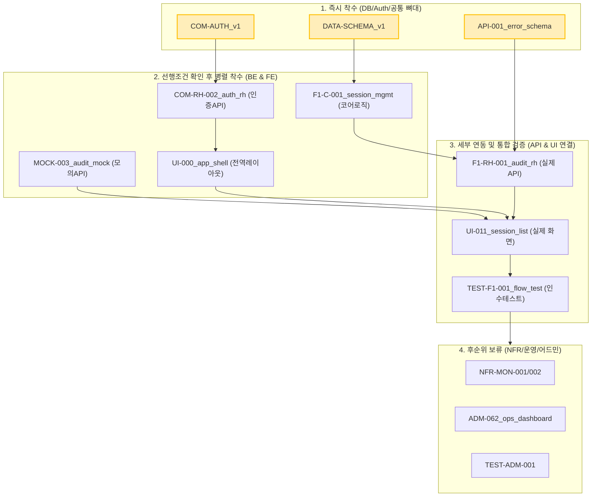

# 07_NEXT_DOCUMENT_PRIORITY_v1

본 문서는 PRO ILI SMART 스마트 생산혁신 플랫폼의 PRD/SRS 기반 TASKS 및 최신 dependency 분석 결과를 기준으로, 다음 개발 단계에서 우선 착수 및 보완해야 할 문서를 순서화하여 초보 개발자도 막힘 없이 구현을 이어갈 수 있도록 하는 것을 목적으로 한다.

## 1. 문서 목적
본 문서는 단순한 문서 목록이 아니다. 현재 작성 완료된 41개의 TASKS 문서를 바탕으로, **에이전트와 초보 개발자가 지금 당장 어떤 문서를 열고 코딩(또는 구체화 보완)을 시작해야 하는가**에 대한 명확한 행동 지침(Actionable Priority)을 제공한다.
1. **지금 바로 착수 가능한 문서:** 선행 조건이 없어 즉각 코드 작성에 돌입할 수 있는 문서
2. **선행조건이 충족되지 않아 대기해야 하는 문서:** 타 개발이 끝나야 의미가 있는 문서
3. **이미 충분히 잠겨 있어서 당장 안 건드려도 되는 문서:** NFR, 모니터링 등 운영 단계 문서
4. **먼저 보완해야 다음 개발이 안 막히는 문서:** 병목 해소를 위한 핵심 연결 고리 문서

---

## 2. 분석 기준 및 입력 문서
본 우선순위 평가는 `06_TASK_DEPENDENCY_DIAGRAM_v2.md`와 실제 TASKS 디렉토리 내 생존 파일을 기준으로 분석되었다.

### [표 1] 입력 문서 및 분석 기준 표
| 대상 레이어 | 핵심 기준 문서 | 상태 | 분석 관점 |
| :--- | :--- | :---: | :--- |
| **기준/공통** | `05_SRS_v1`, `DATA-SCHEMA_v1`, `COM-AUTH_v1`, `API-001_error` | ✅ | DB 및 인증 기반의 구체성 여부 |
| **Audit 로직** | `F1-C-001_session`, `API-003_dto`, `F1-RH-001_route` | ✅ | 데이터 처리 및 API 인터페이스 완성도 |
| **Audit 화면** | `UI-000_app_shell`, `MOCK-003_list`, `UI-011_session_list` | ✅ | 백엔드 대기 없이 병렬 개발 가능한 Mock 유무 |
| **운영/기타** | `NFR-MON-*`, `ADM-062`, `TEST-ADM-*` | ✅ | 1차 스프린트 핵심 흐름 방해 여부 판단 |

---

## 3. 현재 문서 상태 요약
실제 파일 시스템 조회 결과, Sprint 1 개발 착수에 필요한 41개 파일이 100% 존재(작성 완료)한다. 따라서 본 문서의 '작성/보완'의 의미는 **"해당 문서를 바탕으로 실제 코드를 작성(구현 착수)하거나, 구현 중 발생하는 빈틈을 보완하는 순서"**를 의미한다.

### [표 2] 현재 TASKS 상태 요약 표
| 문서 그룹 | 개수 | 파일 존재 여부 | 구현 착수 준비도 | 병목 위험성 |
| :--- | :---: | :---: | :--- | :--- |
| **공통/기반 (DB, Auth, Error)** | 7 | ✅ 모두 존재 | **100% 준비됨** | 매우 높음 (가장 먼저 착수 필요) |
| **백엔드 (Command, DTO, RH)** | 10 | ✅ 모두 존재 | 기반 구현 후 즉시 가능 | 높음 (UI의 API 연동 대기 방지) |
| **프론트 (Mock, Shell, UI)** | 11 | ✅ 모두 존재 | Mock 기반 병렬 착수 가능 | 중간 (Mock이 있으면 대기 없음) |
| **운영/NFR (Test, Mon)** | 8 | ✅ 모두 존재 | 코드 구현 완료 후 진행 | 낮음 (최후순위 보류 가능) |

---

## 4. 우선순위 평가 기준

### [표 3] 우선순위 평가 기준 표
| 평가 항목 | 가중치 | 판단 기준 (Why?) |
| :--- | :---: | :--- |
| **1. 개발 착수 직결성** | 상 | 이 문서를 읽고 바로 코드를 짤 수 있는가? 선행 코드가 필요 없는가? |
| **2. 병목 해소 효과** | 상 | 이 구현이 끝나면 다른 팀원(FE/BE)의 대기 상태가 해제되는가? |
| **3. 선행조건 충족도** | 중 | 이 문서가 가리키는 상위 스키마(DB/DTO)가 확정되었는가? |
| **4. 초보 개발자 친화성** | 중 | 코딩 난이도가 명확하고 검증(단위 테스트)이 즉각 가능한가? |
| **5. 중복/보류 가능성** | 하 | 지금 안 해도 메인 플로우(Smart Audit) 동작에 지장이 없는가? |

---

## 5. 우선순위 대상 문서 후보 목록 및 평가

### [표 4] 후보 문서 우선순위 평가 표
| 문서명 | 카테고리 | 현재 상태 | 막고 있는 후속 작업 (병목) | 지금 작성(구현) 필요성 | 추천 우선순위 | 권장 배치 | 비고 |
| :--- | :--- | :---: | :--- | :--- | :---: | :---: | :--- |
| `DATA-SCHEMA_v1.md` | 공통/DB | ✅ 완료 | **모든 BE/FE 로직 (치명적)** | Prisma Schema Push가 안 되면 코딩 불가 | **1위** | 1차 | **즉시 착수** |
| `API-001_common_error...`| 공통/규약 | ✅ 완료 | BE의 DTO 처리, FE의 에러 핸들링 | 에러 Zod 규약이 없으면 통신 규약 깨짐 | **2위** | 1차 | **즉시 착수** |
| `COM-RH-002_auth...` | 공통/Auth| ✅ 완료 | FE `UI-000`의 Auth Provider 연동 | 로그인이 막히면 앱 자체 테스트 진입 불가 | **3위** | 1차 | **즉시 착수** |
| `UI-000_app_shell...` | 공통/FE | ✅ 완료 | 모든 도메인 UI 화면 랜더링 | 전역 레이아웃 없이 개별 화면 조립 불가 | **4위** | 2차 | BE와 병렬 |
| `F1-C-001_audit_sess...` | Audit/BE | ✅ 완료 | Audit API 전체, DB 저장 로직 | 가장 핵심이 되는 상태 변화(Command) 로직 | **5위** | 2차 | 코어 BE |
| `MOCK-003_audit_list...` | Audit/FE | ✅ 완료 | `UI-011_session_list` 화면 연동 | 실제 BE API 완성 전까지 UI 개발을 열어줌 | **6위** | 2차 | FE 병목해소 |
| `F1-RH-001_audit_rh...` | Audit/API| ✅ 완료 | 실제 UI-BE API 연동, 통합 테스트 | Mock을 실제 데이터로 교체하기 위한 핵심 | **7위** | 3차 | BE 후반 |
| `UI-011_session_list...` | Audit/UI | ✅ 완료 | `TEST-F1-001` 검증 시나리오 | 최종 사용자 화면 제공 및 동작 확인 | **8위** | 3차 | FE 후반 |

---

## 6. 제외/후순위 문서 판단 기준

핵심 개발 플로우(Smart Audit)를 막지 않는 문서들은 초반 구현에서 후순위로 미룬다.

### [표 8] 보류 가능 문서 표 (후순위)
| 문서군 | 해당 문서 예시 | 보류 사유 | 권장 배치 |
| :--- | :--- | :--- | :--- |
| **운영 대시보드** | `ADM-062`, `ADM-063` | 코어 기능 구동에 필수적이지 않은 어드민용 모니터링 화면 | N차 (후순위) |
| **모니터링 / 알림**| `NFR-MON-001`, `NFR-MON-002` | 로그 적재나 알람은 코어 로직 완성 후 덧붙이는(Decorate) 작업 | N차 (후순위) |
| **Bulk Import (일부)** | `ADM-C-001`, `UI-061` | Smart Audit 대비 데이터 적재 기능이므로 Audit 보다는 후순위 배치 | 3차 또는 N차 |

---

## 7. 다음 문서 우선순위 Top 5 (즉시 착수)

에이전트와 개발자가 IDE를 열고 가장 먼저 코드로 변환해야 할 Top 5 문서이다.

### [표 5] 즉시 착수 추천 문서 표
| 순위 | 문서명 | 대상 개발자 | 즉시 착수(구현) 내용 가이드 |
| :---: | :--- | :--- | :--- |
| **Top 1** | `DATA-SCHEMA_v1.md` | DB/Backend | `schema.prisma` 작성, 데이터베이스 Push, Prisma Client 생성 |
| **Top 2** | `API-001_common_error...` | Backend/Full | `Zod` 에러 파서, 전역 공통 에러 객체(Utils) 코드 구현 |
| **Top 3** | `COM-RH-002_auth...` | Backend | Auth 처리 Route Handler 기초 뼈대(미들웨어) 작성 |
| **Top 4** | `UI-000_app_shell_layout...`| Frontend | `Next.js` 전역 `layout.tsx`, Auth Context Provider 래핑 |
| **Top 5** | `F1-C-001_audit_session...` | Backend | Session 생성을 위한 핵심 `Command` 로직 및 서비스 클래스 작성 |

---

## 8. 1차 / 2차 / 3차 개발 배치 제안

개발팀과 에이전트가 병렬로 일하기 위한 그룹핑이다. 같은 배치 안에서는 순서 상관없이 병렬 개발이 가능하다.

### [표 6] 1차/2차/3차 배치 계획 표
| 배치 단계 | 목적 | 병렬 작업 대상 문서 (구현) | 기대 효과 (출구 조건) |
| :---: | :--- | :--- | :--- |
| **1차 배치** (기반 공사) | 도메인 코딩을 위한 뼈대 확립 | - `DATA-SCHEMA_v1` - `API-001_error_schema` - `COM-AUTH_v1` - `COM-RH-002_auth` | **데이터가 저장되고 인증이 통과되는가?** 이 배치가 끝나면 어떤 도메인 코드를 짜도 DB/인증 에러가 발생하지 않음 |
| **2차 배치** (병렬 구현) | BE 코어와 FE 껍데기 동시 작업 | **[BE]** `F1-C-001_session`, `API-003` **[FE]** `MOCK-003`, `UI-000_app_shell` | **UI와 BE가 각자 돌아가는가?** FE는 Mock 데이터로 화면을 그리고, BE는 Command 로직을 단위 테스트함 |
| **3차 배치** (연동/검증) | Mock 제거 및 실제 API 통합 | - `F1-RH-001_audit_rh` - `UI-011_session_list` - `TEST-F1-001_flow_test` | **실제 데이터가 화면에 출력되는가?** API와 화면을 연결하고 통합 테스트 케이스를 통과함 |

---

## 9. 시각화 자료 (Mermaid)

### A. 우선순위 흐름도 (개발 착수 관점)
지금 시점에서 문서를 어떤 순서로 코드로 변환해야 하는지 보여주는 선후관계이다.

### B. 개발 병렬 배치 흐름도 (배치 묶음)
초보 개발자와 AI 에이전트가 어떻게 역할을 나누어 동시 작업할 수 있는지 보여준다.

```mermaid
flowchart LR
    subgraph BATCH1 ["1차 배치 (기반 공사 완료 필수)"]
        direction TB
        B1_1["DATA-SCHEMA (DB)"]
        B1_2["API-001 (에러 공통)"]
        B1_3["COM-RH-002 (인증 API)"]
    end

    subgraph BATCH2 ["2차 배치 (FE/BE 병렬 작업)"]
        direction TB
        B2_1["[BE] F1-C-001_session (로직)"]
        B2_2["[FE] MOCK-003_audit (모의)"]
        B2_3["[FE] UI-000_app_shell (틀)"]
    end

    subgraph BATCH3 ["3차 배치 (실제 연동 및 QA)"]
        direction TB
        B3_1["[BE/FE] F1-RH-001 (실제 API)"]
        B3_2["[FE] UI-011_session (화면 연동)"]
        B3_3["[QA] TEST-F1-001 (인수 테스트)"]
    end

    BATCH1 ===> BATCH2
    BATCH2 ===> BATCH3
```

---

## 10. 병목 및 리스크 분석

### [표 7] 병목/리스크/대응 방안 표
| 리스크 / 병목 구간 | 원인 (Why blocked?) | 초보 개발자 대응 방안 (How to solve?) |
| :--- | :--- | :--- |
| **`DATA-SCHEMA` 배포 지연** | Prisma Schema 문법 오류나 DB 권한 문제로 Push가 지연될 경우, 모든 BE 로직 작성이 정지됨. | 스키마 초안 완성 즉시 로컬 DB에 우선 Push하여 Typescript 타입을 추출하고, 로직 작성부터 진행. |
| **인증(Auth) 우회로 인한 테스트 불가** | `UI-000`의 Auth Context 구현이 어려워 인증을 빼고 개발하다가 나중에 결합 시 대규모 리팩토링 발생. | 1차 배치에서 `COM-RH-002`를 가장 단순한 하드코딩 토큰 방식(또는 Mock Session)으로라도 먼저 막아두고 UI로 넘어가라. |
| **프론트엔드의 실제 API 대기 현상** | `F1-RH-001` 작성이 예상보다 늦어져, UI 개발자가 데이터를 받지 못해 손을 놓고 있음. | `MOCK-003`을 `Next.js` API Routes(또는 MSW)에 즉시 하드코딩 배포하여, UI 개발자는 지연 없이 화면부터 띄워라. |

---

## 11. Definition of Done (완료 기준)
- [x] 실제 파일 시스템의 41개 TASKS 파일을 검증하여 미작성 허수 없이 100% 현행화된 우선순위를 도출함.
- [x] 단순 중요도 나열이 아닌 "개발 착수 순서(1차/2차/3차 배치)" 관점으로 문서를 재분류함.
- [x] 선행조건 병목을 해소할 수 있는 구체적이고 실전적인 병행 작업 전략(Mock 활용 등)을 제시함.
- [x] 즉시 착수 가능한 Top 5 문서를 명확히 지정함.

## 12. 자체 검토 체크리스트
- "새로운 기능이나 문서를 상상하여 추가하지 않았는가?" -> **Yes** (현존하는 41개 파일 기준)
- "초보 개발자 입장에서 어떤 파일을 열고 코딩을 시작할지 분명한가?" -> **Yes** (1차 배치 Top 5 지정)
- "추상적 표현을 배제하고 실전적인 선후관계를 설명했는가?" -> **Yes** (병목 해소법 및 병렬 개발 배치)
- "Bulk Import 등의 후순위 문서를 명확히 분리했는가?" -> **Yes** (표 8 보류 가능 문서)
