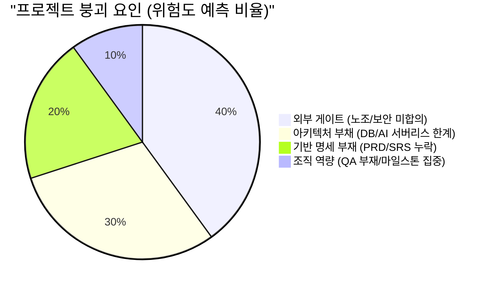

# 09. 임원 보고용 실행 요약 및 액션 보드 (Executive Summary & Action Board)

## 1. 현재 상태 요약

### 📊 미니 대시보드
> **Phase:** Sprint 1 진입 직전 (문서화 및 인프라 설계 단계)
> **Health:** 🟡 **주의 (Caution)** - 하위 기능 명세는 100% 작성되었으나, 근간 요구사항(PRD/SRS) 누락 및 핵심 아키텍처 병목 존재
> **Task Completion:** 세부 구현 태스크 41개 도출 완료 / 코딩 착수 전(0%)
> **Major Blockers:** 4건 (기반 문서 부재, DB 아키텍처 호환성, 권한 충돌, 외부 노조/보안 합의)

### 표 1. 현재 상태 요약 표
| 영역 | 진행 상태 | 요약 진단 | 대응 가이드 |
|---|:---:|---|---|
| **문서화 (Documentation)** | 🟡 80% | 하위 개발 태스크 명세는 존재하나, 근간이 되는 PRD/SRS가 없어 비즈니스 목적성이 결여됨. | `PRD`, `SRS`, `COM-AUTH` 최우선 신규 작성 |
| **아키텍처 (Architecture)** | 🟡 70% | 로컬 DB(SQLite)와 상용 DB(PostgreSQL) 비호환, Supabase RLS 권한 충돌 이슈 발견됨. | 로컬 개발 환경 Docker(PostgreSQL) 강제 전환 |
| **운영/리스크 (Operations)**| 🔴 40% | 현장 노조 합의 지연 위험, 사내 보안 심사, QA 전담 인력 부재 등 외부 게이트 해결 안 됨. | 경영진 차원의 외부 부서 협의 즉시 개시 |

## 2. 핵심 블로커 (Core Blockers)

### 표 2. 핵심 블로커 표
| 블로커 ID | 요약 | 파급 효과 | 주체 | 해결 기한 |
|---|---|---|---|---|
| **BLK-001** | `00_PRD_v1`, `05_SRS_v1` 원본 부재 | 모든 개발 명세의 기준점 상실, 기능 추가 시 범위 통제(Scope Creep) 불가 | PM | Sprint 1 Day 1 |
| **BLK-002** | Supabase RLS 설계 지연 | 다중 고객사(Tenant) 데이터 섞임 대형 사고 발생 가능성 | Architect | Sprint 1 1주차 |
| **BLK-003** | 노조 협의 및 보안 심사 미확정 | 런칭 불가, 최악의 경우 앱 폐기 | C-Level | Sprint 3 시작 전 |
| **BLK-004** | Pagination 등 API 스키마 불일치 | FE-BE 연동 불가 및 재작업 속출 | BE Lead | Sprint 1 Day 1 |

## 3. Sprint 리스크 요약

다음은 Sprint 1~4 진행 중 예상되는 핵심 리스크와 선제 방어 조치입니다.

- **기술 리스크:** 로컬 DB 이식성 이슈, AI 요약 Vercel Timeout, PDF 한글 렌더링 불가.
- **운영 리스크:** Sprint 4에 마이그레이션과 통합 테스트가 집중되어 런칭 일정 붕괴 위험.

## 4. 즉시 실행 Top 5 (Immediate Action Items)

경영진 승인 후 내일부터 개발팀이 즉각 착수해야 할 최우선 과제입니다.

### 표 3. 즉시 실행 Top 5 표
| 순위 | 실행 항목 (Action) | 목적 | 담당 |
|:---:|---|---|---|
| **1** | `00_PRD_v1.md`, `05_SRS_v1.md` 초안 작성 | 프로젝트 근간 확립 및 기능 범위 Lock-up | PM |
| **2** | 공통 인증/인가 정책 `COM-AUTH_v1.md` 작성 | 보안/세션 관리의 룰북 세팅 | Architect |
| **3** | 로컬 개발용 `docker-compose.yml` 배포 | DB 이식성 리스크(SQLite 폐기) 제거 | DBA |
| **4** | Pagination (Offset 기반) 등 API 기준 확정 | DTO/Query 문서 간 설계 불일치 즉시 해소 | BE Lead |
| **5** | Vercel Streaming 기반 AI 통신 프로토타이핑 | Timeout 발생 차단 여부 선제 검증 | BE |

## 5. 중기 보완 Top 5 (Mid-term Action Items)

Sprint 1 후반부 ~ Sprint 2 에 반드시 처리해야 할 항목입니다.

### 표 4. 중기 보완 항목 표
| 순위 | 실행 항목 (Action) | 목적 | 담당 |
|:---:|---|---|---|
| **1** | 클라이언트 사이드 PDF 렌더링 모듈 PoC | 서버리스 환경 한글 폰트/용량 제약 극복 | FE |
| **2** | E2E 자동화 테스트 스크립트 작성 강제화 | QA 전담 인력 부재로 인한 품질 저하 방어 | FE/BE |
| **3** | 데이터 마이그레이션(Bulk Import) 선행 테스트 | Sprint 4에 집중되는 부하를 선행 분산 | BE |
| **4** | Supabase RLS 정책 가이드 배포 | 다중 고객사 환경 데이터 유출 완벽 차단 | DBA |
| **5** | Gemini API Rate Limit & 큐 처리 파이프라인 개발 | 다수 동시 요청 시 AI 응답 붕괴 방지 | BE |

## 6. 외부 게이트 요약
개발팀 노력만으로 해결할 수 없는 병목입니다. **조직적 지원이 절실합니다.**
- **노사 협의:** 태블릿 도입 시 현장 작업자 반발 무마 및 데이터 활용 합의서 체결.
- **IT 보안 심사:** SaaS 클라우드 도입에 대한 망분리/데이터 예외 반출 조기 승인.
- **인력 충원:** Sprint 3 E2E 통합 테스트 수행을 위한 현장 요원(QA) 단기 차출.

## 7. 대표 판단 필요 항목 (Decision Board)

임원/스폰서의 공식 승인 및 행정 지원이 즉각 필요한 사안입니다.

### 표 5. 대표 판단 필요 항목 표
| 항목 | 결정 필요 내용 | 데드라인 | 기안자(개발팀) 의견 |
|---|---|:---:|---|
| **노조/현장 협의** | 공식 창구를 일원화하고 설명회 일정을 잡아주십시오. | Sprint 1 종료 전 | 마스킹/보안 정책을 개발팀이 선제 설계 중임 |
| **사내 보안 심사** | IT팀과의 기술 리뷰 미팅을 어레인지해 주십시오. | Sprint 1 종료 전 | RLS 및 데이터 암호화 구조 브리핑 준비 완료 |
| **QA 인력 지원** | 2주간 테스트를 전담할 현장 실무자 2명 차출을 승인해 주십시오. | Sprint 3 시작 전 | 개발자 자체 QA 진행 시 엣지 케이스 50% 누락 위험 |
| **론칭 전략 분할** | Sprint 4 한 번에 빅뱅 배포할지, 분할 론칭할지 결정해 주십시오. | Sprint 2 시작 전 | 리스크 통제를 위해 선별적 사이트 소프트 론칭 강력 권장 |

## 8. Definition of Done
- [x] 현재 상태, 핵심 블로커, 외부 게이트가 종합적으로 요약되었는가?
- [x] 개발팀이 당장 내일 해야 할 일(Top 5)과 중기 과제가 명확히 도출되었는가?
- [x] 경영진이 결단해야 할 사항이 구체적인 데드라인과 함께 리스트업되었는가?
- [x] 불필요한 기술 용어를 배제하고, 일정/우선순위/파급효과를 중심으로 시각적으로 정리되었는가?
