# PRO ILI SMART - 상세 Task 의존성 다이어그램 (Node-level)

본 문서는 `01_TASK_LIST_v1.md`에 정의된 개별 Task(T1-001 ~ T4-005) 단위의 상세 의존성과 실행 흐름(Critical Path)을 시각화한 다이어그램입니다.

*   🔴 **붉은색 테두리 노드**: Sprint 1의 시연을 위한 핵심 척추 (Critical Path)
*   🟠 **주황색 테두리 노드**: MVP 배포를 막는 규제/보안 블로커 (Blocker)
*   🔵 **점선 원형 노드**: 선행되어야 하는 외부 승인 및 인프라 프로비저닝 (Gate)

```mermaid
graph TD
    %% Global Gates
    G1((Supabase 프로비저닝)):::gate
    G2((Gemini API Key 발급)):::gate
    G3((노조 합의/법무 통과)):::gate

    subgraph Sprint 1 : 기반 공사 & Smart Audit Core
        T1_001[T1-001<br>DB 스키마 설계]:::critical
        T1_002[T1-002<br>Audit Log 정책]:::critical
        T1_003[T1-003<br>Auth/RBAC 구현]
        T1_004[T1-004<br>Bulk Import API]:::critical
        T1_005[T1-005<br>Bulk Import UI]
        T1_006[T1-006<br>Zero-UI STT 프롬프트]:::critical
        T1_007[T1-007<br>모바일 음성 입력 UI]
        T1_008[T1-008<br>Smart Audit 매핑 엔진]:::critical
        T1_009[T1-009<br>Audit PDF 구현]
    end

    subgraph Sprint 2 : Vision & NC 시정 조치
        T2_001[T2-001<br>Vision AI 프롬프트]
        T2_002[T2-002<br>카메라 전송 UI]
        T2_003[T2-003<br>NC 파싱 및 초안 생성]
        T2_004[T2-004<br>NC 트래킹 UI]
        T2_005[T2-005<br>무결성 비교 API/UI]
    end

    subgraph Sprint 3 : Lean 진단 & AI 거버넌스
        T3_001[T3-001<br>COPQ 산식/쿼리]
        T3_002[T3-002<br>Lean ROI 대시보드]
        T3_003[T3-003<br>경영진 요약 PDF]
        T3_004[T3-004<br>AI Model Card 도입]
        T3_005[T3-005<br>Drift 경고 시스템]
        T3_006[T3-006<br>XAI 설명가능성 UI]
    end

    subgraph Sprint 4 : 최적화 & 규제 락업
        T4_001[T4-001<br>모니터링/SLI 세팅]
        T4_002[T4-002<br>PIPA 다국어 동의 강제]:::blocker
        T4_003[T4-003<br>관리자 MFA 강제]:::blocker
        T4_004[T4-004<br>AI 타임아웃 검증]
        T4_005[T4-005<br>E2E 성능/침투 테스트]
    end

    RELEASE((MVP 최종 배포)):::release

    %% External Dependencies
    G1 --> T1_001
    G2 --> T1_006
    G2 --> T2_001

    %% Sprint 1 Links
    T1_001 --> T1_002
    T1_001 --> T1_003
    T1_002 --> T1_004
    T1_006 --> T1_008
    T1_008 --> T1_009

    %% Sprint 2 Links
    T1_006 --> T2_001
    T1_008 --> T2_003
    T2_003 --> T2_005

    %% Sprint 3 Links
    T1_004 --> T3_001
    T3_002 --> T3_003
    T1_006 --> T3_004
    T3_004 --> T3_005
    T1_008 --> T3_006

    %% Sprint 4 Links
    T1_003 --> T4_003
    T1_008 --> T4_004
    
    %% Release Links
    T4_002 --> RELEASE
    T4_003 --> RELEASE
    T4_005 --> RELEASE
    G3 --> RELEASE

    %% Styling Classes
    classDef critical fill:#ffebee,stroke:#c62828,stroke-width:2px,color:#b71c1c;
    classDef gate fill:#e8eaf6,stroke:#3f51b5,stroke-width:2px,stroke-dasharray: 5 5;
    classDef blocker fill:#fff3e0,stroke:#e65100,stroke-width:2px,color:#e65100;
    classDef release fill:#e8f5e9,stroke:#2e7d32,stroke-width:3px;
```

