# Software Requirements Specification (SRS)

## 0. 문서 개요 (Document Overview)

| 항목 | 내용 |
|:---|:---|
| **프로젝트명** | PRO ILI SMART — 스마트 제조 품질혁신 플랫폼 |
| **기준문서 (Base Document)** | PRD_v0.1.md |
| **작성일 (Date)** | 2026-04-16 |
| **작성기준 (Standard)** | ISO/IEC/IEEE 29148:2018 — 시스템 및 소프트웨어 엔지니어링 요구사항 엔지니어링 |
| **Owner** | PRO ILI 기술팀 (Tech Lead) |

-------------------------------------------------

## 1. Introduction

### 1.1 Purpose (목적)

본 SRS 문서는 중소·중견 제조기업(반도체 소부장 등)의 품질 관리 및 인증 대응 업무를 혁신하는 **PRO ILI SMART (스마트 제조 품질혁신 플랫폼)** 시스템의 소프트웨어 요구사항을 ISO/IEC/IEEE 29148:2018 표준에 준거하여 정의한다.

본 시스템의 핵심 목적은 현장의 수기 데이터를 Zero-UI(음성/비전)로 디지털화하고, AI 기반 문서 자동 매핑을 통해 원청 심사(Audit) 및 부적합(NC) 대응에 소요되는 시간과 비용(COPQ)을 획기적으로 감축하는 데 있다. `PRD_v0.1`에 정의된 핵심 비즈니스 목표와 이를 달성하기 위한 시스템의 정량적 해결 목표(To-Be)는 다음과 같다.

**[핵심 문제 영역 및 정량적 해결 목표]**

| # | 문제 영역 (Jobs to be Done) | 현 상태 (As-Is) | 정량적 목표 상태 (To-Be) |
|:---:|:---|:---|:---|
| **P-1** | **Audit 리포트 생성 및 인증 대응** | 수기 취합 및 문서 작업 **120시간 이상** 소요 | AI 자동 매핑을 통한 증빙 리포트 생성 **≤ 10분** (p95), 매핑 정확도 **≥ 99%**, 필수 항목 누락률 **0%** |
| **P-2** | **현장 데이터 입력 및 수집 마찰** | 작업 환경(오염/장갑) 제약으로 키보드/터치 입력 거부율 **80% 이상** | **Zero-UI(음성/비전)** 전환으로 80dB 소음 환경 내 음성 인식률 **≥ 92%**, 로컬 처리 **≤ 3초** (데이터 유실률 **0%**) |
| **P-3** | **NC(부적합) 통보 시 긴급 대응** | 대응 지연 및 시정 계획 수립에 **수일(Days)** 소요 | NC 사유 파싱 후 긴급 시정 계획 초안 **≤ 5분** 내 생성 (필수 항목 커버리지 **≥ 95%**) |
| **P-4** | **COPQ(저품질 비용) 가시화 부재** | 숨은 낭비로 인해 영업이익 **20~30% 잠식** | 4대 낭비(불량·대기 등) 진단 및 대시보드 시각화 **≤ 30초**, 정확도 **≥ 85%** |
| **P-5** | **비용 한계 및 시스템 가용성** | 고비용 구축형 솔루션 및 유지보수 부담 | 클라우드 인프라 월 **≤ $50/고객**, Edge 디바이스 노드당 **≤ 50만원**, 시스템 Uptime **≥ 99.5%** 보장 |

본 문서는 위와 같은 정량적 목표를 달성하기 위해 개발팀, QA팀, 프로젝트 관리자 및 이해관계자가 시스템 구현·검증·인수 시 참조하는 유일한 기술 요구사항 원천(Single Source of Truth)이다. 본 문서의 모든 기능(Functional) 및 비기능(Non-Functional) 요구사항은 6개 품질 기준(스토리/AC, 기능, 비기능, 범위, 리스크, 목표/지표) 검토를 통과한 결과물이다.

### 1.2 Scope

#### 1.2.1 In-Scope

| # | 기능 | MoSCoW | Sprint 배치 | Man-Day |
|:---:|:---|:---:|:---|:---:|
| F-1 | **Smart Audit 엔진** — ISO 9001 양식 자동 매핑 핵심 시스템 (Sprint 2에서 ISO 14001/45001 확장) | Must | Sprint 1 W1~W2 | 10 |
| F-2 | **긴급 NC 시정 패키지** — 부적합 사항 접수 시 시정 조치 계획 초안 자동 생성 | Must | Sprint 1 W2~ | 8 |
| F-3 | **Zero-UI 수집기** — 음성(STT) 코어 기반 데이터 입력 (Sprint 2에서 비전 AI 확장) | Must | Sprint 1 W1~W2 | 10 |
| F-4 | **Lean 진단 도구** — 생산 데이터 기반 COPQ 대시보드 시각화 | Must | Sprint 1 W2~W3 | 8 |
| F-5 | **데이터 무결성 시스템** — 불변 감사 로그, 타임스탬프, SHA-256 해시 기록 | Must | Sprint 1 (전 기능 공통) | — |
| | **합계 (4인 팀 기준: 40MD 여유)** | | | **36** |

#### 1.2.2 Out-of-Scope

| # | 기능 | MoSCoW | 배치 계획 | 비고 |
|:---:|:---|:---:|:---|:---|
| O-1 | XAI 신호등 뷰어 — AI 설명 가능성 보강 대시보드 | Should | Phase 2 (2스프린트) | SHAP/LIME 통합 + UI 별도 개발 필요 |
| O-2 | 글로벌 벤더 등록 가속기 — 해외 팹 인증 체크리스트 자동 매핑 | Could | Phase 2 (2스프린트) | 팹 DB 구축 선행 필요 |
| O-3 | 보조금 매핑 도우미 — 정부 API 연동 지원금 매칭 | Could | 시간 여유 시 (1스프린트) | 정부 API 연동 5MD |
| O-4 | 공급망 리스크 예측 — 원재료 파급력/수요 딥러닝 탐지 | Won't | Phase 3 | 장기 로드맵 |
| O-5 | 다국어 지원 — 초기 버전은 한국어 전용 | Won't | Phase 2+ | — |

#### 1.2.3 Constraints / Assumptions

**제약 사항 (Constraints):**

| ID | 제약 유형 | 설명 |
|:---|:---|:---|
| CON-01 | 아키텍처 (ADR-1) | 하이브리드 Edge-Cloud 아키텍처 채택. Edge에서 1차 AI 처리 후 Cloud 동기화. NFR 검증: 오프라인 72시간 큐잉, 유실률 0% |
| CON-02 | 아키텍처 (ADR-2) | STT 엔진은 상용 API(Google/AWS) + 도메인 파인튜닝 LLM 하이브리드 구성. NFR 검증: 80dB 환경 인식률 ≥ 92% |
| CON-03 | 아키텍처 (ADR-3) | WORM(Write Once Read Many) 스토리지 기반 감사 로그. NFR 검증: 타임스탬프/SHA 무결성 100%, 3년 보존 |
| CON-04 | 인프라 예산 | 클라우드 운영비 월 ≤ $50/고객, Edge 디바이스 ≤ 50만원/노드 |
| CON-05 | 팀 규모 | 4인 개발팀 기준 Sprint 1(2주) 내 Must 기능 완료 목표 |
| CON-06 | 규제 | ISO 9001/14001/45001 양식 적합성 유지. 감사 추적 3년 보존 의무 |

**가정 사항 (Assumptions):**

| ID | 가정 | 검증 방법 |
|:---|:---|:---|
| ASM-01 | 반도체 소부장 SME의 기존 Audit 수기 작업은 120시간 이상 소요된다 | 파일럿 사전 인터뷰(n≥5) |
| ASM-02 | 현장 작업자는 장갑/오염 환경에서 키보드 입력 거부율이 80% 이상이다 | 현장 관찰 조사 |
| ASM-03 | COPQ가 영업이익의 20~30%를 잠식한다 | 재무 데이터 분석(n≥3 사업장) |
| ASM-04 | 음성 기반 입력이 키보드 기반 대비 현장 채택률을 유의미하게 향상시킨다 | A/B 테스트(파일럿 30일) |
| ASM-05 | 시스템 도입 30일 이내 ROI 양수 전환이 달성 가능하다 | LTV:CAC 3단계 프레임워크 검증 |

**리스크 (Risks):**

| ID | 리스크 | 영향도 | 확률 | 완화 전략 |
|:---|:---|:---:|:---:|:---|
| R-1 | 소음 환경 STT 정확도 미달 | 높음 | 중간 | 도메인 파인튜닝 + 노이즈 캔슬링 전처리. Fallback: 수동 확인 UI |
| R-2 | 원청별 양식 다양성으로 매핑 엔진 커버리지 부족 | 높음 | 중간 | 템플릿 레지스트리 확장 구조 + 커스텀 매핑 룰 엔진 |
| R-3 | Edge 디바이스 환경(온도, 습도) 내구성 이슈 | 중간 | 낮음 | IP65+ 등급 디바이스 선정. Phase 2에서 하드웨어 규격 NFR 상세화 |
| R-4 | 오프라인-온라인 동기화 시 데이터 충돌 | 높음 | 중간 | CRDT 기반 충돌 해결 + Idempotent API 설계 |
| R-5 | 파일럿 사업장 데이터 부족으로 AI 모델 정확도 저하 | 중간 | 높음 | 최소 7일 데이터 기반 경고 배너 + 점진적 정확도 개선 |
| R-6 | 규제 변경에 의한 ISO 양식 구조 변동 | 낮음 | 낮음 | 템플릿 버전 관리(Template Registry API) |

### 1.3 Definitions, Acronyms, Abbreviations

| 용어 | 정의 |
|:---|:---|
| **Zero-UI** | 키보드·터치 입력을 최소화하고 음성(STT), 비전 AI 등을 기반으로 데이터를 기록하는 시스템 인터페이스 |
| **COPQ (Cost of Poor Quality)** | 불량, 대기열 지연, 재작업, 과잉 생산 등으로 인해 영업이익을 잠식하는 숨겨진 낭비 비용(히든 팩토리 비용) |
| **NC (Non-Conformance)** | 원청 검사 및 외부 기관 감사 과정에서 부적합 판정되어 공식 통보된 품질 위반 사유 |
| **JTBD (Jobs to be Done)** | 사용자가 처한 구체적 상황 내에서 본질적으로 해결해야 하는 과업 |
| **AOS (Adjusted Opportunity Score)** | 시스템 도입으로 해결 가능한 잠재적 시장 문제의 깊이와 절실함을 평가하는 지수 |
| **DOS (Discovered Opportunity Score)** | 탐색된 기회의 크기를 평가하는 보조 지수 |
| **Validator (검증자)** | 시스템 도입 후 파일럿 성과 달성(AC, ROI 등) 여부를 직접 승인하는 담당자 그룹 |
| **STT (Speech-to-Text)** | 음성 신호를 텍스트 데이터로 변환하는 기술 |
| **WORM (Write Once Read Many)** | 한 번 기록하면 변경이 불가능한 저장 방식. 감사 추적용 불변 로그에 사용 |
| **SLA (Service Level Agreement)** | 서비스 수준 협약. 시스템 가용성 보장 목표 |
| **SLI (Service Level Indicator)** | SLA 준수 여부를 측정하는 정량 지표 |
| **SLO (Service Level Objective)** | SLI 기반으로 설정된 목표 임계값 |
| **RPO (Recovery Point Objective)** | 재해 시 허용 가능한 최대 데이터 손실 시간 |
| **RTO (Recovery Time Objective)** | 재해 시 서비스 복구까지 허용 가능한 최대 시간 |
| **RBAC (Role-Based Access Control)** | 역할 기반 접근 제어 체계 |
| **CRDT (Conflict-free Replicated Data Type)** | 분산 환경에서 충돌 없이 동기화가 가능한 데이터 구조 |
| **p95** | 전체 요청의 95번째 백분위 응답 시간(상위 5%를 제외한 최대 지연) |
| **MoSCoW** | Must / Should / Could / Won't 우선순위 분류 체계 |
| **MVP (Minimum Viable Product)** | 핵심 가치 검증을 위한 최소 기능 제품 |
| **LTV:CAC** | 고객 생애 가치 대비 고객 획득 비용 비율 |

### 1.4 References

| ID | 문서명 | 설명 |
|:---|:---|:---|
| REF-01 | PRD_PRO-ILI-SMART_v0.1.md | PRO ILI SMART 원본 PRD 문서 |
| REF-02 | PRD_PRO-ILI-SMART_QualityReview_v0.2.md | PRD 품질 검토 보고서 (갭 해소 완료, 종합 4.72/5.0) |
| REF-03 | 06_Value-proposition-sheet_260410(final).md | 가치 제안서 최종본 |
| REF-04 | ISO/IEC/IEEE 29148:2018 | 시스템 및 소프트웨어 엔지니어링 — 요구사항 엔지니어링 |
| REF-05 | ISO 9001:2015 | 품질경영시스템 — 요구사항 |
| REF-06 | ISO 14001:2015 | 환경경영시스템 — 요구사항 및 사용 지침 |
| REF-07 | ISO 45001:2018 | 안전보건경영시스템 — 요구사항 및 사용 지침 |

---

## 2. Stakeholders

| # | 이름 (페르소나) | 역할 (Role) | 책임 (Responsibility) | 관심사 (Interest) |
|:---:|:---|:---|:---|:---|
| S-1 | **박품질** | Champion / 품질관리 팀장 | 시스템 최종 산출물 관리, 원청 Audit 심사 전담 대응 | 최소 시간 내 필수 항목 100% 매핑 Audit 리포트 생성, 야근 단축, 무결점 심사 통과 |
| S-2 | **정태식** | Decider / SME 대표이사 | 솔루션 도입 결정, NC 위기 상황 예산 투입 의사 결정 | LTV/CAC ROI 30일 내 양수 전환 확인, 공급사 자격 방어 |
| S-3 | **오반장** | End-User / 현장 반장 | 현장 가동·운영, Zero-UI(음성/사진)로 원본 데이터 입력 | 장갑·오염 환경에서 마찰 없는 데이터 입력, 업무 흐름 유지 |
| S-4 | **김도약** | Visionary / 해외진출 CEO | 글로벌 표준 내재화, 해외 팹(TSMC, Intel 등) 진입 영업 주도 | 해외 등록 조건 체크리스트 매핑, 글로벌 인증 레퍼런스 확립 |
| S-5 | 개발팀 | Implementer | 시스템 설계·구현·테스트 | 명확한 요구사항, 구현 가능한 Sprint 단위 작업 분해 |
| S-6 | QA팀 | Verifier | 요구사항 검증, 테스트 수행 | 테스트 가능한 AC, 추적 가능한 요구사항-테스트 매핑 |
| S-7 | 원청 심사관 | External Auditor | ISO 인증 심사 수행, 부적합 판정 | 양식 적합성, 데이터 무결성, 감사 추적 완전성 |

---

## 3. System Context and Interfaces

### 3.1 External Systems

| # | 외부 시스템 | 연동 방식 | 용도 | 제약 사항 |
|:---:|:---|:---|:---|:---|
| EXT-1 | **혁신바우처 질의망** (정부 API) | REST API / HTTPS | 지원금 한도·매칭 정보 조회 (체감가 관리) | 정부 API 업타임 의존, 응답 지연 가능 |
| EXT-2 | **Cloud Infrastructure** (AWS/GCP) | IaaS / PaaS | 비동기 데이터 큐, Event DB, 컨테이너 컴퓨팅 호스팅 | Multi-AZ 배포, 월 ≤ $50/고객 비용 제약 |
| EXT-3 | **상용 STT API** (Google Speech / AWS Transcribe) | gRPC / REST | 음성→텍스트 변환 1차 처리 | 네트워크 의존. Edge Fallback 필요 |
| EXT-4 | **모니터링 플랫폼** (Grafana / Datadog) | Agent / API | SLI 에러 버짓 모니터링, 알림 에스컬레이션 | 5단계 에스컬레이션 정책 준수 |

### 3.2 Client Applications

| # | 클라이언트 | 플랫폼 | 대상 사용자 | 주요 기능 |
|:---:|:---|:---|:---|:---|
| CLI-1 | **현장 Edge 디바이스 앱** | 산업용 태블릿 (IP65+) | 오반장 (현장 반장) | Zero-UI 음성/이미지 입력, 오프라인 72시간 큐잉, 로컬 AI 1차 처리 |
| CLI-2 | **Web Manager Dashboard** | 웹 브라우저 (SaaS) | 박품질 (품질팀장), 정태식 (대표이사) | COPQ/NC 현황 확인, Audit 리포트 생성·출력, Lean 진단 대시보드 |

### 3.3 API Overview

| # | API | 설명 | 주요 입력 | 주요 출력 | 제약 사항 |
|:---:|:---|:---|:---|:---|:---|
| API-1 | `Audit Report API` | ISO 양식 기반 PDF Audit 증빙 생성 | session_id, data_filter, template_id | PDF 파일, 메타데이터 | Payload ≤ 50MB, 생성 시간 ≤ 600초 |
| API-2 | `Zero-UI Edge API` | Edge→Cloud 데이터 동기화 | 오디오(WAV), 이미지, device_id | 구조화 JSON, 인식 결과 | 오프라인 로컬 처리 허용, 72시간 큐 보관 |
| API-3 | `NC Response API` | NC 사유 파싱 및 시정 조치 초안 생성 | nc_id, 사유 텍스트 | 시정 계획서, 진행 상태 | Critical 심각도: 24시간 내 대응 |
| API-4 | `Lean Diagnosis API` | COPQ 통계·ROI 트렌드 데이터 제공 | site_id, 기간 필터 | 낭비 JSON 통계, ROI 트렌드 | 최소 7일 데이터 필수, 정확도 ≥ 85% |
| API-5 | `Template Registry API` | 원청별 ISO 양식 템플릿 관리 | template_id, audit_type | 템플릿 JSON/XML | 버전 관리 지원, 확장 가능 |

### 3.4 System Architecture & Use Case Models

#### 3.4.1 Component Diagram
시스템의 인프라스트럭처와 모듈 다이어그램 (Edge-Cloud 및 외부 시스템 연동).

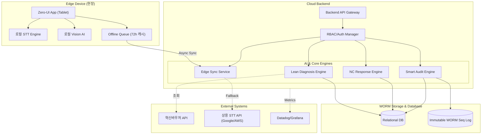
```mermaid
flowchart TB
    subgraph Edge["Edge Device (현장)"]
        UI["Zero-UI App (Tablet)"]
        STT_Eng["로컬 STT Engine"]
        Vis_Eng["로컬 Vision AI"]
        LQ["Offline Queue (72h 캐시)"]
        
        UI --> STT_Eng
        UI --> Vis_Eng
        UI --> LQ
    end
    
    subgraph Cloud["Cloud Backend"]
        API["Backend API Gateway"]
        Auth["RBAC/Auth Manager"]
        
        subgraph CoreEngines["AI & Core Engines"]
            AuditEng["Smart Audit Engine"]
            NCEng["NC Response Engine"]
            LeanEng["Lean Diagnosis Engine"]
            SyncServ["Edge Sync Service"]
        end
        
        API --> Auth
        Auth --> SyncServ
        Auth --> AuditEng
        Auth --> NCEng
        Auth --> LeanEng
    end
    
    subgraph DB["WORM Storage & Database"]
        RDBMS[(Relational DB)]
        WORM[(Immutable WORM Seq Log)]
    end
    
    subgraph External["External Systems"]
        Gov["혁신바우처 API"]
        GovSTT["상용 STT API (Google/AWS)"]
        Moni["Datadog/Grafana"]
    end
    
    LQ --Async Sync--> SyncServ
    AuditEng --> RDBMS
    NCEng --> RDBMS
    LeanEng --> RDBMS
    AuditEng --> WORM
    
    SyncServ -.Fallback.-> GovSTT
    LeanEng -.조회.-> Gov
    Cloud -.Metrics.-> Moni
```

#### 3.4.2 Use Case Diagram
주요 액터들과 시스템 간의 핵심 과업 상호작용.

```mermaid
usecaseDiagram
    actor "오반장 (현장 반장)" as OB
    actor "박품질 (품질팀장)" as PQ
    actor "정태식 (대표이사)" as CE
    actor "원청 심사관" as EA
    
    rectangle "PRO ILI SMART System" {
        usecase "음성/비전 데이터 수집" as UC1
        usecase "데이터 동기화 (Sync)" as UC1_1
        
        usecase "Smart Audit 리포트 생성" as UC2
        usecase "ISO 커스텀 양식 선택" as UC2_1
        
        usecase "NC 사유 등록" as UC3
        usecase "긴급 시정 계획 초안 생성" as UC3_1
        
        usecase "COPQ 진단 대시보드 조회" as UC4
        usecase "ROI 트렌드 PDF 출력" as UC5
    }
    
    OB --> UC1
    UC1 ..> UC1_1 : <<include>>
    
    PQ --> UC2
    UC2 ..> UC2_1 : <<extend>>
    PQ --> UC3
    UC3 ..> UC3_1 : <<include>>
    PQ --> UC4
    
    CE --> UC5
    PQ --> UC5
    
    EA --> UC2 : 감사 리포트 수령
    EA --> UC3 : 시정 보고서 수령
```

### 3.5 Interaction Sequences

#### 3.4.1 핵심 흐름: 현장 데이터 수집 → Audit 리포트 생성

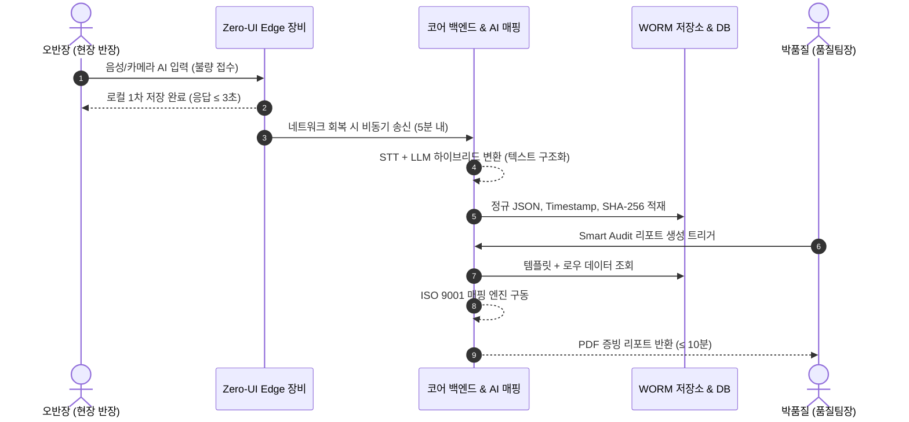
```mermaid
sequenceDiagram
    autonumber
    actor O as 오반장 (현장 반장)
    participant E as Zero-UI Edge 장비
    participant C as 코어 백엔드 & AI 매핑
    participant DB as WORM 저장소 & DB
    actor P as 박품질 (품질팀장)

    O->>E: 음성/카메라 AI 입력 (불량 접수)
    E-->>O: 로컬 1차 저장 완료 (응답 ≤ 3초)
    E->>C: 네트워크 회복 시 비동기 송신 (5분 내)
    C-->>C: STT + LLM 하이브리드 변환 (텍스트 구조화)
    C->>DB: 정규 JSON, Timestamp, SHA-256 적재
    P->>C: Smart Audit 리포트 생성 트리거
    C->>DB: 템플릿 + 로우 데이터 조회
    C-->>C: ISO 9001 매핑 엔진 구동
    C-->>P: PDF 증빙 리포트 반환 (≤ 10분)
```

#### 3.4.2 핵심 흐름: NC 통보 → 긴급 시정 대응

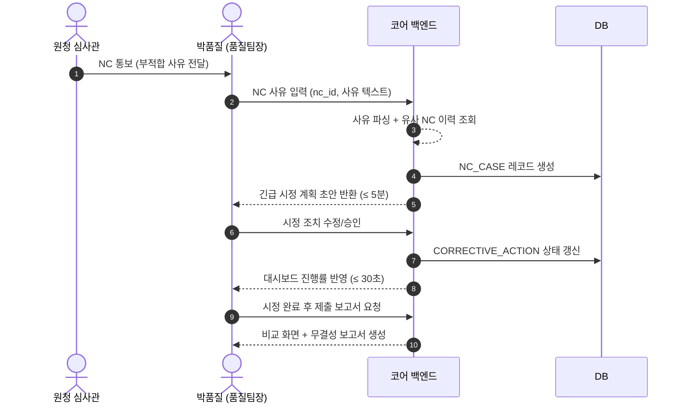
```mermaid
sequenceDiagram
    autonumber
    actor A as 원청 심사관
    actor P as 박품질 (품질팀장)
    participant C as 코어 백엔드
    participant DB as DB

    A->>P: NC 통보 (부적합 사유 전달)
    P->>C: NC 사유 입력 (nc_id, 사유 텍스트)
    C-->>C: 사유 파싱 + 유사 NC 이력 조회
    C->>DB: NC_CASE 레코드 생성
    C-->>P: 긴급 시정 계획 초안 반환 (≤ 5분)
    P->>C: 시정 조치 수정/승인
    C->>DB: CORRECTIVE_ACTION 상태 갱신
    C-->>P: 대시보드 진행률 반영 (≤ 30초)
    P->>C: 시정 완료 후 제출 보고서 요청
    C-->>P: 비교 화면 + 무결성 보고서 생성
```

#### 3.4.3 핵심 흐름: Lean 진단 (COPQ 대시보드)

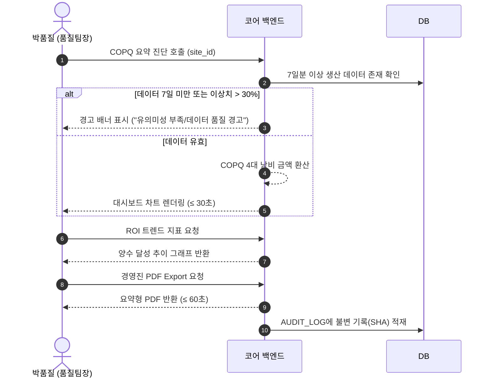
```mermaid
sequenceDiagram
    autonumber
    actor P as 박품질 (품질팀장)
    participant C as 코어 백엔드
    participant DB as DB

    P->>C: COPQ 요약 진단 호출 (site_id)
    C->>DB: 7일분 이상 생산 데이터 존재 확인
    alt 데이터 7일 미만 또는 이상치 > 30%
        C-->>P: 경고 배너 표시 ("유의미성 부족/데이터 품질 경고")
    else 데이터 유효
        C-->>C: COPQ 4대 낭비 금액 환산
        C-->>P: 대시보드 차트 렌더링 (≤ 30초)
    end
    P->>C: ROI 트렌드 지표 요청
    C-->>P: 양수 달성 추이 그래프 반환
    P->>C: 경영진 PDF Export 요청
    C-->>P: 요약형 PDF 반환 (≤ 60초)
    C->>DB: AUDIT_LOG에 불변 기록(SHA) 적재
```

---

## 4. Specific Requirements

### 4.1 Functional Requirements

#### 4.1.1 Smart Audit 엔진 (Source: Story 3.1)

| ID | Priority | Source | Requirement Description | Acceptance Criteria (Given/When/Then) |
|:---|:---:|:---|:---|:---|
| REQ-FUNC-001 | Must | Story 3.1 / F-1 | 시스템은 50건 이상의 실데이터가 축적된 상태에서, 사용자의 Audit 리포트 생성 요청 시 ISO 9001 증빙 리포트를 10분 이내에 PDF 형식으로 생성하여야 한다. | **Given:** 데이터 ≥ 50건 적재 완료 **When:** 사용자가 리포트 생성 버튼 클릭 **Then:** ISO 9001 양식 PDF 리포트가 ≤ 10분(p95) 내 반환되며, 생성 실패율 < 0.5% |
| REQ-FUNC-002 | Must | Story 3.1 / F-1 | 생성된 Audit 리포트는 원청 심사 시 필수 항목을 100% 포함하여야 하며, 로우 데이터에서 양식 필드로의 매핑 정확도가 ≥ 99%를 달성하여야 한다. | **Given:** 리포트 생성 완료 **When:** 원청 심사관이 필수 항목 검증 수행 **Then:** 누락률 = 0%, 매핑 정확도 ≥ 99% |
| REQ-FUNC-003 | Must | Story 3.1 / F-1 | 시스템은 과거 3개월분의 데이터에 기초하여 주요 품질 지표 트렌드 통계와 이상 징후 분석 섹션을 리포트에 포함하여야 한다. | **Given:** 과거 3개월 데이터 존재 **When:** 트렌드 분석 요약 포함 요청 **Then:** 지표 트렌드 차트 포함, 이상 탐지 정밀도 ≥ 90% |
| REQ-FUNC-004 | Must | Story 3.1 / F-1 | 시스템은 삼성, SK 등 복수 원청의 서식 템플릿을 지원하여, 대상 양식 선택 시 즉시 데이터 재매핑을 수행하여야 한다. | **Given:** 복수 커스텀 템플릿 등록 완료 **When:** 특정 원청 양식 선택 **Then:** 양식 매핑 오류율 < 1%, 렌더링 결과 반환 |
| REQ-FUNC-005 | Must | Story 3.1 / F-1 | 시스템은 생성된 리포트에 대한 버전 이력을 관리하고, 이전 버전과의 비교(diff) 기능을 제공하여야 한다. | **Given:** 동일 세션에 대해 2회 이상 리포트 생성 **When:** 이전 버전 비교 요청 **Then:** 변경 필드 목록 및 이전/현재 값 병렬 표시 |

#### 4.1.2 긴급 NC 시정 패키지 (Source: Story 3.2)

| ID | Priority | Source | Requirement Description | Acceptance Criteria (Given/When/Then) |
|:---|:---:|:---|:---|:---|
| REQ-FUNC-006 | Must | Story 3.2 / F-2 | 시스템은 등록된 NC 통보 사유를 파싱하여 ≤ 5분 이내에 긴급 시정 조치 계획서 초안을 생성하여야 한다. 계획서는 해당 NC 유형의 필수 시정 항목을 ≥ 95% 커버하여야 한다. | **Given:** NC 통보 사유 입력 완료 **When:** 긴급 시정 조치 플랜 생성 요청 **Then:** 계획서 ≤ 5분(p95) 내 반환, 커버리지 ≥ 95% |
| REQ-FUNC-007 | Must | Story 3.2 / F-2 | 시스템은 진행 중인 각 NC건의 시정 활동 진척도를 ≤ 30초 이내 갱신 주기로 대시보드에 반영하여야 한다. | **Given:** 시정 조치 진행 중 **When:** 대시보드 진행률 확인 **Then:** 완료율이 ≤ 30초 내 실시간 갱신 표시 |
| REQ-FUNC-008 | Must | Story 3.2 / F-2 | 시스템은 완료된 시정 건에 대해 조치 전후 비교 화면을 시각화하고, 타임스탬프 및 SHA-256 해시가 포함된 무결성 보고서를 렌더링하여야 한다. | **Given:** 시정 완료 후 데이터 축적 **When:** 제출용 보고서 생성 요청 **Then:** 전후 비교치 표시, 타임스탬프/해시값 100% 무결 기록 |
| REQ-FUNC-009 | Must | Story 3.2 / F-2 | Critical 심각도의 NC 건에 대해 시스템은 24시간 내 제출 기한 알림을 관련 이해관계자에게 자동 발송하여야 한다. | **Given:** NC 심각도 = Critical로 등록 **When:** 등록 시점부터 24시간 카운트다운 시작 **Then:** 담당자에게 4시간 간격 알림 발송, 제출 기한 초과 시 에스컬레이션 |
| REQ-FUNC-010 | Must | Story 3.2 / F-2 | 시스템은 과거 유사 NC 이력을 조회하여 시정 계획 초안에 참고 사례를 제시하여야 한다. | **Given:** 동일 nc_code 이력 ≥ 1건 존재 **When:** 시정 계획 생성 시 **Then:** 유사 사례 목록(최대 5건) 및 성공률 표시 |

#### 4.1.3 Zero-UI 수집기 (Source: Story 3.3)

| ID | Priority | Source | Requirement Description | Acceptance Criteria (Given/When/Then) |
|:---|:---:|:---|:---|:---|
| REQ-FUNC-011 | Must | Story 3.3 / F-3 | 시스템은 80dB 소음 환경에서 사용자의 음성 명령을 Edge-level AI로 판별하여 구조화 데이터로 변환하여야 한다. 인식 정확도 ≥ 92%, 로컬 처리 완료 ≤ 3초. | **Given:** 80dB 소음 환경에서 음성 명령 발화 **When:** 불량 기록 명령 입력 **Then:** 인식 정확도 ≥ 92%, 로컬 완료 ≤ 3초(p95) |
| REQ-FUNC-012 | Must | Story 3.3 / F-3 | Edge 카메라 연동으로 부품 이미지 포착 시 객체 ID 및 외관 상태를 판별하는 Vision AI 처리를 수행하여야 한다. 판별 확률 ≥ 90%, 완료 지연 ≤ 2초. | **Given:** 촬영 모듈 활성화 **When:** 카메라로 피사체 촬영 **Then:** 부품 인식 판별 확률 ≥ 90%, 완료 ≤ 2초(p95) |
| REQ-FUNC-013 | Must | Story 3.3 / F-3 | Edge 환경 오프라인(망 단절) 진입 시 데이터를 로컬 캐싱하고, 네트워크 복구 시 5분 이내에 백엔드 DB로 자동 동기화하여야 한다. 데이터 유실률 = 0%. | **Given:** Edge 디바이스 오프라인 상태 **When:** 데이터 입력 수행 **Then:** 로컬 저장 확인, 복구 후 5분 내 동기화 완료, 유실률 = 0% |
| REQ-FUNC-014 | Must | Story 3.3 / F-3 | Edge 장비는 최대 72시간의 오프라인 큐잉을 지원하여야 하며, 큐 용량 90% 도달 시 사용자에게 경고를 표시하여야 한다. | **Given:** Edge 오프라인 상태 지속 **When:** 72시간 경과 또는 큐 용량 90% 도달 **Then:** 사용자에게 시각/음성 경고 표시, 큐 오버플로우 방지 |
| REQ-FUNC-015 | Must | Story 3.3 / F-3 | 음성 인식 실패(정확도 < 70%) 시 시스템은 자동으로 재시도 프롬프트를 표시하고, 3회 연속 실패 시 수동 입력 Fallback UI를 활성화하여야 한다. | **Given:** 음성 인식 시도 **When:** 인식 정확도 < 70% **Then:** 재시도 프롬프트 표시. 3회 연속 실패 시 수동 입력 UI 활성화 |

#### 4.1.4 글로벌 벤더 등록 가속기 (Source: Story 3.4, Phase 2)

| ID | Priority | Source | Requirement Description | Acceptance Criteria (Given/When/Then) |
|:---|:---:|:---|:---|:---|
| REQ-FUNC-016 | Could | Story 3.4 / O-2 | 사용자가 진입 희망 팹(TSMC 등)을 지정하면 필수 인증·점검 항목 매핑 체크리스트 템플릿을 ≤ 30초 이내에 생성하여야 한다. (Phase 2) | **Given:** 대상 글로벌 팹 지정 **When:** 요구사항 매핑 버튼 클릭 **Then:** 체크리스트 ≤ 30초 내 반환, 누락률 < 3% |
| REQ-FUNC-017 | Could | Story 3.4 / O-2 | 체크리스트 진행 내역 기반으로 투자 소요 기간 및 Gap 델타 분석 리포트를 ≤ 60초 이내에 반환하여야 한다. (Phase 2) | **Given:** 준비 상태 파라미터 입력 **When:** Gap 분석 리포트 요청 **Then:** ≤ 60초 내 산출 반환 |
| REQ-FUNC-018 | Could | Story 3.4 / O-2 | 해소된 Gap 기준으로 글로벌 IATF/ISO 증빙 요구조건을 포함하는 포괄 승인 제출 패키지를 생성하여야 한다. (Phase 2) | **Given:** 모든 Gap 해소 완료 **When:** 증빙 종합 패키지 다운로드 요청 **Then:** 포맷 오류 0건 기준 충족, 패키지 반환 |

#### 4.1.5 Lean 진단 도구 (Source: Story 3.5)

| ID | Priority | Source | Requirement Description | Acceptance Criteria (Given/When/Then) |
|:---|:---:|:---|:---|:---|
| REQ-FUNC-019 | Must | Story 3.5 / F-4 | 코어 백엔드에 7일분 이상의 생산 데이터가 존재할 때, 시스템은 COPQ 4대 낭비(불량, 대기, 재작업, 과잉생산) 금액 환산 시각화 지표를 ≤ 30초 이내에 대시보드에 렌더링하여야 한다. 정확도 ≥ 85%. | **Given:** 최소 7일 생산 데이터 보유 **When:** COPQ 요약 진단 호출 **Then:** 금액 환산 차트 ≤ 30초 표시, 정확도 ≥ 85% |
| REQ-FUNC-020 | Must | Story 3.5 / F-4 | 시스템은 도입 후 30일 경과 데이터를 기반으로 ROI 양수 달성 일수를 산정하여 트렌드 그래프를 보고서에 포함하여야 한다. | **Given:** 도입 후 30일 경과 데이터 확보 **When:** ROI 트렌드 지표 요청 **Then:** 양수 달성 추이 포함 그래프 생성 |
| REQ-FUNC-021 | Must | Story 3.5 / F-4 | 월간 추이 및 그래프가 결합된 경영진 보고용 요약형 PDF 다운로드를 ≤ 60초 이내에 제공하여야 한다. | **Given:** 웹 대시보드 환경 **When:** 경영진 전용 PDF Export 요청 **Then:** ≤ 60초 내 PDF 파일 생성·다운로드 가능 |
| REQ-FUNC-022 | Must | Story 3.5 / F-4 | 데이터가 7일 미만이거나 이상치가 30%를 초과할 경우, 시스템은 COPQ 도출을 중단하고 구체적 제한 사유를 경고 배너로 표시하여야 한다. | **Given:** 7일 미만 데이터 또는 이상치 > 30% **When:** COPQ 진단 실행 **Then:** "유의미성 부족" 또는 "데이터 품질 경고" 배너 표시, 진단 중단 |
| REQ-FUNC-023 | Must | Story 3.5 / F-4 | COPQ 진단 파라미터 변경, ROI 로직 값 수정, 다운로드 이벤트 발생 시 시스템은 AUDIT_LOG 및 SUBMISSION_LOG에 SHA-256 기반 위변조 방지 불변 기록을 적재하여야 한다. | **Given:** 관리자가 파라미터 변경 또는 다운로드 수행 **When:** 저장/다운로드 버튼 확인 **Then:** AUDIT_LOG에 타임스탬프 + SHA-256 해시 기록 생성, 위변조 불가 |

#### 4.1.6 데이터 무결성 시스템 (Source: F-5, 전 기능 공통)

| ID | Priority | Source | Requirement Description | Acceptance Criteria (Given/When/Then) |
|:---|:---:|:---|:---|:---|
| REQ-FUNC-024 | Must | F-5 / CON-03 | 모든 외부 제출용 파일 및 시스템 로그에는 타임스탬프와 SHA-256 기반 무결성 검증 장치가 포함되어야 한다. | **Given:** 제출용 파일 또는 로그 생성 **When:** 파일 저장 시점 **Then:** 타임스탬프 + SHA-256 해시 부여, 검증 API 제공 |
| REQ-FUNC-025 | Must | F-5 / CON-03 | 감사 로그는 WORM 스토리지에 적재되어 최소 3년간 보존되어야 하며, 임의 삭제/수정이 불가하여야 한다. | **Given:** 감사 이벤트 발생 **When:** 로그 적재 시 **Then:** WORM 스토리지 기록, 삭제/수정 시도 시 거부 응답 |
| REQ-FUNC-026 | Must | F-5 / CON-03 | 시스템은 사용자별 접근 권한을 RBAC로 관리하며, 권한 변경 이력을 감사 로그에 기록하여야 한다. | **Given:** 관리자가 사용자 권한 변경 **When:** 권한 변경 저장 **Then:** RBAC 즉시 반영, 변경 이력 AUDIT_LOG 기록 |

### 4.2 Non-Functional Requirements

#### 4.2.1 성능 (Performance)

| ID | 범주 | 비기능 요구 사항 | 측정 기준 | 모니터링 도구 |
|:---|:---|:---|:---|:---|
| REQ-NF-001 | 성능 | Smart Audit 엔진 PDF 리포트 생성 응답 시간은 p95 ≤ 600초(10분)를 유지하여야 한다. | p95 latency ≤ 600s | Grafana / Datadog |
| REQ-NF-002 | 성능 | Edge Zero-UI 음성 인식 명령 처리는 p95 ≤ 3초 이내에 결과를 반환하여야 한다. | p95 latency ≤ 3s | Edge 로컬 메트릭 |
| REQ-NF-003 | 성능 | Edge Vision AI 이미지 인식 처리는 p95 ≤ 2초 이내에 완료되어야 한다. | p95 latency ≤ 2s | Edge 로컬 메트릭 |
| REQ-NF-004 | 성능 | NC 시정 계획 초안 텍스트 생성의 p95 응답 시간은 ≤ 300초(5분)이어야 한다. | p95 latency ≤ 300s | Grafana / Datadog |
| REQ-NF-005 | 성능 | Web 대시보드 실시간 데이터 갱신 주기는 최대 30초이어야 한다. | 갱신 주기 ≤ 30s | Datadog RUM |
| REQ-NF-006 | 성능 | COPQ 진단 차트 렌더링은 p95 ≤ 30초 이내에 완료되어야 한다. | p95 latency ≤ 30s | Grafana / Datadog |

#### 4.2.2 가용성 (Availability)

| ID | 범주 | 비기능 요구 사항 | 측정 기준 | 모니터링 도구 |
|:---|:---|:---|:---|:---|
| REQ-NF-007 | 가용성 | 플랫폼 SLA Uptime은 월 단위 ≥ 99.5%를 보장하여야 한다. | 월간 Uptime ≥ 99.5% | CloudWatch / Datadog |
| REQ-NF-008 | 가용성/DR | RPO ≤ 1시간, RTO ≤ 4시간의 복구 목표를 달성하기 위해 Multi-AZ 교차 백업을 적용하여야 한다. | RPO ≤ 1h, RTO ≤ 4h | DR 훈련 반기 1회 |
| REQ-NF-009 | 가용성 | 분기별 부분 복원 테스트, 반기별 전체 DR 훈련을 수행하여야 한다. | DR 훈련: 반기 1회 부분 복원: 분기 1회 | 운영 보고서 |

#### 4.2.3 무결성 (Integrity)

| ID | 범주 | 비기능 요구 사항 | 측정 기준 | 모니터링 도구 |
|:---|:---|:---|:---|:---|
| REQ-NF-010 | 무결성 | Edge 오프라인 캐시 데이터의 Cloud 복원 동기화 시 Payload 유실률은 = 0%이어야 한다. | 유실률 = 0% | 동기화 로그 검증 |
| REQ-NF-011 | 무결성 | 외부 실사·심사관 제출 파일 및 시스템 로그에는 타임스탬프 + SHA-256 100% 탐지 무결성 장치가 포함되어야 한다. | 무결성 검증 통과율 = 100% | 자동 무결성 체크 |
| REQ-NF-012 | 품질 | Audit 리포트 필수 항목 누락률 = 0%, 생성 실패율 < 0.5%를 달성하여야 한다. | 누락률 = 0% 실패율 < 0.5% | 생성 로그 분석 |

#### 4.2.4 보안 (Security)

| ID | 범주 | 비기능 요구 사항 | 측정 기준 | 모니터링 도구 |
|:---|:---|:---|:---|:---|
| REQ-NF-013 | 보안 (저장) | 저장 데이터(at-rest)는 AES-256 암호화를 적용하여야 한다. | AES-256 적용 확인 | 보안 감사 |
| REQ-NF-014 | 보안 (전송) | 외부 통신 데이터(in-flight)는 TLS 1.3 프로토콜로 보호하여야 한다. | TLS 1.3 강제 | 인증서 모니터링 |
| REQ-NF-015 | 보안 (접근) | RBAC 기반 논리적 격리를 유지하고, 90일 단위 암호 키 로테이션을 준수하여야 한다. | 키 로테이션: 90일 RBAC 정책 적용 | 키 관리 시스템 |
| REQ-NF-016 | 보안 (감사) | 감사 로그는 변경 불가(Immutable) 속성으로 최소 3년간 보존하여야 한다. | 보존 기간 ≥ 3년 | WORM 스토리지 검증 |
| REQ-NF-017 | 보안 (침투) | 연 1회 이상 침투 테스트를 수행하고, 발견 취약점에 대한 SLA 기반 해소 일정을 적용하여야 한다. | 침투 테스트: 연 1회 취약점 해소 SLA 준수 | 보안 감사 보고서 |

#### 4.2.5 비용 (Cost)

| ID | 범주 | 비기능 요구 사항 | 측정 기준 | 모니터링 도구 |
|:---|:---|:---|:---|:---|
| REQ-NF-018 | 비용 | 클라우드 인프라 운영비는 월 ≤ $50/고객으로 유지하여야 한다. | 월 인프라 비용 ≤ $50 | 클라우드 과금 대시보드 |
| REQ-NF-019 | 비용 | Edge 디바이스 노드당 구매 비용은 ≤ 50만원이어야 한다. | 노드당 ≤ 500,000원 | 구매 명세 |
| REQ-NF-020 | 비용 | 최종 사용자 체감 월 이용료는 ≤ 12만원을 유지하여야 한다. | 월 체감가 ≤ 120,000원 | NPV·민감도 분석 |

##### 4.2.5.1 MVP 인프라 비용 산출 근거 (Cost Breakdown & Feasibility)

본 절은 REQ-NF-018(클라우드 인프라 운영비 월 ≤ $50/고객)의 실현 가능성을 검증하기 위한 항목별 비용 산출 근거(BoM: Bill of Materials)를 제시한다.

**산출 전제 조건:**

| # | 전제 항목 | 값 | 근거 |
|:---:|:---|:---|:---|
| A-1 | MVP 단계 고객(테넌트) 수 | 10개 사업장 | 파일럿 Phase 1 목표 |
| A-2 | 사업장 당 활성 사용자 | 10~20명 | 소부장 SME 평균 규모 |
| A-3 | 일 평균 음성 입력 건수 (고객당) | 50건 | 현장 반장 5인 × 10건/일 |
| A-4 | 음성 입력 평균 발화 길이 | 10초 | 불량 접수 명령 ("불량 접수: A라인 2번") |
| A-5 | 일 평균 이미지 입력 건수 (고객당) | 20건 | 부품 외관 촬영 |
| A-6 | 월 Audit 리포트 생성 횟수 (고객당) | 3건 | 월 2~3회 정기/비정기 심사 |
| A-7 | 월 NC 케이스 발생 건수 (고객당) | 5건 | 업계 평균 부적합 빈도 |
| A-8 | 아키텍처 | 멀티테넌트 공유 인프라 | 테넌트별 논리 격리 (RBAC) |
| A-9 | 클라우드 리전 | AWS ap-northeast-2 (서울) | 한국 고객 대상 최소 지연 |
| A-10 | 과금 기준 | On-Demand 기준 (최적화 전) | 보수적 산정 후 절감 전략 별도 제시 |

**클라우드 인프라 항목별 BoM (고객당 월 비용):**

| # | 비용 항목 | 서비스 | 산출식 | 공유 비용 (월) | 고객당 (÷10) | 비고 |
|:---:|:---|:---|:---|---:|---:|:---|
| C-1 | **컴퓨팅 (API 서버)** | AWS Fargate (ARM/Graviton) | 1 vCPU × 2GB × 730h × $0.03238/vCPU-h + $0.00356/GB-h | $27.63 | **$2.76** | Graviton 20% 절감 적용 |
| C-2 | **컴퓨팅 (AI Worker)** | AWS Fargate (ARM/Graviton) | 2 vCPU × 4GB × 730h (피크 시만 스케일) | $57.28 | **$5.73** | 평균 가동률 60% 가정 시 $3.44 |
| C-3 | **데이터베이스** | RDS PostgreSQL db.t4g.medium Multi-AZ | $0.130/h × 730h + 50GB gp3 스토리지 | $99.90 | **$9.99** | Multi-AZ 이중화 포함 |
| C-4 | **WORM 스토리지** | S3 Standard + Object Lock | 고객당 월 증분 ~200MB × S3 $0.025/GB | — | **$0.005** | 3년 누적 시 별도 분석 (하단 참조) |
| C-5 | **STT API** | Google Speech-to-Text V2 | 50건/일 × 30일 × 10초 = 250분/월 × $0.016/분 | — | **$4.00** | 고객별 직접 비용 |
| C-6 | **LLM 추론 (매핑/파싱)** | 자체 호스팅 또는 API | 월 ~500회 추론 × 평균 1K tokens × $0.003/1K (입력) | — | **$3.00** | 경량 파인튜닝 모델 기준 |
| C-7 | **네트워크 (Egress)** | AWS Data Transfer | 고객당 월 ~5GB outbound × $0.126/GB (서울) | — | **$0.63** | PDF + 동기화 데이터 |
| C-8 | **CDN / 정적 호스팅** | CloudFront + S3 | 웹 대시보드 정적 자산 | $5.00 | **$0.50** | 공유 배포 |
| C-9 | **모니터링** | Grafana Cloud Free + CloudWatch | CW 기본 메트릭 + Grafana 무료 티어 | $15.00 | **$1.50** | MVP 단계 무료 티어 활용 |
| C-10 | **비밀 관리 / 키 관리** | AWS Secrets Manager + KMS | 키 2개 × $1 + 시크릿 5개 × $0.40 | $4.00 | **$0.40** | 90일 로테이션 포함 |
| C-11 | **로드 밸런서** | ALB | 1 ALB + LCU 사용량 | $20.00 | **$2.00** | 고정비 $16.20 + LCU 변동 |
| C-12 | **큐 / 이벤트 버스** | SQS + EventBridge | Edge 동기화 큐 + 이벤트 라우팅 | $3.00 | **$0.30** | 메시지 100만건 미만 무료 범위 |
| | **합계 (On-Demand 기준)** | | | | **$30.86** | |
| | **여유 마진 (20%)** | | 예비비: 예상 외 트래픽, 스토리지 증가 | | **$6.17** | |
| | **📌 총 예상 비용 (고객당/월)** | | | | **$37.03** | **≤ $50 한도 대비 여유 $12.97 (26%)** |

**WORM 스토리지 3년 누적 비용 추이 (고객당):**

| 경과 기간 | 누적 데이터량 | S3 Standard 비용 (월) | S3 Standard-IA 비용 (월) | Glacier 비용 (월) |
|:---|:---|:---|:---|:---|
| 6개월 | 1.2 GB | $0.03 | $0.015 | $0.005 |
| 12개월 | 2.4 GB | $0.06 | $0.030 | $0.010 |
| 24개월 | 4.8 GB | $0.12 | $0.060 | $0.019 |
| 36개월 (최대) | 7.2 GB | $0.18 | $0.090 | $0.029 |

> WORM 스토리지 비용은 36개월 최대 누적 시에도 $0.18/월로, 전체 비용에 미치는 영향은 무시 가능 수준이다. 1년 경과 데이터는 S3 Lifecycle 정책으로 Standard-IA 또는 Glacier로 자동 전환하여 추가 절감한다.

**고객 규모별 민감도 분석 (Sensitivity Analysis):**

| 시나리오 | 고객 수 | 공유 비용 배분 | 직접 비용 | 고객당 총 비용 | $50 한도 충족 |
|:---|:---:|:---:|:---:|:---:|:---:|
| 비관적 (MVP 초기) | 5 | $35.51 | $8.09 | **$43.60** | ✅ 충족 (여유 $6.40) |
| 기준 (파일럿 목표) | 10 | $17.76 | $8.09 | **$25.85** | ✅ 충족 (여유 $24.15) |
| 낙관적 (확장) | 20 | $8.88 | $8.09 | **$16.97** | ✅ 충족 (여유 $33.03) |
| 스트레스 (고사용량) | 5 + 사용량 2× | $35.51 | $16.18 | **$51.69** | ⚠️ 초과 $1.69 |

> 스트레스 시나리오(고객 5개 + 사용량 2배)에서 $50 한도를 $1.69 초과할 수 있으므로, 아래 비용 최적화 전략의 1~2번 항목을 반드시 적용하여야 한다.

**비용 최적화 전략 (Cost Optimization Roadmap):**

| # | 전략 | 예상 절감률 | 적용 시점 | 설명 |
|:---:|:---|:---:|:---|:---|
| OPT-1 | **Compute Savings Plan (1년)** | 컴퓨팅 30~40% | 파일럿 3개월 후 | Fargate + RDS 예약 인스턴스. 기준 시나리오 $37.03 → ~$28 |
| OPT-2 | **STT Dynamic Batch** | STT 81% | Phase 2 | Google Dynamic Batch 전환 ($0.016 → $0.003/분). $4.00 → $0.75 |
| OPT-3 | **Graviton (ARM) 전환** | 컴퓨팅 20% | 즉시 | x86 → ARM 전환 (이미 산출에 반영 완료) |
| OPT-4 | **WORM 티어링** | 스토리지 60~80% | 즉시 | 1년 경과 데이터 → S3 Glacier 자동 전환 |
| OPT-5 | **경량 LLM 자체 호스팅** | LLM 50~70% | Phase 2 | 외부 API → 자체 파인튜닝 모델 Fargate 배포 |
| OPT-6 | **Reserved DB Instance (1년)** | DB 40% | 파일럿 6개월 후 | RDS ri 적용. $9.99 → ~$6.00 |

**비용 구조 시각화:**

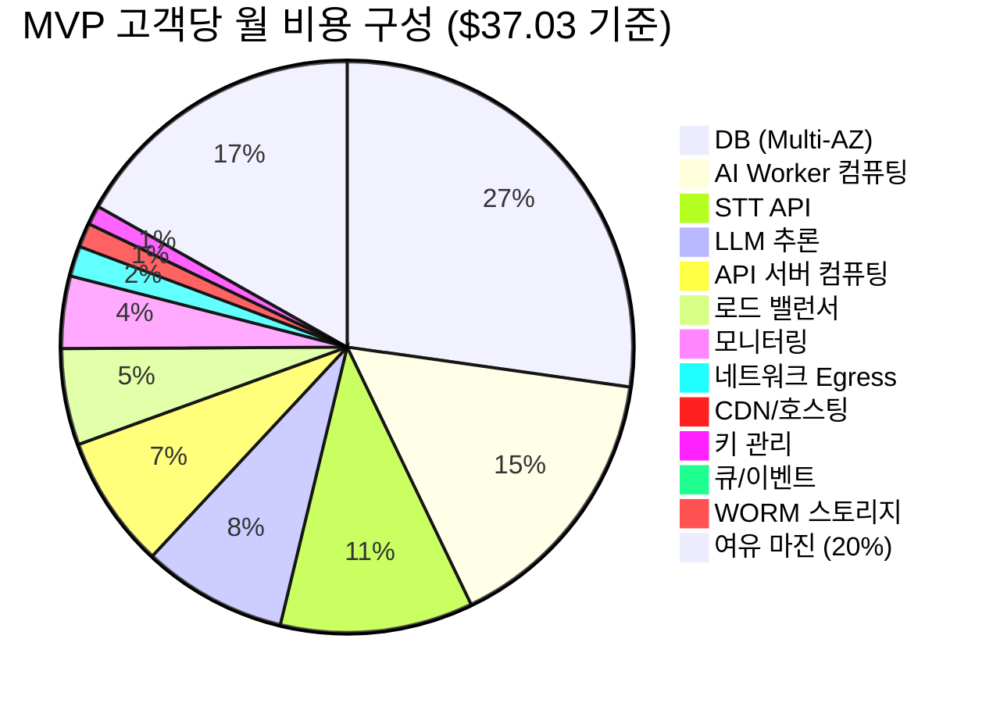
```mermaid
pie title MVP 고객당 월 비용 구성 ($37.03 기준)
    "DB (Multi-AZ)" : 9.99
    "AI Worker 컴퓨팅" : 5.73
    "STT API" : 4.00
    "LLM 추론" : 3.00
    "API 서버 컴퓨팅" : 2.76
    "로드 밸런서" : 2.00
    "모니터링" : 1.50
    "네트워크 Egress" : 0.63
    "CDN/호스팅" : 0.50
    "키 관리" : 0.40
    "큐/이벤트" : 0.30
    "WORM 스토리지" : 0.05
    "여유 마진 (20%)" : 6.17
```

**최종 단가 검증 요약:**

| 항목 | 값 | 비고 |
|:---|:---|:---|
| On-Demand 기준 고객당 월 비용 | **$37.03** | 20% 마진 포함 |
| $50 한도 대비 여유 | **$12.97 (26%)** | |
| 최소 고객 수 (한도 준수) | **≥ 5개** | 표준 사용량 기준 |
| Savings Plan 적용 후 예상 | **~$25~28** | 1년 약정 기준 |
| 비용 최대 리스크 시나리오 | **$51.69** | 고객 5개 + 사용량 2× |
| 리스크 대응 | OPT-1 (Savings Plan) + OPT-2 (Batch STT) 적용 시 $35 이하 확보 | |

#### 4.2.6 스케일링 (Scalability)

| ID | 범주 | 비기능 요구 사항 | 측정 기준 | 모니터링 도구 |
|:---|:---|:---|:---|:---|
| REQ-NF-021 | 스케일링 | 단일 사업장(테넌트) 내 동시 접속 사용자 ≥ 50명을 지원하여야 한다. | 동시 접속 ≥ 50명 | 부하 테스트 결과 |

#### 4.2.7 모니터링 및 운영 (Operations)

| ID | 범주 | 비기능 요구 사항 | 측정 기준 | 모니터링 도구 |
|:---|:---|:---|:---|:---|
| REQ-NF-022 | 모니터링 | Grafana/Datadog 기반 SLI 에러 버짓 모니터링을 상시 운용하여야 한다. SLI는 최소 4종(가용성, 지연, 오류율, 처리량)을 포함한다. | SLI 4종 상시 모니터링 | Grafana / Datadog |
| REQ-NF-023 | 에스컬레이션 | 5단계 에스컬레이션 정책을 적용한다: Critical 오류는 CTO에게 1시간 이내 알림을 발송하여야 한다. | Critical → CTO 1h Alert | PagerDuty / Opsgenie |
| REQ-NF-024 | KPI 측정 | 북극성 KPI(Audit 리포트 생성 시간) 및 보조 KPI 5종에 대한 Warning/Critical 알림 임계치를 정의하고 자동 알림을 운용하여야 한다. | 6개 KPI 알림 임계치 정의 | 모니터링 대시보드 |

### 4.3 Functional Sequence Diagrams

각 기능 그룹의 요구사항이 시스템 내에서 어떤 흐름으로 실현되는지를 시퀀스 다이어그램으로 표현한다. 각 단계에 해당하는 REQ-FUNC ID를 명시하여 요구사항과의 추적성을 확보한다.

#### 4.3.1 Smart Audit 엔진 (REQ-FUNC-001 ~ 005)

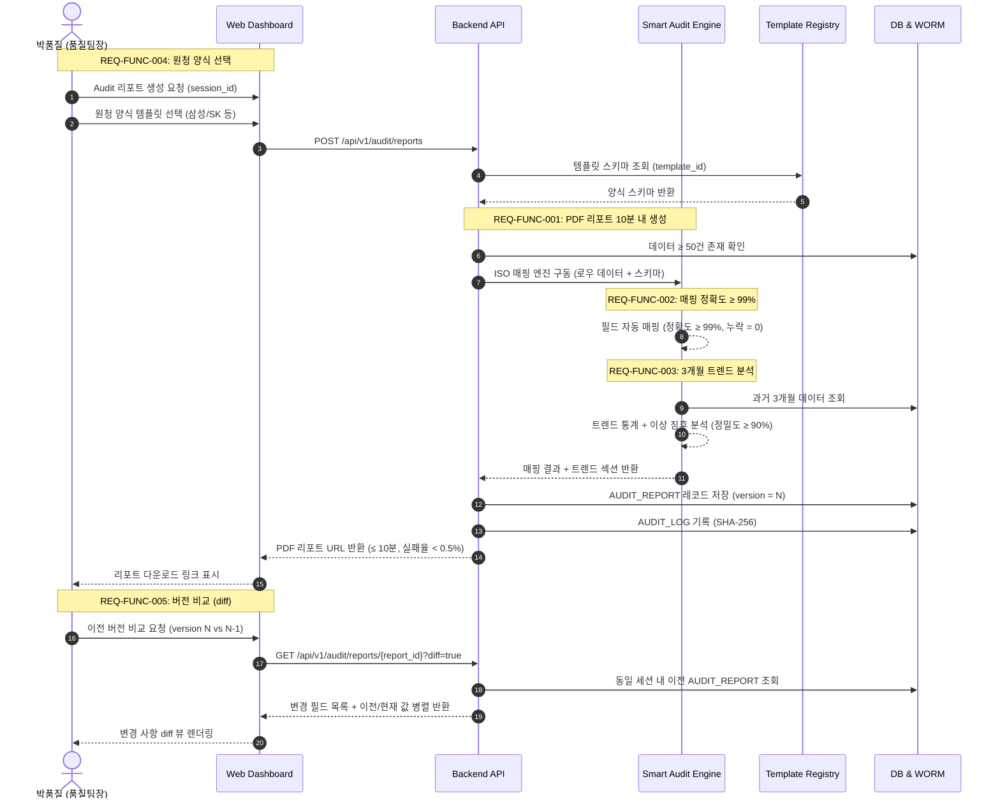
```mermaid
sequenceDiagram
    autonumber
    actor P as 박품질 (품질팀장)
    participant W as Web Dashboard
    participant B as Backend API
    participant AE as Smart Audit Engine
    participant TR as Template Registry
    participant DB as DB & WORM

    Note over P,W: REQ-FUNC-004: 원청 양식 선택
    P->>W: Audit 리포트 생성 요청 (session_id)
    P->>W: 원청 양식 템플릿 선택 (삼성/SK 등)
    W->>B: POST /api/v1/audit/reports
    B->>TR: 템플릿 스키마 조회 (template_id)
    TR-->>B: 양식 스키마 반환

    Note over B,AE: REQ-FUNC-001: PDF 리포트 10분 내 생성
    B->>DB: 데이터 ≥ 50건 존재 확인
    B->>AE: ISO 매핑 엔진 구동 (로우 데이터 + 스키마)

    Note over AE: REQ-FUNC-002: 매핑 정확도 ≥ 99%
    AE-->>AE: 필드 자동 매핑 (정확도 ≥ 99%, 누락 = 0)

    Note over AE: REQ-FUNC-003: 3개월 트렌드 분석
    AE->>DB: 과거 3개월 데이터 조회
    AE-->>AE: 트렌드 통계 + 이상 징후 분석 (정밀도 ≥ 90%)
    AE-->>B: 매핑 결과 + 트렌드 섹션 반환

    B->>DB: AUDIT_REPORT 레코드 저장 (version = N)
    B->>DB: AUDIT_LOG 기록 (SHA-256)
    B-->>W: PDF 리포트 URL 반환 (≤ 10분, 실패율 < 0.5%)
    W-->>P: 리포트 다운로드 링크 표시

    Note over P,W: REQ-FUNC-005: 버전 비교 (diff)
    P->>W: 이전 버전 비교 요청 (version N vs N-1)
    W->>B: GET /api/v1/audit/reports/{report_id}?diff=true
    B->>DB: 동일 세션 내 이전 AUDIT_REPORT 조회
    B-->>W: 변경 필드 목록 + 이전/현재 값 병렬 반환
    W-->>P: 변경 사항 diff 뷰 렌더링
```

#### 4.3.2 긴급 NC 시정 패키지 (REQ-FUNC-006 ~ 010)

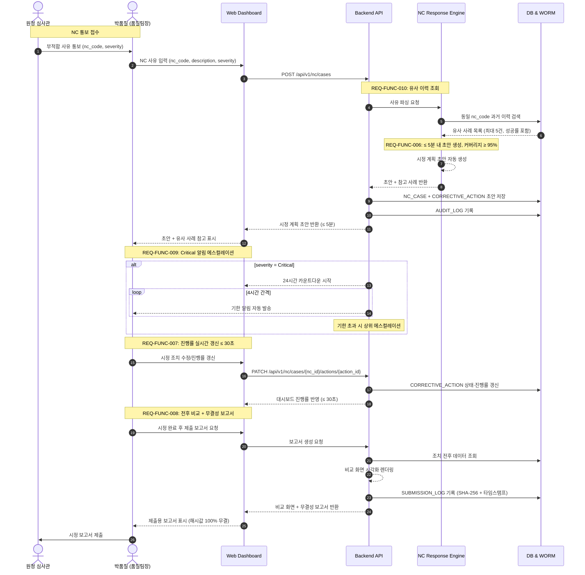
```mermaid
sequenceDiagram
    autonumber
    actor A as 원청 심사관
    actor P as 박품질 (품질팀장)
    participant W as Web Dashboard
    participant B as Backend API
    participant NC as NC Response Engine
    participant DB as DB & WORM

    Note over A,P: NC 통보 접수
    A->>P: 부적합 사유 통보 (nc_code, severity)
    P->>W: NC 사유 입력 (nc_code, description, severity)
    W->>B: POST /api/v1/nc/cases

    Note over B,NC: REQ-FUNC-010: 유사 이력 조회
    B->>NC: 사유 파싱 요청
    NC->>DB: 동일 nc_code 과거 이력 검색
    DB-->>NC: 유사 사례 목록 (최대 5건, 성공률 포함)

    Note over NC: REQ-FUNC-006: ≤ 5분 내 초안 생성, 커버리지 ≥ 95%
    NC-->>NC: 시정 계획 초안 자동 생성
    NC-->>B: 초안 + 참고 사례 반환
    B->>DB: NC_CASE + CORRECTIVE_ACTION 초안 저장
    B->>DB: AUDIT_LOG 기록
    B-->>W: 시정 계획 초안 반환 (≤ 5분)
    W-->>P: 초안 + 유사 사례 참고 표시

    Note over P,W: REQ-FUNC-009: Critical 알림 에스컬레이션
    alt severity = Critical
        B-->>W: 24시간 카운트다운 시작
        loop 4시간 간격
            B-->>P: 기한 알림 자동 발송
        end
        Note over B: 기한 초과 시 상위 에스컬레이션
    end

    Note over P,W: REQ-FUNC-007: 진행률 실시간 갱신 ≤ 30초
    P->>W: 시정 조치 수정/진행률 갱신
    W->>B: PATCH /api/v1/nc/cases/{nc_id}/actions/{action_id}
    B->>DB: CORRECTIVE_ACTION 상태·진행률 갱신
    B-->>W: 대시보드 진행률 반영 (≤ 30초)

    Note over P,W: REQ-FUNC-008: 전후 비교 + 무결성 보고서
    P->>W: 시정 완료 후 제출 보고서 요청
    W->>B: 보고서 생성 요청
    B->>DB: 조치 전후 데이터 조회
    B-->>B: 비교 화면 시각화 렌더링
    B->>DB: SUBMISSION_LOG 기록 (SHA-256 + 타임스탬프)
    B-->>W: 비교 화면 + 무결성 보고서 반환
    W-->>P: 제출용 보고서 표시 (해시값 100% 무결)
    P->>A: 시정 보고서 제출
```

#### 4.3.3 Zero-UI 수집기 (REQ-FUNC-011 ~ 015)

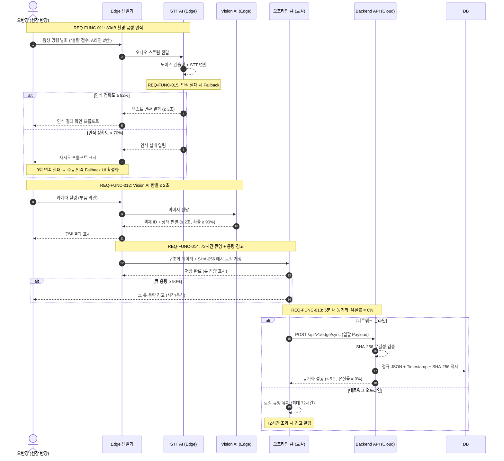
```mermaid
sequenceDiagram
    autonumber
    actor O as 오반장 (현장 반장)
    participant E as Edge 단말기
    participant STT as STT AI (Edge)
    participant VIS as Vision AI (Edge)
    participant Q as 오프라인 큐 (로컬)
    participant B as Backend API (Cloud)
    participant DB as DB

    Note over O,STT: REQ-FUNC-011: 80dB 환경 음성 인식
    O->>E: 음성 명령 발화 ("불량 접수: A라인 2번")
    E->>STT: 오디오 스트림 전달
    STT-->>STT: 노이즈 캔슬링 + STT 변환

    Note over STT: REQ-FUNC-015: 인식 실패 시 Fallback
    alt 인식 정확도 ≥ 92%
        STT-->>E: 텍스트 변환 결과 (≤ 3초)
        E-->>O: 인식 결과 확인 프롬프트
    else 인식 정확도 < 70%
        STT-->>E: 인식 실패 알림
        E-->>O: 재시도 프롬프트 표시
        Note over O,E: 3회 연속 실패 → 수동 입력 Fallback UI 활성화
    end

    Note over O,VIS: REQ-FUNC-012: Vision AI 판별 ≤ 2초
    O->>E: 카메라 촬영 (부품 외관)
    E->>VIS: 이미지 전달
    VIS-->>E: 객체 ID + 상태 판별 (≤ 2초, 확률 ≥ 90%)
    E-->>O: 판별 결과 표시

    Note over E,Q: REQ-FUNC-014: 72시간 큐잉 + 용량 경고
    E->>Q: 구조화 데이터 + SHA-256 해시 로컬 저장
    Q-->>E: 저장 완료 (큐 잔량 표시)
    alt 큐 용량 ≥ 90%
        Q-->>O: ⚠️ 큐 용량 경고 (시각/음성)
    end

    Note over Q,B: REQ-FUNC-013: 5분 내 동기화, 유실률 = 0%
    alt 네트워크 온라인
        Q->>B: POST /api/v1/edge/sync (일괄 Payload)
        B-->>B: SHA-256 무결성 검증
        B->>DB: 정규 JSON + Timestamp + SHA-256 적재
        B-->>Q: 동기화 성공 (≤ 5분, 유실률 = 0%)
    else 네트워크 오프라인
        Q-->>Q: 로컬 큐잉 유지 (최대 72시간)
        Note over Q: 72시간 초과 시 경고 알림
    end
```

#### 4.3.4 글로벌 벤더 등록 가속기 (REQ-FUNC-016 ~ 018, Phase 2)

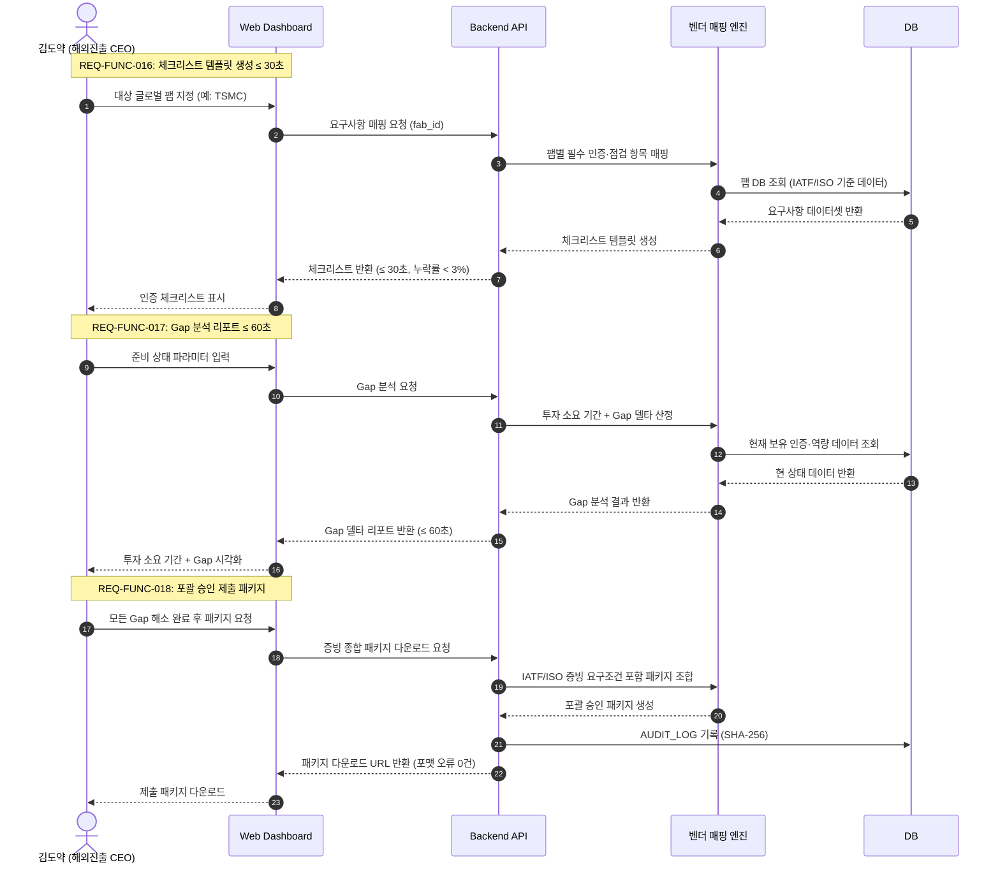
```mermaid
sequenceDiagram
    autonumber
    actor K as 김도약 (해외진출 CEO)
    participant W as Web Dashboard
    participant B as Backend API
    participant VE as 벤더 매핑 엔진
    participant DB as DB

    Note over K,W: REQ-FUNC-016: 체크리스트 템플릿 생성 ≤ 30초
    K->>W: 대상 글로벌 팹 지정 (예: TSMC)
    W->>B: 요구사항 매핑 요청 (fab_id)
    B->>VE: 팹별 필수 인증·점검 항목 매핑
    VE->>DB: 팹 DB 조회 (IATF/ISO 기준 데이터)
    DB-->>VE: 요구사항 데이터셋 반환
    VE-->>B: 체크리스트 템플릿 생성
    B-->>W: 체크리스트 반환 (≤ 30초, 누락률 < 3%)
    W-->>K: 인증 체크리스트 표시

    Note over K,W: REQ-FUNC-017: Gap 분석 리포트 ≤ 60초
    K->>W: 준비 상태 파라미터 입력
    W->>B: Gap 분석 요청
    B->>VE: 투자 소요 기간 + Gap 델타 산정
    VE->>DB: 현재 보유 인증·역량 데이터 조회
    DB-->>VE: 현 상태 데이터 반환
    VE-->>B: Gap 분석 결과 반환
    B-->>W: Gap 델타 리포트 반환 (≤ 60초)
    W-->>K: 투자 소요 기간 + Gap 시각화

    Note over K,W: REQ-FUNC-018: 포괄 승인 제출 패키지
    K->>W: 모든 Gap 해소 완료 후 패키지 요청
    W->>B: 증빙 종합 패키지 다운로드 요청
    B->>VE: IATF/ISO 증빙 요구조건 포함 패키지 조합
    VE-->>B: 포괄 승인 패키지 생성
    B->>DB: AUDIT_LOG 기록 (SHA-256)
    B-->>W: 패키지 다운로드 URL 반환 (포맷 오류 0건)
    W-->>K: 제출 패키지 다운로드
```

#### 4.3.5 Lean 진단 도구 (REQ-FUNC-019 ~ 023)

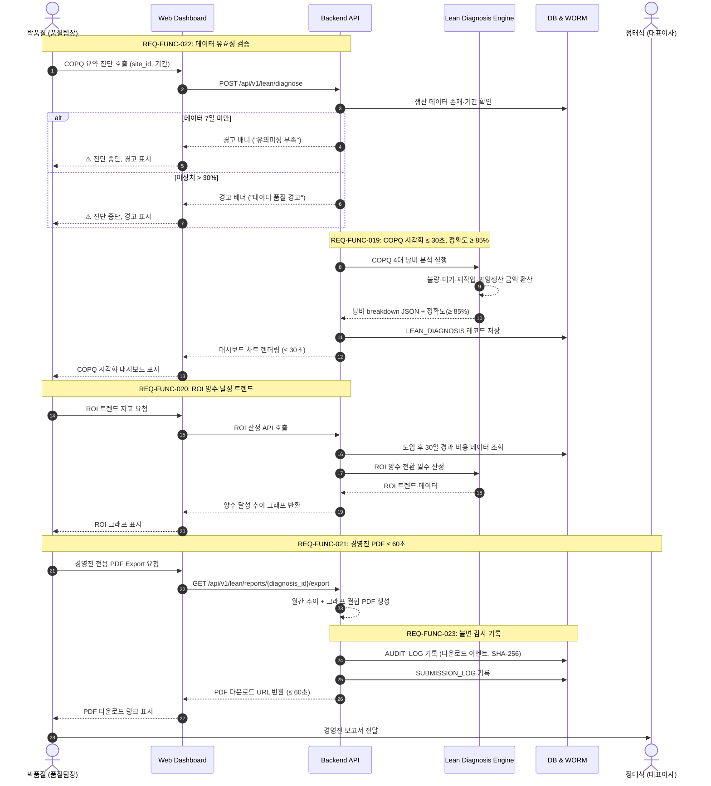
```mermaid
sequenceDiagram
    autonumber
    actor P as 박품질 (품질팀장)
    participant W as Web Dashboard
    participant B as Backend API
    participant LE as Lean Diagnosis Engine
    participant DB as DB & WORM
    actor CEO as 정태식 (대표이사)

    Note over P,B: REQ-FUNC-022: 데이터 유효성 검증
    P->>W: COPQ 요약 진단 호출 (site_id, 기간)
    W->>B: POST /api/v1/lean/diagnose
    B->>DB: 생산 데이터 존재·기간 확인

    alt 데이터 7일 미만
        B-->>W: 경고 배너 ("유의미성 부족")
        W-->>P: ⚠️ 진단 중단, 경고 표시
    else 이상치 > 30%
        B-->>W: 경고 배너 ("데이터 품질 경고")
        W-->>P: ⚠️ 진단 중단, 경고 표시
    end

    Note over B,LE: REQ-FUNC-019: COPQ 시각화 ≤ 30초, 정확도 ≥ 85%
    B->>LE: COPQ 4대 낭비 분석 실행
    LE-->>LE: 불량·대기·재작업·과잉생산 금액 환산
    LE-->>B: 낭비 breakdown JSON + 정확도(≥ 85%)
    B->>DB: LEAN_DIAGNOSIS 레코드 저장
    B-->>W: 대시보드 차트 렌더링 (≤ 30초)
    W-->>P: COPQ 시각화 대시보드 표시

    Note over P,B: REQ-FUNC-020: ROI 양수 달성 트렌드
    P->>W: ROI 트렌드 지표 요청
    W->>B: ROI 산정 API 호출
    B->>DB: 도입 후 30일 경과 비용 데이터 조회
    B->>LE: ROI 양수 전환 일수 산정
    LE-->>B: ROI 트렌드 데이터
    B-->>W: 양수 달성 추이 그래프 반환
    W-->>P: ROI 그래프 표시

    Note over P,CEO: REQ-FUNC-021: 경영진 PDF ≤ 60초
    P->>W: 경영진 전용 PDF Export 요청
    W->>B: GET /api/v1/lean/reports/{diagnosis_id}/export
    B-->>B: 월간 추이 + 그래프 결합 PDF 생성

    Note over B,DB: REQ-FUNC-023: 불변 감사 기록
    B->>DB: AUDIT_LOG 기록 (다운로드 이벤트, SHA-256)
    B->>DB: SUBMISSION_LOG 기록
    B-->>W: PDF 다운로드 URL 반환 (≤ 60초)
    W-->>P: PDF 다운로드 링크 표시
    P->>CEO: 경영진 보고서 전달
```

#### 4.3.6 데이터 무결성 시스템 (REQ-FUNC-024 ~ 026)

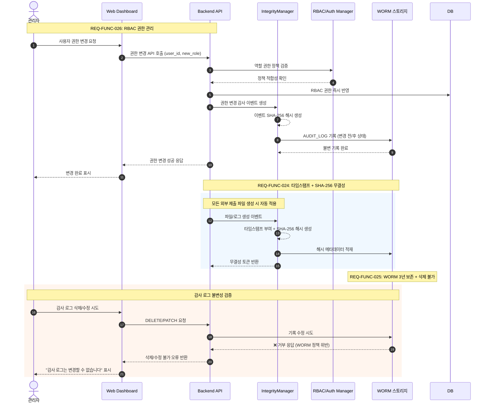
```mermaid
sequenceDiagram
    autonumber
    actor Admin as 관리자
    participant W as Web Dashboard
    participant B as Backend API
    participant IM as IntegrityManager
    participant RBAC as RBAC/Auth Manager
    participant WORM as WORM 스토리지
    participant DB as DB

    Note over Admin,B: REQ-FUNC-026: RBAC 권한 관리
    Admin->>W: 사용자 권한 변경 요청
    W->>B: 권한 변경 API 호출 (user_id, new_role)
    B->>RBAC: 역할 권한 정책 검증
    RBAC-->>B: 정책 적합성 확인
    B->>DB: RBAC 권한 즉시 반영
    B->>IM: 권한 변경 감사 이벤트 생성
    IM-->>IM: 이벤트 SHA-256 해시 생성
    IM->>WORM: AUDIT_LOG 기록 (변경 전/후 상태)
    WORM-->>IM: 불변 기록 완료
    B-->>W: 권한 변경 성공 응답
    W-->>Admin: 변경 완료 표시

    Note over B,WORM: REQ-FUNC-024: 타임스탬프 + SHA-256 무결성
    rect rgb(240, 248, 255)
        Note over B,IM: 모든 외부 제출 파일 생성 시 자동 적용
        B->>IM: 파일/로그 생성 이벤트
        IM-->>IM: 타임스탬프 부여 + SHA-256 해시 생성
        IM->>WORM: 해시 메타데이터 적재
        IM-->>B: 무결성 토큰 반환
    end

    Note over WORM: REQ-FUNC-025: WORM 3년 보존 + 삭제 불가
    rect rgb(255, 245, 238)
        Note over Admin,WORM: 감사 로그 불변성 검증
        Admin->>W: 감사 로그 삭제/수정 시도
        W->>B: DELETE/PATCH 요청
        B->>WORM: 기록 수정 시도
        WORM-->>B: ❌ 거부 응답 (WORM 정책 위반)
        B-->>W: 삭제/수정 불가 오류 반환
        W-->>Admin: "감사 로그는 변경할 수 없습니다" 표시
    end
```

---

## 5. Traceability Matrix

### 5.1 Story ↔ Requirement ↔ Test Case 추적 매트릭스

| Source Story | Feature | Requirement IDs | Test Case IDs |
|:---|:---|:---|:---|
| Story 3.1 (Smart Audit) | F-1 | REQ-FUNC-001, REQ-FUNC-002, REQ-FUNC-003, REQ-FUNC-004, REQ-FUNC-005 | TC-SA-001 ~ TC-SA-005 |
| Story 3.2 (NC 시정) | F-2 | REQ-FUNC-006, REQ-FUNC-007, REQ-FUNC-008, REQ-FUNC-009, REQ-FUNC-010 | TC-NC-001 ~ TC-NC-005 |
| Story 3.3 (Zero-UI) | F-3 | REQ-FUNC-011, REQ-FUNC-012, REQ-FUNC-013, REQ-FUNC-014, REQ-FUNC-015 | TC-UI-001 ~ TC-UI-005 |
| Story 3.4 (벤더 등록, Phase 2) | O-2 | REQ-FUNC-016, REQ-FUNC-017, REQ-FUNC-018 | TC-VD-001 ~ TC-VD-003 |
| Story 3.5 (Lean 진단) | F-4 | REQ-FUNC-019, REQ-FUNC-020, REQ-FUNC-021, REQ-FUNC-022, REQ-FUNC-023 | TC-LN-001 ~ TC-LN-005 |
| 공통 (데이터 무결성) | F-5 | REQ-FUNC-024, REQ-FUNC-025, REQ-FUNC-026 | TC-DI-001 ~ TC-DI-003 |

### 5.2 Non-Functional Requirements ↔ Test Case 추적 매트릭스

| NFR 범주 | Requirement IDs | Test Case IDs |
|:---|:---|:---|
| 성능 | REQ-NF-001 ~ REQ-NF-006 | TC-NFR-PERF-001 ~ TC-NFR-PERF-006 |
| 가용성 | REQ-NF-007 ~ REQ-NF-009 | TC-NFR-AVAIL-001 ~ TC-NFR-AVAIL-003 |
| 무결성 | REQ-NF-010 ~ REQ-NF-012 | TC-NFR-INTG-001 ~ TC-NFR-INTG-003 |
| 보안 | REQ-NF-013 ~ REQ-NF-017 | TC-NFR-SEC-001 ~ TC-NFR-SEC-005 |
| 비용 | REQ-NF-018 ~ REQ-NF-020 | TC-NFR-COST-001 ~ TC-NFR-COST-003 |
| 스케일링 | REQ-NF-021 | TC-NFR-SCALE-001 |
| 모니터링/운영 | REQ-NF-022 ~ REQ-NF-024 | TC-NFR-OPS-001 ~ TC-NFR-OPS-003 |

---

## 6. Appendix

### 6.1 API Endpoint List

| # | API 이름 | HTTP Method | Endpoint Path | 설명 | 주요 입력 파라미터 | 주요 응답 | 제약 사항 |
|:---:|:---|:---:|:---|:---|:---|:---|:---|
| 1 | Audit Report API | POST | `/api/v1/audit/reports` | 수집 데이터 기반 ISO 양식 PDF 리포트 생성 | `session_id`, `data_filter`, `template_id` | PDF 파일 URL, 메타데이터 JSON | Payload ≤ 50MB, 생성 대기 ≤ 600초 |
| 2 | Audit Report API (조회) | GET | `/api/v1/audit/reports/{report_id}` | 기생성 리포트 조회 및 다운로드 | `report_id` | PDF 파일, 생성 시간, 매핑 정확도 | — |
| 3 | Zero-UI Edge API (동기화) | POST | `/api/v1/edge/sync` | Edge → Cloud 데이터 동기화 | `device_id`, `payload[]` (WAV, 이미지, JSON) | 동기화 결과, processed_count | 오프라인 72시간 큐 허용 |
| 4 | Zero-UI Edge API (상태) | GET | `/api/v1/edge/devices/{device_id}/status` | Edge 디바이스 연결 상태 조회 | `device_id` | 연결 상태, 큐 잔량, 마지막 동기화 시간 | — |
| 5 | NC Response API (생성) | POST | `/api/v1/nc/cases` | NC 케이스 등록 및 시정 계획 초안 생성 | `nc_code`, `description`, `severity` | 시정 계획 초안, nc_id | Critical: 24h 내 제출 프로세스 |
| 6 | NC Response API (조회) | GET | `/api/v1/nc/cases/{nc_id}` | NC 케이스 상세 및 시정 진행 상태 조회 | `nc_id` | NC 상세, 시정 조치 목록, 진행률 | — |
| 7 | NC Response API (시정 갱신) | PATCH | `/api/v1/nc/cases/{nc_id}/actions/{action_id}` | 시정 조치 상태·진행률 갱신 | `action_id`, `status`, `completion_pct` | 갱신 결과 | 갱신 반영 ≤ 30초 |
| 8 | Lean Diagnosis API (진단) | POST | `/api/v1/lean/diagnose` | COPQ 진단 실행 및 ROI 산정 | `site_id`, `period_start`, `period_end` | COPQ 통계 JSON, ROI 트렌드 | 최소 7일 데이터. 정확도 ≥ 85% |
| 9 | Lean Diagnosis API (Export) | GET | `/api/v1/lean/reports/{diagnosis_id}/export` | 경영진 보고용 PDF 내보내기 | `diagnosis_id`, `format` | PDF 파일 | 생성 ≤ 60초 |
| 10 | Template Registry API (목록) | GET | `/api/v1/templates` | 원청 Audit 양식 템플릿 목록 조회 | `audit_type` (ISO9001, 14001 등) | 템플릿 ID·이름·버전 목록 | — |
| 11 | Template Registry API (상세) | GET | `/api/v1/templates/{template_id}` | 특정 템플릿 상세 조회 | `template_id` | 템플릿 JSON/XML 구조 | — |
| 12 | Template Registry API (등록) | POST | `/api/v1/templates` | 신규 커스텀 템플릿 등록 | 템플릿 JSON/XML, `audit_type`, `org_name` | `template_id` | 관리자 권한 필요 |

### 6.2 Entity & Data Model

#### 6.2.0 Entity-Relationship Diagram (ERD)
전체 관계형 데이터베이스 테이블 매핑. 다대일 및 일대다 연관성 표시.

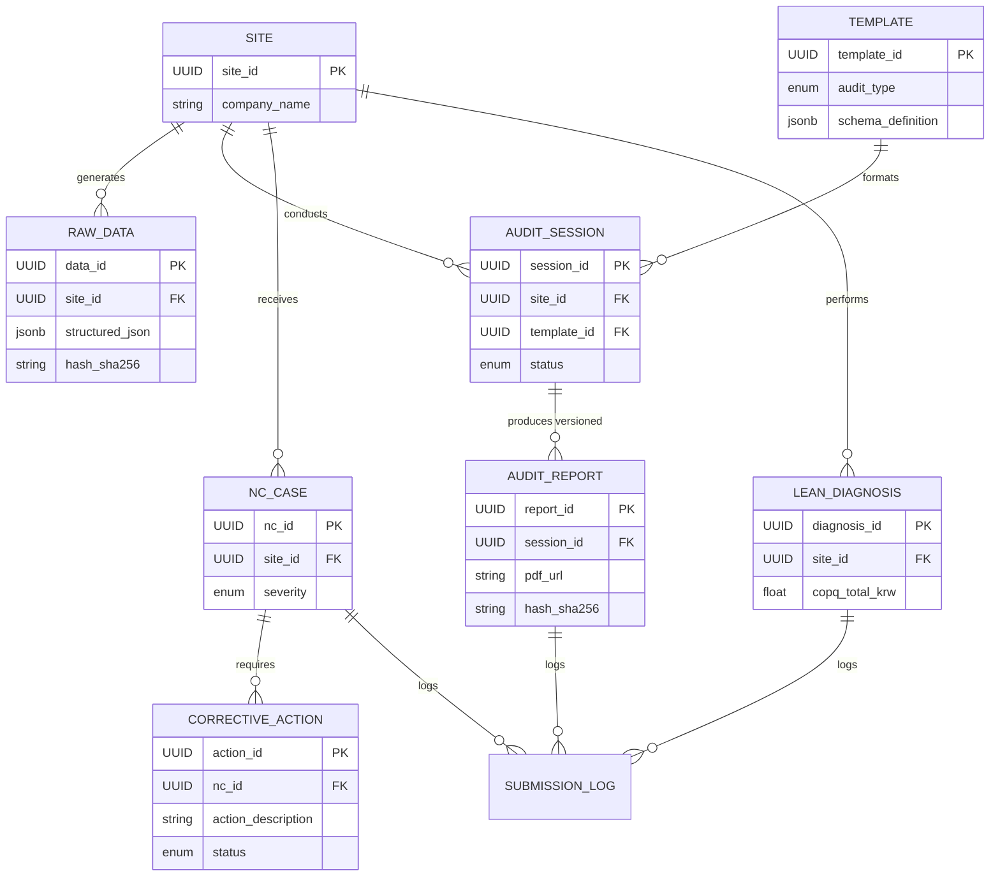
```mermaid
erDiagram
    SITE ||--o{ RAW_DATA : generates
    SITE ||--o{ AUDIT_SESSION : conducts
    SITE ||--o{ NC_CASE : "receives"
    SITE ||--o{ LEAN_DIAGNOSIS : performs
    
    AUDIT_SESSION ||--o{ AUDIT_REPORT : "produces versioned"
    TEMPLATE ||--o{ AUDIT_SESSION : "formats"
    
    NC_CASE ||--o{ CORRECTIVE_ACTION : requires
    
    AUDIT_REPORT ||--o{ SUBMISSION_LOG : logs
    NC_CASE ||--o{ SUBMISSION_LOG : logs
    LEAN_DIAGNOSIS ||--o{ SUBMISSION_LOG : logs
    
    SITE {
        UUID site_id PK
        string company_name
    }
    RAW_DATA {
        UUID data_id PK
        UUID site_id FK
        jsonb structured_json
        string hash_sha256
    }
    AUDIT_SESSION {
        UUID session_id PK
        UUID site_id FK
        UUID template_id FK
        enum status
    }
    AUDIT_REPORT {
        UUID report_id PK
        UUID session_id FK
        string pdf_url
        string hash_sha256
    }
    TEMPLATE {
        UUID template_id PK
        enum audit_type
        jsonb schema_definition
    }
    NC_CASE {
        UUID nc_id PK
        UUID site_id FK
        enum severity
    }
    CORRECTIVE_ACTION {
        UUID action_id PK
        UUID nc_id FK
        string action_description
        enum status
    }
    LEAN_DIAGNOSIS {
        UUID diagnosis_id PK
        UUID site_id FK
        float copq_total_krw
    }
```

#### 6.2.1 SITE (사업장)

| 필드 | 타입 | 설명 | 제약 조건 |
|:---|:---|:---|:---|
| site_id | UUID | 사업장 고유 식별자 | **PK** |
| company_name | string(200) | 기업명 | NOT NULL |
| employee_count | int | 직원 수 | ≥ 1 |
| industry_sector | string(100) | 산업 분야 | NOT NULL |
| certifications | array[string] | 보유 인증 목록 (ISO 9001, 14001 등) | — |
| created_at | timestamp | 등록 일시 | NOT NULL, DEFAULT NOW() |
| updated_at | timestamp | 최종 수정 일시 | NOT NULL |

#### 6.2.2 RAW_DATA (원본 수집 데이터)

| 필드 | 타입 | 설명 | 제약 조건 |
|:---|:---|:---|:---|
| data_id | UUID | 데이터 고유 식별자 | **PK** |
| site_id | UUID | 사업장 참조 | **FK → SITE.site_id**, NOT NULL |
| source_type | enum | 수집 유형: `voice`, `vision`, `sensor`, `manual` | NOT NULL |
| payload | blob | 원본 데이터 바이너리 | NOT NULL |
| structured_json | jsonb | AI 변환 후 구조화 데이터 | — |
| collected_at | timestamp | 수집 일시 | NOT NULL |
| synced_at | timestamp | Cloud 동기화 완료 일시 | — |
| device_id | string(100) | 수집 디바이스 식별자 | NOT NULL |
| hash_sha256 | string(64) | SHA-256 무결성 해시 | NOT NULL |

#### 6.2.3 AUDIT_SESSION (Audit 세션)

| 필드 | 타입 | 설명 | 제약 조건 |
|:---|:---|:---|:---|
| session_id | UUID | Audit 세션 고유 식별자 | **PK** |
| site_id | UUID | 사업장 참조 | **FK → SITE.site_id**, NOT NULL |
| audit_type | enum | Audit 유형: `ISO9001`, `ISO14001`, `ISO45001`, `IATF16949` | NOT NULL |
| auditor_org | string(200) | 심사 기관명 | — |
| template_id | UUID | 적용 템플릿 참조 | **FK → TEMPLATE.template_id** |
| scheduled_date | date | 심사 예정일 | NOT NULL |
| status | enum | 세션 상태: `draft`, `in_progress`, `completed` | NOT NULL, DEFAULT `draft` |
| created_at | timestamp | 생성 일시 | NOT NULL |

#### 6.2.4 AUDIT_REPORT (Audit 리포트)

| 필드 | 타입 | 설명 | 제약 조건 |
|:---|:---|:---|:---|
| report_id | UUID | 리포트 고유 식별자 | **PK** |
| session_id | UUID | Audit 세션 참조 | **FK → AUDIT_SESSION.session_id**, NOT NULL |
| version | int | 리포트 버전 번호 | NOT NULL, DEFAULT 1 |
| pdf_url | string(500) | PDF 파일 저장 경로/URL | NOT NULL |
| generation_time_sec | int | 생성 소요 시간(초) | NOT NULL |
| mapping_accuracy_pct | float | 매핑 정확도(%) | NOT NULL, CHECK ≥ 0 AND ≤ 100 |
| missing_field_count | int | 누락 필드 수 | NOT NULL, DEFAULT 0 |
| generated_at | timestamp | 생성 일시 | NOT NULL |
| hash_sha256 | string(64) | 리포트 파일 SHA-256 해시 | NOT NULL |

#### 6.2.5 NC_CASE (부적합 사례)

| 필드 | 타입 | 설명 | 제약 조건 |
|:---|:---|:---|:---|
| nc_id | UUID | NC 고유 식별자 | **PK** |
| site_id | UUID | 사업장 참조 | **FK → SITE.site_id**, NOT NULL |
| nc_code | string(50) | NC 분류 코드 | NOT NULL |
| description | text | 부적합 사유 상세 | NOT NULL |
| severity | enum | 심각도: `critical`, `major`, `minor`, `observation` | NOT NULL |
| notified_at | date | NC 통보일 | NOT NULL |
| deadline | date | 시정 기한 | NOT NULL |
| status | enum | 상태: `open`, `in_progress`, `resolved`, `closed` | NOT NULL, DEFAULT `open` |
| created_at | timestamp | 등록 일시 | NOT NULL |

#### 6.2.6 CORRECTIVE_ACTION (시정 조치)

| 필드 | 타입 | 설명 | 제약 조건 |
|:---|:---|:---|:---|
| action_id | UUID | 시정 조치 고유 식별자 | **PK** |
| nc_id | UUID | NC 사례 참조 | **FK → NC_CASE.nc_id**, NOT NULL |
| action_description | text | 시정 조치 상세 내용 | NOT NULL |
| assignee | string(100) | 담당자 | NOT NULL |
| status | enum | 상태: `pending`, `in_progress`, `completed`, `verified` | NOT NULL, DEFAULT `pending` |
| completion_pct | float | 진행률(%) | CHECK ≥ 0 AND ≤ 100 |
| evidence_url | string(500) | 근거 자료 URL | — |
| started_at | timestamp | 착수 일시 | — |
| completed_at | timestamp | 완료 일시 | — |
| updated_at | timestamp | 최종 갱신 일시 | NOT NULL |

#### 6.2.7 LEAN_DIAGNOSIS (Lean 진단)

| 필드 | 타입 | 설명 | 제약 조건 |
|:---|:---|:---|:---|
| diagnosis_id | UUID | 진단 고유 식별자 | **PK** |
| site_id | UUID | 사업장 참조 | **FK → SITE.site_id**, NOT NULL |
| period_start | date | 분석 시작일 | NOT NULL |
| period_end | date | 분석 종료일 | NOT NULL |
| copq_total_krw | float | COPQ 총 금액(원) | NOT NULL |
| waste_breakdown | jsonb | 4대 낭비 항목별 금액 분해 | NOT NULL |
| roi_days | float | ROI 양수 전환 소요 일수 | — |
| accuracy_pct | float | 산출 정확도(%) | CHECK ≥ 0 AND ≤ 100 |
| data_quality_flag | enum | 데이터 품질: `valid`, `insufficient`, `outlier_warning` | NOT NULL |
| diagnosed_at | timestamp | 진단 일시 | NOT NULL |

#### 6.2.8 TEMPLATE (Audit 양식 템플릿)

| 필드 | 타입 | 설명 | 제약 조건 |
|:---|:---|:---|:---|
| template_id | UUID | 템플릿 고유 식별자 | **PK** |
| audit_type | enum | `ISO9001`, `ISO14001`, `ISO45001`, `IATF16949` | NOT NULL |
| org_name | string(200) | 원청 기관명 (예: 삼성, SK) | NOT NULL |
| template_name | string(200) | 템플릿 표시명 | NOT NULL |
| version | int | 버전 번호 | NOT NULL, DEFAULT 1 |
| schema_definition | jsonb | 필드 매핑 스키마 정의 | NOT NULL |
| is_active | boolean | 활성 여부 | NOT NULL, DEFAULT true |
| created_at | timestamp | 등록 일시 | NOT NULL |
| updated_at | timestamp | 최종 수정 일시 | NOT NULL |

#### 6.2.9 AUDIT_LOG (감사 로그)

| 필드 | 타입 | 설명 | 제약 조건 |
|:---|:---|:---|:---|
| log_id | UUID | 로그 고유 식별자 | **PK** |
| event_type | enum | 이벤트 유형: `create`, `update`, `delete`, `download`, `login`, `permission_change` | NOT NULL |
| actor_id | string(100) | 수행자 식별자 | NOT NULL |
| target_entity | string(100) | 대상 엔터티명 | NOT NULL |
| target_id | UUID | 대상 레코드 식별자 | NOT NULL |
| before_state | jsonb | 변경 전 상태 (해당 시) | — |
| after_state | jsonb | 변경 후 상태 (해당 시) | — |
| ip_address | string(45) | 요청 IP 주소 | NOT NULL |
| timestamp | timestamp | 이벤트 발생 일시 | NOT NULL |
| hash_sha256 | string(64) | 로그 엔트리 SHA-256 해시 | NOT NULL |
| storage_type | string(20) | 저장 유형: `WORM` 고정 | NOT NULL, DEFAULT `WORM` |

#### 6.2.10 SUBMISSION_LOG (제출 로그)

| 필드 | 타입 | 설명 | 제약 조건 |
|:---|:---|:---|:---|
| submission_id | UUID | 제출 로그 고유 식별자 | **PK** |
| report_type | enum | `audit_report`, `nc_report`, `lean_report` | NOT NULL |
| report_id | UUID | 대상 보고서 식별자 | NOT NULL |
| submitted_by | string(100) | 제출자 | NOT NULL |
| submitted_at | timestamp | 제출 일시 | NOT NULL |
| recipient | string(200) | 수신자/기관 | NOT NULL |
| file_hash_sha256 | string(64) | 제출 파일 SHA-256 해시 | NOT NULL |
| storage_type | string(20) | 저장 유형: `WORM` 고정 | NOT NULL, DEFAULT `WORM` |

### 6.3 Detailed Interaction Models

#### 6.3.1 상세 시퀀스: Zero-UI 데이터 수집 → Cloud 동기화 → Audit 리포트 생성

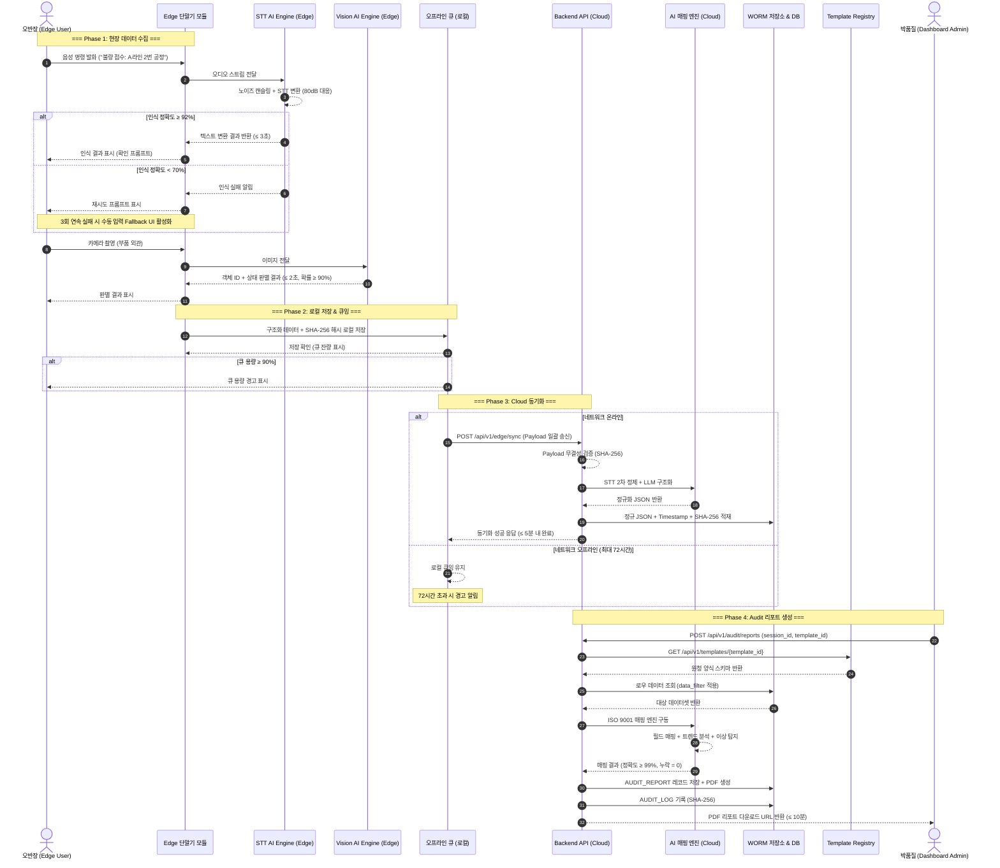
```mermaid
sequenceDiagram
    autonumber
    actor O as 오반장 (Edge User)
    participant E as Edge 단말기 모듈
    participant STT as STT AI Engine (Edge)
    participant VIS as Vision AI Engine (Edge)
    participant Q as 오프라인 큐 (로컬)
    participant B as Backend API (Cloud)
    participant AI as AI 매핑 엔진 (Cloud)
    participant DB as WORM 저장소 & DB
    participant TMP as Template Registry
    actor P as 박품질 (Dashboard Admin)

    Note over O,E: === Phase 1: 현장 데이터 수집 ===
    O->>E: 음성 명령 발화 ("불량 접수: A라인 2번 공정")
    E->>STT: 오디오 스트림 전달
    STT-->>STT: 노이즈 캔슬링 + STT 변환 (80dB 대응)
    alt 인식 정확도 ≥ 92%
        STT-->>E: 텍스트 변환 결과 반환 (≤ 3초)
        E-->>O: 인식 결과 표시 (확인 프롬프트)
    else 인식 정확도 < 70%
        STT-->>E: 인식 실패 알림
        E-->>O: 재시도 프롬프트 표시
        Note over O,E: 3회 연속 실패 시 수동 입력 Fallback UI 활성화
    end

    O->>E: 카메라 촬영 (부품 외관)
    E->>VIS: 이미지 전달
    VIS-->>E: 객체 ID + 상태 판별 결과 (≤ 2초, 확률 ≥ 90%)
    E-->>O: 판별 결과 표시

    Note over E,Q: === Phase 2: 로컬 저장 & 큐잉 ===
    E->>Q: 구조화 데이터 + SHA-256 해시 로컬 저장
    Q-->>E: 저장 확인 (큐 잔량 표시)
    alt 큐 용량 ≥ 90%
        Q-->>O: 큐 용량 경고 표시
    end

    Note over Q,B: === Phase 3: Cloud 동기화 ===
    alt 네트워크 온라인
        Q->>B: POST /api/v1/edge/sync (Payload 일괄 송신)
        B-->>B: Payload 무결성 검증 (SHA-256)
        B->>AI: STT 2차 정제 + LLM 구조화
        AI-->>B: 정규화 JSON 반환
        B->>DB: 정규 JSON + Timestamp + SHA-256 적재
        B-->>Q: 동기화 성공 응답 (≤ 5분 내 완료)
    else 네트워크 오프라인 (최대 72시간)
        Q-->>Q: 로컬 큐잉 유지
        Note over Q: 72시간 초과 시 경고 알림
    end

    Note over P,B: === Phase 4: Audit 리포트 생성 ===
    P->>B: POST /api/v1/audit/reports (session_id, template_id)
    B->>TMP: GET /api/v1/templates/{template_id}
    TMP-->>B: 원청 양식 스키마 반환
    B->>DB: 로우 데이터 조회 (data_filter 적용)
    DB-->>B: 대상 데이터셋 반환
    B->>AI: ISO 9001 매핑 엔진 구동
    AI-->>AI: 필드 매핑 + 트렌드 분석 + 이상 탐지
    AI-->>B: 매핑 결과 (정확도 ≥ 99%, 누락 = 0)
    B->>DB: AUDIT_REPORT 레코드 저장 + PDF 생성
    B->>DB: AUDIT_LOG 기록 (SHA-256)
    B-->>P: PDF 리포트 다운로드 URL 반환 (≤ 10분)
```

#### 6.3.2 상세 시퀀스: NC 통보 → 시정 → 제출

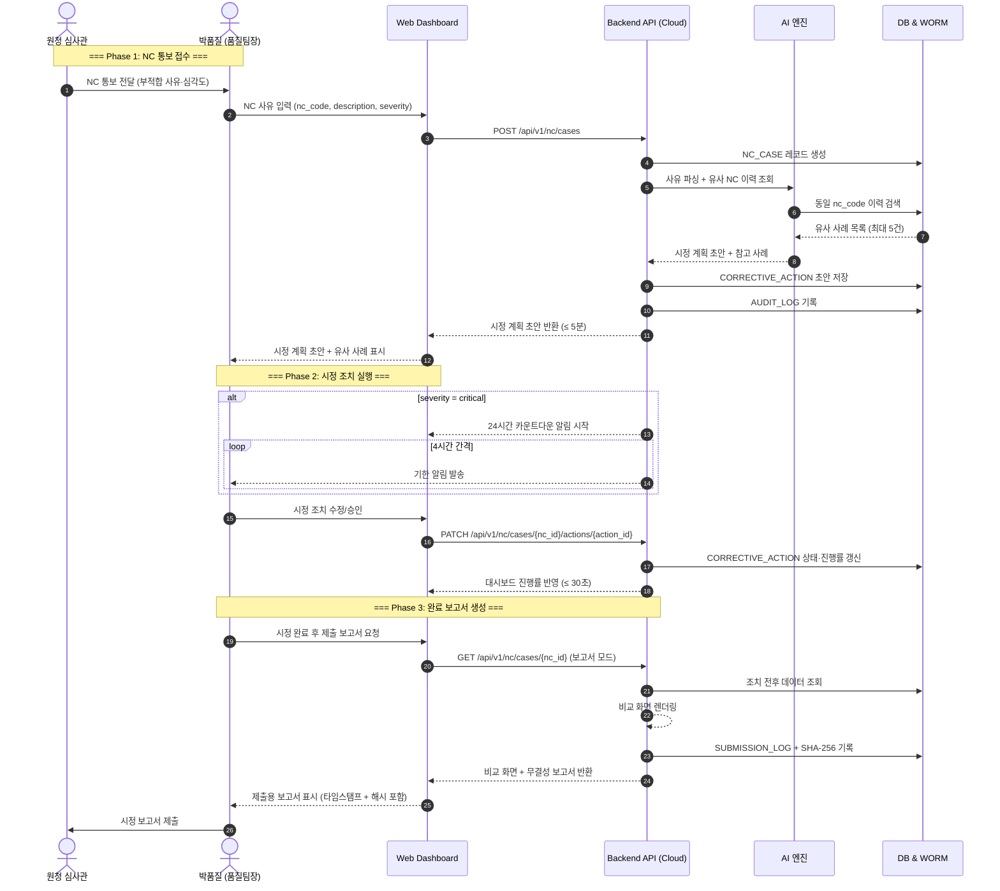
```mermaid
sequenceDiagram
    autonumber
    actor A as 원청 심사관
    actor P as 박품질 (품질팀장)
    participant W as Web Dashboard
    participant B as Backend API (Cloud)
    participant AI as AI 엔진
    participant DB as DB & WORM

    Note over A,P: === Phase 1: NC 통보 접수 ===
    A->>P: NC 통보 전달 (부적합 사유·심각도)
    P->>W: NC 사유 입력 (nc_code, description, severity)
    W->>B: POST /api/v1/nc/cases
    B->>DB: NC_CASE 레코드 생성
    B->>AI: 사유 파싱 + 유사 NC 이력 조회
    AI->>DB: 동일 nc_code 이력 검색
    DB-->>AI: 유사 사례 목록 (최대 5건)
    AI-->>B: 시정 계획 초안 + 참고 사례
    B->>DB: CORRECTIVE_ACTION 초안 저장
    B->>DB: AUDIT_LOG 기록
    B-->>W: 시정 계획 초안 반환 (≤ 5분)
    W-->>P: 시정 계획 초안 + 유사 사례 표시

    Note over P,W: === Phase 2: 시정 조치 실행 ===
    alt severity = critical
        B-->>W: 24시간 카운트다운 알림 시작
        loop 4시간 간격
            B-->>P: 기한 알림 발송
        end
    end
    P->>W: 시정 조치 수정/승인
    W->>B: PATCH /api/v1/nc/cases/{nc_id}/actions/{action_id}
    B->>DB: CORRECTIVE_ACTION 상태·진행률 갱신
    B-->>W: 대시보드 진행률 반영 (≤ 30초)

    Note over P,B: === Phase 3: 완료 보고서 생성 ===
    P->>W: 시정 완료 후 제출 보고서 요청
    W->>B: GET /api/v1/nc/cases/{nc_id} (보고서 모드)
    B->>DB: 조치 전후 데이터 조회
    B-->>B: 비교 화면 렌더링
    B->>DB: SUBMISSION_LOG + SHA-256 기록
    B-->>W: 비교 화면 + 무결성 보고서 반환
    W-->>P: 제출용 보고서 표시 (타임스탬프 + 해시 포함)
    P->>A: 시정 보고서 제출
```

#### 6.3.3 상세 시퀀스: Lean 진단 (COPQ 분석 → 경영진 보고)

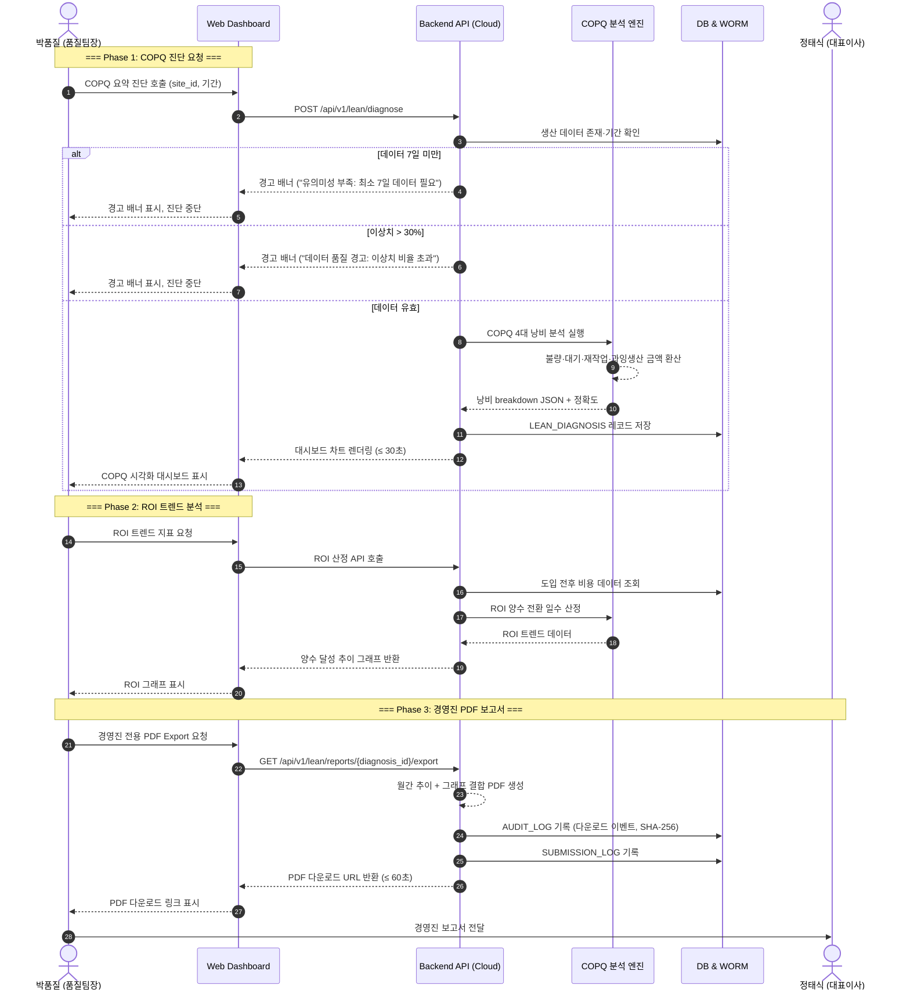
```mermaid
sequenceDiagram
    autonumber
    actor P as 박품질 (품질팀장)
    participant W as Web Dashboard
    participant B as Backend API (Cloud)
    participant AI as COPQ 분석 엔진
    participant DB as DB & WORM
    actor CEO as 정태식 (대표이사)

    Note over P,W: === Phase 1: COPQ 진단 요청 ===
    P->>W: COPQ 요약 진단 호출 (site_id, 기간)
    W->>B: POST /api/v1/lean/diagnose
    B->>DB: 생산 데이터 존재·기간 확인

    alt 데이터 7일 미만
        B-->>W: 경고 배너 ("유의미성 부족: 최소 7일 데이터 필요")
        W-->>P: 경고 배너 표시, 진단 중단
    else 이상치 > 30%
        B-->>W: 경고 배너 ("데이터 품질 경고: 이상치 비율 초과")
        W-->>P: 경고 배너 표시, 진단 중단
    else 데이터 유효
        B->>AI: COPQ 4대 낭비 분석 실행
        AI-->>AI: 불량·대기·재작업·과잉생산 금액 환산
        AI-->>B: 낭비 breakdown JSON + 정확도
        B->>DB: LEAN_DIAGNOSIS 레코드 저장
        B-->>W: 대시보드 차트 렌더링 (≤ 30초)
        W-->>P: COPQ 시각화 대시보드 표시
    end

    Note over P,W: === Phase 2: ROI 트렌드 분석 ===
    P->>W: ROI 트렌드 지표 요청
    W->>B: ROI 산정 API 호출
    B->>DB: 도입 전후 비용 데이터 조회
    B->>AI: ROI 양수 전환 일수 산정
    AI-->>B: ROI 트렌드 데이터
    B-->>W: 양수 달성 추이 그래프 반환
    W-->>P: ROI 그래프 표시

    Note over P,CEO: === Phase 3: 경영진 PDF 보고서 ===
    P->>W: 경영진 전용 PDF Export 요청
    W->>B: GET /api/v1/lean/reports/{diagnosis_id}/export
    B-->>B: 월간 추이 + 그래프 결합 PDF 생성
    B->>DB: AUDIT_LOG 기록 (다운로드 이벤트, SHA-256)
    B->>DB: SUBMISSION_LOG 기록
    B-->>W: PDF 다운로드 URL 반환 (≤ 60초)
    W-->>P: PDF 다운로드 링크 표시
    P->>CEO: 경영진 보고서 전달
```

### 6.4 Validation Plan (검증 계획)

PRD의 검증 계획(실험 방식)에 기반한 검증 프레임워크:

| # | 실험 | 검증 대상 | 방법 | 성공 기준 | 시점 |
|:---:|:---|:---|:---|:---|:---|
| V-1 | 파일럿 사업장 A/B 테스트 | Smart Audit 시간 단축 효과 | 1개 사업장, 30일 운영 | Audit 리포트 생성 ≤ 10분 달성 | Sprint 1 완료 후 |
| V-2 | Zero-UI 채택률 검증 | 현장 데이터 입력 거부율 감소 | 현장 반장 5명 대상 30일 | 입력 거부율 ≤ 20% (대조군 대비 75% 감소) | Sprint 1 완료 후 |
| V-3 | COPQ 절감 효과 검증 | Lean 진단 도구 ROI | 재무 데이터 비교 (n≥3 사업장) | 30일 내 ROI 양수 전환 | Sprint 1 W3 이후 |
| V-4 | NC 대응 시간 검증 | 긴급 시정 속도 향상 | 시정 계획 생성 소요 시간 측정 | 시정 계획 생성 ≤ 5분 (기존 대비 90% 감소) | Sprint 1 완료 후 |
| V-5 | LTV:CAC 비율 검증 | 비즈니스 모델 지속 가능성 | 3단계 프레임워크 적용 (Stage 1→2→3) | LTV:CAC ≥ 3:1 (6개월 내) | Phase 2 |

### 6.5 Backend System Class Models
핵심 처리 엔진의 주요 클래스 및 메소드 설계도.

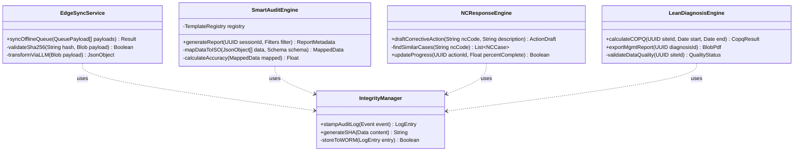
```mermaid
classDiagram
    class EdgeSyncService {
        +syncOfflineQueue(QueuePayload[] payloads) Result
        -validateSha256(String hash, Blob payload) Boolean
        -transformViaLLM(Blob payload) JsonObject
    }
    
    class SmartAuditEngine {
        -TemplateRegistry registry
        +generateReport(UUID sessionId, Filters filter) ReportMetadata
        -mapDataToISO(JsonObject[] data, Schema schema) MappedData
        -calculateAccuracy(MappedData mapped) Float
    }
    
    class NCResponseEngine {
        +draftCorrectiveAction(String ncCode, String description) ActionDraft
        -findSimilarCases(String ncCode) List~NCCase~
        +updateProgress(UUID actionId, Float percentComplete) Boolean
    }
    
    class LeanDiagnosisEngine {
        +calculateCOPQ(UUID siteId, Date start, Date end) CopqResult
        +exportMgmtReport(UUID diagnosisId) BlobPdf
        -validateDataQuality(UUID siteId) QualityStatus
    }
    
    class IntegrityManager {
        +stampAuditLog(Event event) LogEntry
        +generateSHA(Data content) String
        -storeToWORM(LogEntry entry) Boolean
    }

    EdgeSyncService ..> IntegrityManager : uses
    SmartAuditEngine ..> IntegrityManager : uses
    NCResponseEngine ..> IntegrityManager : uses
    LeanDiagnosisEngine ..> IntegrityManager : uses
```

---

**— END OF DOCUMENT —**
