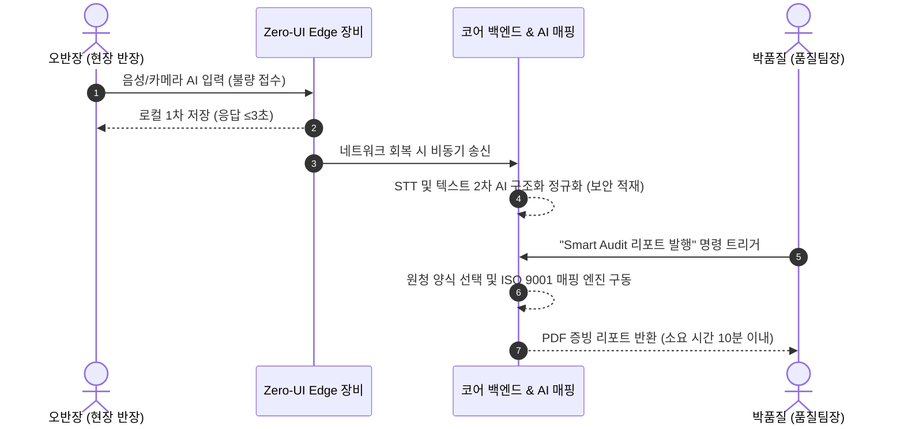
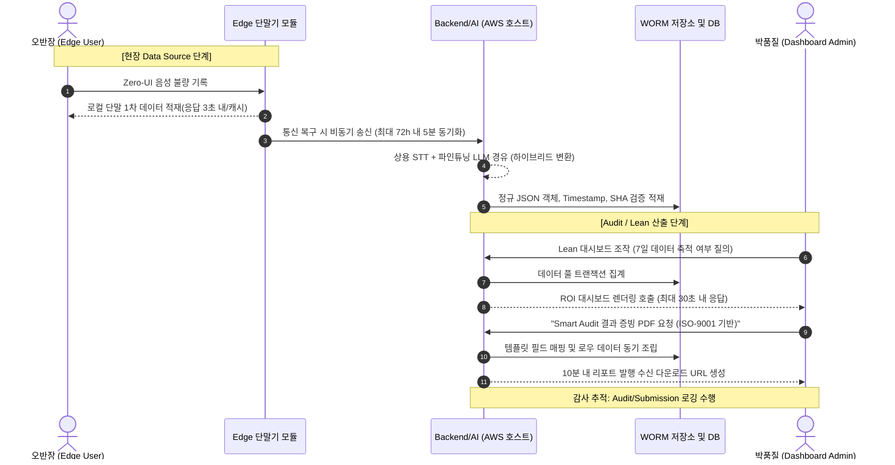

# Software Requirements Specification (SRS)
Document ID: SRS-001
Revision: 1.0
Date: 2026-04-15
Standard: ISO/IEC/IEEE 29148:2018

-------------------------------------------------
## 1. Introduction

### 1.1 Purpose
본 문서의 목적은 반도체 소부장 SME(중소·중견기업)가 ISO 인증 심사(Audit) 및 현장 데이터 품질 관리 시 겪는 문서 작업 문제를 해결하는 PRO ILI SMART 시스템의 소프트웨어 요구사항을 정의하는 것이다. 구체적으로 Audit 대응 문서 작업 120시간 투입, 80% 이상의 현장 데이터 입력 거부율, COPQ(저품질 비용)로 인한 20~30%의 영업이익 잠식을 최소화하기 위한 자동화, AI 인식 기반의 디지털 혁신 요구사항을 명시한다.

### 1.2 Scope
본 프로젝트는 시스템의 자동 매핑, Zero-UI 입력, 모니터링 대시보드 구축을 포함한다. 측정 가능한 범위는: Audit 리포트 생성 시간 10분 이하 단축, 현장 데이터 정합성 95% 향상, 시범 사업장 30일 이내 ROI 증명, 향후 Audit 프리패스율 90% 이상 확보를 포함한다.

**In-Scope:**
- Smart Audit 엔진: ISO 9001 양식 자동 매핑 핵심 시스템 (Sprint 1 개발 후 ISO 14001/45001 확장)
- Zero-UI 수집기: 음성 인식(STT) 코어 기반 데이터 입력 (Sprint 1 개발 후 비전 AI 확장)
- Lean 진단 도구: 생산 데이터 기반 COPQ 대시보드 시각화
- 긴급 NC 시정 패키지: 부적합 사항 접수 시 대응 계획 초안 제공
- 데이터 무결성 시스템: 불변 감사 로그, 타임스탬프 기록

**Out-of-Scope:**
- 글로벌 벤더 등록 가속기: 해외 팹 인증 체크리스트 자동 매핑 (Phase 2 계획)
- XAI 신호등 뷰어: AI 설명 가능성 보강 대시보드 (Phase 2 계획)
- 공급망 리스크 예측: 원재료 파급력/수요 리스크 딥러닝 탐지 엔진 (Phase 3 계획)
- 보조금 매핑 도우미: 시스템 내장 정책 지원 매칭 기능
- 다국어 지원: 초기 핵심 버전은 한국어로 진행되며 타 국가 언어 지원 제외

### 1.3 Definitions, Acronyms, Abbreviations
- **Zero-UI**: 데이터 입력을 위해 키보드, 태블릿 화면을 최소한으로 터치하고 음성(STT), 비전 AI 등을 기반으로 기록을 남기는 시스템 인터페이스.
- **COPQ (Cost of Poor Quality)**: 불량, 대기열 지연, 재작업, 과잉 생산 등으로 인해 영업이익을 잠식하는 숨겨진 무형의 낭비 비용(히든 팩토리 비용).
- **NC (Non-Conformance)**: 원청 검사 및 외부 기관 감사 과정에서 부적합 판정되어 공식적으로 통보된 품질 위반 사유.
- **JTBD (Jobs to be Done)**: 사용자가 처한 구체적 상황 내에서 본질적으로 해결해야만 하는 과업(예: '서류 지옥 없이 10분 내에 Audit 대응을 끝마치고 싶다').
- **AOS (Adjusted Opportunity Score) / DOS**: 시스템 도입으로 해결 가능한 잠재적 시장 문제의 깊이와 절실함을 평가하는 지수.
- **Validator (검증자)**: 시스템의 도입 후 파일럿 성과 달성(AC, ROI 등 달성 여부)을 직접 승인하는 담당자 단계적 그룹.

### 1.4 References
본 문서는 다음의 PRD 데이터 및 사전 자료에 근거하여 작성되었다 (Source of Truth).
- **REF-01**: PRD_PRO-ILI-SMART_v0.1.md
- **REF-02**: 06_Value-proposition-sheet_260410(final).md

## 2. Stakeholders
- **박품질 (본 시스템 Champion / 품질관리 팀장)**
  - 역할 및 책임: 시스템의 최종 산출물을 관리하고, 원청 Audit 심사 시 전담 대응팀장 역할을 수행한다.
  - 관심사: 최소한의 시간에 필수 항목이 100% 매핑된 Audit 리포트를 생성하여, 야근 시간을 단축하고 무결점 심사를 통과한다.
- **정태식 (본 시스템 Decider / SME 대표이사)**
  - 역할 및 책임: 솔루션의 도입 여부를 결정하고 NC 통보 시 거래 중단 등 주요 위기 상황에 예산을 투입해 대처한다.
  - 관심사: 시스템의 LTV/CAC ROI가 30일 이내에 실질적으로 창출(손실비용 절감)되는지 확인하고 공급사 자격을 방어한다.
- **오반장 (본 시스템 End-User / 현장 반장)**
  - 역할 및 책임: 현장에서 가동, 운영하며 Zero-UI(음성, 사진)를 통해 원본 데이터를 시스템에 입력한다.
  - 관심사: 장갑을 끼고 오염된 환경에 처한 상태에서도 랩톱/단말기 조작의 마찰 없이 업무 흐름을 유지하며 입력한다.
- **김도약 (Visionary / 해외진출 추진 CEO)**
  - 역할 및 책임: 글로벌 표준 체계를 내재화하여 TSMC, 인텔 등 해외 팹 진입 영업 활동을 주도한다.
  - 관심사: 해외 등록 조건 체크리스트 매핑과 글로벌 인증 기반 레퍼런스를 확립한다.

## 3. System Context and Interfaces

### 3.1 External Systems
- 혁신바우처 질의망 (정부 API): 지원금 한도와 매칭 정보 호출(체감가 관리용).
- Cloud Infrastructure (AWS / GCP 등): 비동기 데이터 큐 및 Event DB와 확장 가능한 컨테이너 컴퓨팅 호스팅.

### 3.2 Client Applications
- **현장 Edge 디바이스 어플리케이션**: 산업용(IP65+) 태블릿 등으로, 오프라인 시에도 72시간 큐잉 저장 및 음성/이미지 비전 1차 처리를 담당.
- **Web Manager Dashboard**: SaaS 형태로 구성되어 경영자/품질팀장이 접속하는 관리 콘솔. COPQ 및 NC 현황 확인과 리포트 출력 지원.

### 3.3 API Overview
- `Audit Report API`: 수집 데이터를 기반으로 템플릿에 맞춘 PDF Audit 증빙을 동기/비동기 생성.
- `Zero-UI Edge API`: Edge 기기에서 Cloud 백엔드로 Payload 동기화 진행.
- `NC Response API`: NC 케이스 초기 시정 계획 작성 지원.
- `Lean Diagnosis API`: 가공된 COPQ 로그 통계를 대시보드용으로 응답.
- `Template Registry API`: 다양한 원청 맞춤 ISO 양식 템플릿 관리.

### 3.4 Interaction Sequences

## 4. Specific Requirements

### 4.1 Functional Requirements

| ID | Priority | Source Story | Requirement Description | Acceptance Criteria (AC) |
|:---|:---|:---|:---|:---|
| REQ-FUNC-001 | Must | Story 3.1 | [Smart Audit] 시스템은 50건 이상 실데이터가 축적된 상황에서, 사용자의 Audit 버튼 요청 시 10분 내에 ISO 9001 증빙 리포트를 자동 생성해야 한다. | Given: 데이터 ≥50건 적재 When: 리포트 생성 버튼 클릭 Then: ISO9001 양식 리포트가 ≤10분 내 PDF 반환 (생성 실패율 <0.5%) |
| REQ-FUNC-002 | Must | Story 3.1 | [Smart Audit] 생성된 Audit 리포트는 원청 심사 시 필수 항목이 완전히 포함되며, 로우 데이터 매핑이 누락 없이 보장되어야 한다. | Given: 리포트 생성 완료 When: 원청 심사관 검증 Then: 누락률=0%, 매핑 정확도≥99% |
| REQ-FUNC-003 | Must | Story 3.1 | [Smart Audit] 과거 3개월분의 시스템 데이터에 기초해 주요 품질 지표 트렌드 통계와 이상 징후 분석 섹션을 리포트에 포함시킬 수 있어야 한다. | Given: 과거 3개월 데이터 존재 When: 트렌드 분석 요약 요청 Then: 지표 트렌드 포함 및 이상탐지 정밀도≥90% |
| REQ-FUNC-004 | Must | Story 3.1 | [Smart Audit] 삼성/SK 등 복수 원청의 서식 템플릿을 선택하여, 즉시 대상 양식에 맞춘 데이터 재매핑을 제공하여야 한다. | Given: 복수 커스텀 템플릿 확보 When: 특정 원청 양식 선택 지정 Then: 양식 매핑 오류율 <1% 내 렌더링 반환 |
| REQ-FUNC-005 | Must | Story 3.2 | [NC 시정] 등록된 외부 NC 통보 사유를 파싱하여, 즉시 적합한 긴급 시정 조치 계획서 초안을 문서로 생성/배포해야 한다. | Given: NC 통보 사유 입력 완료 When: 긴급 시정 조치 플랜 생성 요청 Then: 문건 ≤5분 내 반환, 커버리지≥95% |
| REQ-FUNC-006 | Must | Story 3.2 | [NC 시정] 사용자는 현재 진행 중인 각 NC별 개선 활동 진척도를 30초 내로 동기화 반영되는 대시보드 상태표를 통해 열람한다. | Given: 시정 조치 진행 환경 When: 대시보드 진행률 확인 Then: 전체 완료율이 지연 ≤30초 내 실시간 갱신 표기 |
| REQ-FUNC-007 | Must | Story 3.2 | [NC 시정] 최종 완료된 단위 시정 건에 대하여 조치 전후에 대한 비교 화면을 시각화하고 완전한 타임스탬프와 무결성이 포함된 보고서를 렌더링해야 한다. | Given: 시정 완료 후 데이터 축적 When: 제출용 보고서 생성 클릭 Then: 비교치 및 데이터 타임스탬프/해시값=100% 무결 기록 |
| REQ-FUNC-008 | Must | Story 3.3 | [Zero-UI] 사용자가 80dB 소음 구간에서 음성을 통해 시스템에 명령/기록할 때 즉각적인 Edge-level AI가 이를 판별하여 데이터로 변환해야 한다. | Given: 80dB 환경 음성 명령 When: 불량 기록 명령 발화 Then: 인식 정확도≥92%, 로컬 완료까지 지연 ≤3초 |
| REQ-FUNC-009 | Must | Story 3.3 | [Zero-UI] Edge 카메라 하드웨어 연동으로 대상 부품 이미지 포착 시 객체 ID 및 외관 상태를 판별하는 Vision AI 처리를 수행한다. | Given: 촬영 모듈 활성화 When: 카메라로 피사체 추적/비춤 Then: 부품인식 판단확률≥90%, 완료 지연 ≤2초 |
| REQ-FUNC-010 | Must | Story 3.3 | [Zero-UI] Edge 환경 단절(오프라인 망) 진입 시 데이터를 자체 로컬 캐싱하고, 복구 시 5분 내 전체 백엔드 데이터베이스로 자동 업로드한다. | Given: 장비 오프라인(망단절) When: 데이터 입력 Then: 5분 내 동기화 보장(오류없는 유실율=0%) |
| REQ-FUNC-011 | Could | Story 3.4 | [벤더 도구] 사용자 조직이 진입 희망 팹(TSMC 등)을 지정하면 필수 요구 인증과 점검 항목을 매핑하는 체크리스트 템플릿을 생성한다. (Phase 2) | Given: 대상 글로벌 팹 지정 When: 요구사항 매핑 버튼 클릭 Then: 체크리스트 ≤30초 내 반환, 누락률<3% |
| REQ-FUNC-012 | Could | Story 3.4 | [벤더 도구] 자체 평가된 체크리스트 진행 내역을 토대로 향후 투자 소요 기간, Gap 델타를 분석하여 경영 리포티로 반환해야 한다. (Phase 2) | Given: 준비 상태 파라미터 입력 시 When: Gap 결과 리포트 요청 Then: ≤60초 산출반환 |
| REQ-FUNC-013 | Could | Story 3.4 | [벤더 도구] 해소된 Gap을 기준으로 글로벌 IATF/ISO 증빙 요구조건을 모두 포함하는 포괄 승인 제출 패키지를 묶음 반환한다. (Phase 2) | Given: 모든 Gap 해소 시 When: 증빙 종합 패키지 다운로드 지정 Then: 포맷 오류 0건의 기준 충족 본 반환 |
| REQ-FUNC-014 | Must | Story 3.5 | [Lean 진단] 코어 백엔드에 7일분 이상의 데이터가 있을 때 낭비 금액(COPQ 4대 종류)을 자동 환산 시각화 지표로 대시보드에 뿌려주어야 한다. | Given: 최소 7일 생산 데이터 소유 When: COPQ 요약 진단 호출 Then: 금액 환산 차트 ≤30초 표시(정확도≥85%) |
| REQ-FUNC-015 | Must | Story 3.5 | [Lean 진단] 제품 도입 이후(30일 경과) 비교 기준에 따라 ROI가 투자 회수 수준으로 양수 도달 일수를 산정하여 보고서에 나타내어야 한다. | Given: 도입 후 30일 경과 데이터 확보 When: ROI 트렌드 지표 요청 Then: 대상 기간 양수 달성 추이 포함 그래프 생성 |
| REQ-FUNC-016 | Must | Story 3.5 | [Lean 진단] 진단 결과의 외부 배포 및 경영층 서면 보고를 위하여 월간 추이 및 그래프가 결합된 요약형 PDF 형식의 다운로드를 지원한다. | Given: 웹 환경 When: 경영진 전용 PDF Export 요청 Then: ≤60초 내 파일 변환 |
| REQ-FUNC-017 | Must | Story 3.5 | [Lean 진단] 초기 데이터가 7일 미만이거나 허용 이상치(30%)를 초과할 시, 도출을 멈추고 구체적인 제한 사유 경고 배너를 응답해야 한다. | Given: 7일 미만 또는 30% 이상 불량치 포맷 발견 When: COPQ 실행 Then: "유의미성 부족/데이터 품질 경고 배너" 전시 |
| REQ-FUNC-018 | Must | Story 3.5 | [Lean 진단] COPQ 진단 파라미터 및 주요 ROI 로직 값의 변경이나 다운로드가 일어날 경우 로깅 시스템은 불변 기록을 반드시 적재한다. | Given: 관리자 변수 변경/출력 등 트리거 존재 When: 관련 버튼 저장/다운로드 확인 Then: AUDIT_LOG 및 SUBMISSION_LOG에 위변조방지 기록(SHA) 생성 |

### 4.2 Non-Functional Requirements

| ID | 범주 | 비기능 요구 사항 (성능 지표 및 임계 조건) |
|:---|:---|:---|
| REQ-NF-001 | 성능 | Smart Audit 엔진의 PDF 통합 리포트 생성 응답은 95% 구간(p95) 내 지연 한계 ≤ 600초(10분)를 유지해야 한다. |
| REQ-NF-002 | 성능 | Edge 디바이스 상 Zero-UI 음성 인식 명령 처리는 p95 지연 한계 ≤ 3초 이내에 결과를 사용자에게 나타내거나 다음 루프로 제어해야 한다. |
| REQ-NF-003 | 성능 | Edge 환경에서의 Zero-UI 카메라 이미지 비전 인식 처리는 p95 지연 한계 ≤ 2초 내에 완료되어야 한다. |
| REQ-NF-004 | 성능 | NC 시정 데이터 역추적 및 계획 초안 텍스트 생성의 p95 지연 한계는 ≤ 300초(5분) 여야 한다. |
| REQ-NF-005 | 성능 | 관제 화면을 구성하는 실시간 Web 대시보드의 데이터 갱신 한계 시간은 최대 30초 이어야 한다. |
| REQ-NF-006 | 가용성 | 전체 플랫폼 시스템 가용 수준(SLA Uptime)은 월 단위 감시 기준 ≥ 99.5% 이상 보장해야 한다. |
| REQ-NF-007 | 품질 | Audit 리포트 생성 과정에서의 필수 항목 오류 누락률 0개를 향해야 하며, 생성 실패율 자체가 발생 기준 < 0.5% 구조를 확보해야 한다. |
| REQ-NF-008 | 무결성 | 오프라인 캐시 된 Edge의 클라우드 복원 동기화 시, Payload 단위 유실율 조건은 무조건 = 0%로 확보해야 한다 (망단절 강건성). |
| REQ-NF-009 | 무결성 | 외부 실사 및 공인 심사관에 제출하는 파일과 시스템 로그에는 타임스탬프와 SHA 기반 100% 탐지 무결성 장치가 포함되어 증빙 효력을 유지해야 한다. |
| REQ-NF-010 | 보안 | 데이터베이스 저장(REST 등) 데이터는 AES-256 규격, In-Flight 전송 데이터 등은 외부 통신망의 경우 TLS 1.3 기반 프로토콜 보호를 강제한다. |
| REQ-NF-011 | 보안/감사 | RBAC를 통한 논리적 격리를 유지하고, 90일 단위 암호 키 로테이션 준수 및 변경 불가 속성의 DB 백업을 활용, 최소 3년간 보존 가능한 아키텍처를 채택한다. |
| REQ-NF-012 | 비용/제약 | 인프라 SaaS 구축 비용 구조: Edge 디바이스 노드당 ≤ 50만원 구매 내로 처리, 클라우드 운영비 월 ≤ $50/고객당 이하로 유지해야 비용 건전성(최종가 기준 월 12만원)을 맞춘다. |
| REQ-NF-013 | 가용성/DR | 클라우드 재해 발생 및 백업 규정을 위해 RPO ≤ 1시간, RTO ≤ 4시간의 복구 목표를 달성할 수 있도록 AWS 등 Multi-AZ에 교차 백업 되어야 한다. |
| REQ-NF-014 | 모니터링 | Grafana/Datadog 기반 SLI 에러 버짓 모니터링을 상시화하고, 5단계 에스컬레이션 정책 하에 Critical 오류는 CTO 1h Alert 체제를 구동시켜야 한다. |
| REQ-NF-015 | 스케일링 | 사업장별 서버가 분리/분할 구성되어 있으나, 단일 사업장 내 1대 테넌트당 지원되어야 하는 동시 접속 사용자 병목 처리 한계는 최소 ≥ 50명을 충족해야 한다. |

## 5. Traceability Matrix

| Source Story | Requirement ID (Functional & Non-Functional) | Test Case ID |
|:---|:---|:---|
| Story 3.1 (Smart Audit) | REQ-FUNC-001, REQ-FUNC-002, REQ-FUNC-003, REQ-FUNC-004 | TC-SA-001 ~ 004 |
| Story 3.2 (NC 시정) | REQ-FUNC-005, REQ-FUNC-006, REQ-FUNC-007 | TC-NC-001 ~ 003 |
| Story 3.3 (Zero-UI) | REQ-FUNC-008, REQ-FUNC-009, REQ-FUNC-010 | TC-UI-001 ~ 003 |
| Story 3.4 (벤더 등록) | REQ-FUNC-011, REQ-FUNC-012, REQ-FUNC-013 | TC-VD-001 ~ 003 |
| Story 3.5 (Lean 진단) | REQ-FUNC-014, REQ-FUNC-015, REQ-FUNC-016, REQ-FUNC-017, REQ-FUNC-018 | TC-LN-001 ~ 005 |
| - | REQ-NF-001 ~ REQ-NF-015 (성능, 보안, 모니터링 등) | TC-NFR-001 ~ 015 |

## 6. Appendix

### 6.1 API Endpoint List

| Component API | 설명 / 대상 | 주요 제약 사항 |
|:---|:---|:---|
| `Audit Report API` | `session_id`, `data_filter` 입력 → PDF Audit 리포트 발행본 및 메타데이터 반환 | 데이터 Payload 처리 제한 ≤50MB. 생성 대기시간 ≤600초 보장 |
| `Zero-UI Edge API` | 내부 Edge 오디오(WAV), 이미지 처리 후 Cloud 수신 / 데이터 JSON 출력 반환 | Edge 단독 오프라인 로컬 처리 허용. 최고 72시간 큐 보관 |
| `NC Response API` | `nc_id` 및 사유 데이터 입력 → 시정 조치 초안 진행 상태 반환 및 계획서 출력 | Critical 심각도의 경우 24h 내 제출 프로세스 대응 연계 |
| `Lean Diagnosis API` | `site_id` 조회 조건 적용 → 낭비/COPQ JSON 통계 및 ROI 트렌드 데이터 리턴 | 최소 7일 이상의 통계 데이터 필수. 산출 계산 정확도 목표 ≥85% |
| `Template Registry API` | 외부 원청 Audit 양식의 템플릿(ISO9001/14001 등) 코드 JSON XML 저장소 연결 | 유연한 양식 관리. 지속적인 업데이트 API 오픈 지원 |

### 6.2 Entity & Data Model

| Entity 이름 | 맵핑 필드 (Data Properties) | Key 제약 조건 |
|:---|:---|:---|
| **SITE** | site_id (uuid), company_name (string), employee_count (int), industry_sector (string), certifications (array) | PK: site_id |
| **RAW_DATA** | data_id (uuid), site_id (uuid), source_type (enum: voice/vision/sensor/manual), payload (blob), collected_at (timestamp), device_id (string), hash_sha256 (string) | PK: data_id FK: site_id |
| **AUDIT_SESSION** | session_id (uuid), site_id (uuid), audit_type (enum: ISO9001, 14001 등), auditor_org (string), scheduled_date (date) | PK: session_id FK: site_id |
| **AUDIT_REPORT** | report_id (uuid), session_id (uuid), pdf_content (blob), generation_time_sec (int), mapping_accuracy_pct (float), generated_at (timestamp) | PK: report_id FK: session_id |
| **NC_CASE** | nc_id (uuid), site_id (uuid), nc_code (string), description (string), severity (enum), notified_at (date), deadline (date) | PK: nc_id FK: site_id |
| **CORRECTIVE_ACTION** | action_id (uuid), nc_id (uuid), action_description (string), status (enum), completion_pct (float), updated_at (timestamp) | PK: action_id FK: nc_id |
| **LEAN_DIAGNOSIS** | diagnosis_id (uuid), site_id (uuid), copq_amount_krw (float), roi_days (float), waste_breakdown (json), diagnosed_at (timestamp) | PK: diagnosis_id FK: site_id |

### 6.3 Detailed Interaction Models

