# Software Requirements Specification (SRS)

## 0. 문서 개요 (Document Overview)

| 항목 | 내용 |
|:---|:---|
| **프로젝트명** | PRO ILI SMART — 스마트 제조 품질혁신 플랫폼 |
| **기준문서 (Base Document)** | PRD_v0.1.md |
| **작성일 (Date)** | 2026-04-18 |
| **작성기준 (Standard)** | ISO/IEC/IEEE 29148:2018 — 시스템 및 소프트웨어 엔지니어링 요구사항 엔지니어링 |
| **Owner** | PRO ILI 기술팀 (Tech Lead) |

-------------------------------------------------

## 1. Introduction

### 1.1 Purpose (목적)

본 SRS 문서는 중소·중견 제조기업(반도체 소부장 등)의 품질 관리 및 인증 대응 업무를 혁신하는 **PRO ILI SMART (스마트 제조 품질혁신 플랫폼)** 시스템의 소프트웨어 요구사항을 ISO/IEC/IEEE 29148:2018 표준에 준거하여 정의한다.

본 시스템의 핵심 목적은 현장의 수기 데이터를 Zero-UI(음성/비전)로 디지털화하고, AI 기반 문서 자동 매핑을 통해 원청 심사(Audit) 및 부적합(NC) 대응에 소요되는 시간과 비용(COPQ)을 획기적으로 감축하는 데 있다. 

이러한 문제 배경을 해결하기 위해 본 시스템은 현장 작업자의 데이터 수집 마찰을 줄이고, 관리자의 품질 비용(COPQ) 가시화를 도우며, 합리적인 클라우드 구독형 비용으로 도입할 수 있는 방향성을 갖는다. 
*(구체적인 목표 수치 및 지표는 **4.2 Non-Functional Requirements**의 검증 기준으로 상세 정의한다.)*

본 문서는 목표 달성을 위해 개발팀, QA팀, 프로젝트 관리자 및 이해관계자가 시스템 구현·검증·인수 시 참조하는 유일한 기술 요구사항 원천(Single Source of Truth)이다.

### 1.2 Scope

본 시스템은 제조기업의 품질 관리 및 Audit 대응을 위해 다음의 핵심 기능을 지원한다. 본 시스템은 **100% 온라인 웹앱 기반**으로 작동하며, 별도의 오프라인 데이터 로컬 동기화 기능은 포함하지 않는다.

1. **Smart Audit 엔진:** 기존 수기 데이터 및 Zero-UI로 수집된 데이터를 기반으로, ISO 및 원청 커스텀 양식에 맞는 증빙 리포트를 자동 매핑 및 생성한다.
2. **긴급 NC 시정 패키지:** 원청으로부터 통보된 부적합(NC) 사유를 파싱하여, 신속하게 시정 조치 계획서 초안을 제공하고 진행률을 추적한다.
3. **Zero-UI 수집기:** 현장의 소음·오염 환경에서도 원활한 입력이 가능하도록 실시간 클라우드 연동 기반 음성(STT) 및 비전 AI 데이터 수집을 지원한다.
4. **Lean 진단 도구:** 축적된 생산/품질 데이터를 분석하여 COPQ 4대 낭비를 금액으로 환산하고, ROI 트렌드 대시보드를 제공한다.
5. **데이터 무결성 시스템:** 위변조 방지를 위한 **Insert-only 방식의 클라우드 DB 감사 로그** 및 RBAC 권한 관리를 지원한다.
6. **기준정보 벌크 업로드 (Bulk Import):** CSV/Excel 파일을 이용하여 제품·BOM·공정 등 대량의 기준정보를 일괄 등록하는 기능을 제공한다.

*(Sprint 범위 및 개발 일정은 §1.2.1 Sprint Slice 로드맵을 참조한다.)*

#### 1.2.1 Sprint 1 Core Slice

본 프로젝트는 4인 개발팀 기준 2주 단위 Sprint로 진행한다. Sprint 1(Slice-1)에서 E2E 최소 검증 가능한 Core Slice를 우선 구현한다.

**Slice-1 범위 (Sprint 1 · 2주 · 4인)**

| REQ ID | 기능 | 담당 |
|:---|:---|:---|
| REQ-FUNC-001 | Audit 리포트 PDF 일괄 생성 | S-5a |
| REQ-FUNC-002 | 원청 양식 자동 매핑 엔진 | S-5c |
| REQ-FUNC-011 | 음성 기반 불량 접수 입력 (Online) | S-5b |
| REQ-FUNC-025 | Insert-only 방식 클라우드 DB 감사 로그 | S-5d |
| REQ-FUNC-026 | 역할 기반 접근 제어(RBAC) UI | S-5a |
| REQ-FUNC-030 | CSV/Excel 기준정보 일괄 업로드 (Bulk Import) | S-5b |

**Slice 2~4 로드맵**

| Sprint | 범위 | 주요 REQ |
|:---|:---|:---|
| Sprint 2 (Slice-2) | NC 시정 + Vision AI | REQ-FUNC-006~010, 012, 014, 015 |
| Sprint 3 (Slice-3) | Lean 진단 + AI 거버넌스 | REQ-FUNC-019~023, REQ-FUNC-AI-001~008 |
| Sprint 4 (Slice-4) | 마무리 및 최적화 | REQ-FUNC-016~018, REQ-FUNC-INT-003~005 |

#### 1.2.2 Out-of-Scope

| # | 기능 | MoSCoW | 배치 계획 | 비고 |
|:---:|:---|:---:|:---|:---|
| O-1 | XAI 신호등 뷰어 — AI 설명 가능성 보강 대시보드 | Should | Phase 2 (2스프린트) | SHAP/LIME 통합 + UI 별도 개발 필요 |
| O-2 | 글로벌 벤더 등록 가속기 — 해외 팹 인증 체크리스트 자동 매핑 | Could | Phase 2 (2스프린트) | 팹 DB 구축 선행 필요 |
| O-3 | 보조금 매핑 도우미 — 정부 API 연동 지원금 매칭 | Could | 시간 여유 시 (1스프린트) | 정부 API 연동 5MD |
| O-4 | 공급망 리스크 예측 — 원재료 파급력/수요 딥러닝 탐지 | Won't | Phase 3 | 장기 로드맵 |
| O-5 | 다국어 지원 — 초기 버전은 한국어 전용 | Won't | Phase 2+ | Phase 1 UI·시스템 UX는 한국어 전용. 단, PIPA 동의 폼만 법적 필수로 5개 언어(한/영/베트남/네팔/캄보디아) 지원 — 4.2.10.1 참조 |
| O-6 | 기존 시스템 연동 (ERP/MES) | Could | Phase 2 | API 기반 실시간 동기화 (Phase 1은 Bulk Import로 대체) |

#### 1.2.3 Constraints / Assumptions

본 시스템은 MVP 단계의 구축 비용을 $0로 최소화하고 개발 효율을 극대화하기 위해 다음의 7가지 핵심 기술 제약사항(C-TEC)을 준수한다.

| ID | 기술 제약사항 | 핵심 방향 |
|:---|:---|:---|
| **C-TEC-001** | Next.js (App Router) | 단일 통합 풀스택 프레임워크 사용 (프론트/백엔드 분리 제거) |
| **C-TEC-002** | Server Actions / Route Handlers | REST API 서버 대신 프레임워크 내장 데이터 처리 기능 활용 |
| **C-TEC-003** | Prisma + SQLite / Supabase | 로컬 SQLite 개발 및 프로덕션 Supabase(PostgreSQL) 전환 아키텍처 |
| **C-TEC-004** | Tailwind CSS + shadcn/ui | AI 코드 생성 일관성을 위한 디자인 시스템 고정 |
| **C-TEC-005** | Vercel AI SDK | Next.js 내부에서 AI 오케스트레이션 및 스트리밍 처리 |
| **C-TEC-006** | Gemini API Multimodal | STT/Vision/텍스트 처리를 Gemini API 하나로 통합 연동 |
| **C-TEC-007** | Vercel Git Push 자동 배포 | 인프라 설정 최소화 및 CI/CD 자동화 |
| **C-TEC-008** | Vercel Hobby Timeout (60s) | 서버리스 함수 실행 한계(60초) 내 최적화 및 스트리밍 활용 |

상세한 기술 제약 및 리스크 해결 방안은 **3.6 Resolved Architecture** 및 **Appendix C**를 참조한다. PRD는 비즈니스 배경 문서로서 참조용이며, 기술 제약·리스크의 최종 권위는 본 SRS에 있다.

### 1.3 Definitions, Acronyms, Abbreviations

| 용어 | 정의 |
|:---|:---|
| **Zero-UI** | 키보드·터치 입력을 최소화하고 음성(STT), 비전 AI 등을 기반으로 데이터를 기록하는 시스템 인터페이스 |
| **COPQ (Cost of Poor Quality)** | 불량, 대기열 지연, 재작업, 과잉 생산 등으로 인해 영업이익을 잠식하는 숨겨진 낭비 비용(히든 팩토리 비용) |
| **NC (Non-Conformance)** | 원청 검사 및 외부 기관 감사 과정에서 부적합 판정되어 공식 통보된 품질 위반 사유 |
| **JTBD (Jobs to be Done)** | 사용자가 처한 구체적 상황 내에서 본질적으로 해결해야 하는 과업 |
| **AOS (Adjusted Opportunity Score)** | 시스템 도입으로 해결 가능한 잠재적 시장 문제의 깊이와 절실함을 평가하는 지수 |
| **DOS (Discovered Opportunity Score)** | 탐색된 기회의 크기를 평가하는 보조 지수 |
| **Validator (검증자)** | 시스템 도입 후 파일럿 성과 달성(AC, ROI 등) 여부를 직접 승인하는 담당자 그룹 |
| **STT (Speech-to-Text)** | 음성 신호를 텍스트 데이터로 변환하는 기술 |
| **Insert-only Audit Log** | 한 번 기록하면 변경이 불가능하도록 설계된 추가 전용(Append-only) 방식의 감사 로그 |
| **SLA (Service Level Agreement)** | 서비스 수준 협약. 시스템 가용성 보장 목표 |
| **p95** | 전체 요청의 95번째 백분위 응답 시간(상위 5%를 제외한 최대 지연) |
| **MoSCoW** | Must / Should / Could / Won't 우선순위 분류 체계 |
| **MVP (Minimum Viable Product)** | 핵심 가치 검증을 위한 최소 기능 제품 |
| **LTV:CAC** | 고객 생애 가치 대비 고객 획득 비용 비율 |
| **DPO** | Data Protection Officer (데이터 보호 책임자), 개인정보 보호 책임 및 감독기관 접점 |
| **DPIA / PIA** | Data Protection Impact Assessment (개인정보 영향평가) |
| **SCC** | Standard Contractual Clauses (표준 계약 절차), GDPR 데이터 역외 이전용 |
| **가명정보** | 추가 정보의 사용·결합 없이는 특정 개인을 알아볼 수 없게 조치한 정보 |
| **Cryptographic Erasure** | 암호화 키 파기를 통해 데이터를 복호화할 수 없도록 만들어 영구 삭제와 동일한 효과를 내는 논리적 삭제 기법 |
| **Outcome Coverage** | 시스템 도입을 통해 달성해야 하는 Desired Outcome(목표 결과)이 실제 시스템 기능 및 지표에 의해 커버되는 비율 |

### 1.4 MVP Value Preservation Assessment (MVP 가치 보존 검토)

새로운 기술 스택(C-TEC-001 ~ 007) 적용이 MVP의 핵심 가치에 미치는 영향을 검토한 결과, 사용자 경험의 훼손 없이 오히려 가치가 극대화되는 것으로 확인되었다.

| 핵심 사용자 경험 (MVP 가치) | 기존 아키텍처 방식 | 새로운 기술 스택 (Vercel/Supabase/Gemini) | 검토 결과 |
| :--- | :--- | :--- | :---: |
| **1. Zero-UI 현장 수집** | 별도 Python AI 서버(STT/Vision) 거침 | **Vercel AI SDK + Gemini Multimodal** 직접 연동 | **[향상]** 응답 속도 단축 |
| **2. Smart Audit 자동화** | 생성 완료 시까지 로딩 스피너 대기 | **Vercel AI SDK UI Streaming** 적용 | **[향상]** 실시간 생성 과정 노출 |
| **3. 데이터 무결성 보장** | AWS S3 Object Lock 등 복잡한 설정 | **Supabase RLS + Insert-only 감사 로그** | **[유지]** 복잡도 감소, 보안 동일 |
| **4. 초저비용 도입 (ROI)** | AWS Fargate/RDS 등 고정비 발생 | **Vercel + Supabase Free Tier ($0)** | **[극대화]** 초기 인프라 비용 $0 달성 |
| **5. 유지보수 및 확장성** | 프론트/백엔드/AI 인프라 분절 관리 | **Next.js 단일 통합 코드베이스** | **[향상]** 개발 및 운영 속도 가속 |

---

## 2. Stakeholders

| # | 이름 (페르소나) | 역할 (Role) | 책임 (Responsibility) | 관심사 (Interest) |
|:---:|:---|:---|:---|:---|
| S-1 | **박품질** | Champion / 품질관리 팀장 | 시스템 최종 산출물 관리, 원청 Audit 심사 전담 대응 | 최소 시간 내 필수 항목 100% 매핑 Audit 리포트 생성, 야근 단축, 무결점 심사 통과 |
| S-2 | **정태식** | Decider / SME 대표이사 | 솔루션 도입 결정, NC 위기 상황 예산 투입 의사 결정 | LTV/CAC ROI 30일 내 양수 전환 확인, 공급사 자격 방어 |
| S-3 | **오반장** | End-User / 현장 반장 | 현장 가동·운영, Zero-UI(음성/사진)로 원본 데이터 입력 | 장갑·오염 환경에서 마찰 없는 데이터 입력, 업무 흐름 유지 |
| S-4 | **김도약** | Visionary / 해외진출 CEO | 글로벌 표준 내재화, 해외 팹(TSMC, Intel 등) 진입 영업 주도 | 해외 등록 조건 체크리스트 매핑, 글로벌 인증 레퍼런스 확립 |
| S-5a | Backend/Cloud Engineer | Implementer | 백엔드 API, 데이터베이스, 클라우드 인프라 설계·구현 | 명확한 API 스펙, 스케일링 요구사항 |
| S-5b | Frontend/Edge App Engineer | Implementer | 웹 대시보드, Edge 디바이스 앱 개발 | Zero-UI 인터페이스 요구사항, 오프라인 동기화 사양 |
| S-5c | AI/ML Engineer | Implementer | AI 매핑 엔진, STT/Vision 파이프라인, Model Card/VMP | 모델 성능 지표, Golden Dataset 명세, XAI 요구사항 |
| S-5d | DevOps/QA Engineer | Implementer | CI/CD 파이프라인, 보안 스캔, 테스트 자동화, 인프라 운영 | NFR 검증 자동화, 모니터링 대시보드 |
| S-6 | QA팀 | Verifier | 요구사항 검증, 테스트 수행 | 테스트 가능한 AC, 추적 가능한 요구사항-테스트 매핑 |
| S-7 | 원청 심사관 | External Auditor | ISO 인증 심사 수행, 부적합 판정 | 양식 적합성, 데이터 무결성, 감사 추적 완전성 |
| S-8 | **DPO** (데이터 보호 책임자) | Compliance | 개인정보 보호 및 규제 대응 | PIPA/GDPR 컴플라이언스 준수, 사용자 동의율 및 감사 로그 적법성 검토 |
| S-9 | Validator | Acceptance Authority | 파일럿 성과 달성(AC, ROI 등) 여부를 직접 승인 | 내부: 정태식(S-2) 겸임 / 외부: 원청 심사관(S-7) |

**논리 역할 ↔ 실제 인원 매핑**

| 논리 역할 | 책임 | 실제 겸임 인원 |
|:---|:---|:---|
| 백엔드팀 | API·DB·Cloud | S-5a |
| 프론트엔드/Edge팀 | 웹·모바일·Edge 앱 | S-5b |
| AI팀 | AI 모델·VMP·Golden Dataset | S-5c |
| QA팀 | 테스트·검증·보안 스캔 | S-5d (일부 S-6) |
| DPO | 개인정보 보호 책임 | 외부 자문 계약 또는 대표이사(S-2) 겸임 |
| Compliance | 규제 모니터링 | S-2 + DPO |
| 현장 QA | 사용성 테스트·현장 검증 | S-3 (오반장) + S-6 |
| 재무/사업 | ROI 검증·예산 승인 | S-2 (정태식) |
| 내부 Validator | AC 승인 | S-2 (정태식) 겸임 |
| 외부 Validator | 심사 결과 승인 | S-7 (원청 심사관) |

---

## 3. System Context and Interfaces

### 3.1 External Systems

| # | 외부 시스템 | 연동 방식 | 용도 | 제약 사항 |
|:---:|:---|:---|:---|:---|
| EXT-1 | **혁신바우처 질의망** (정부 API) | REST API / HTTPS | 지원금 한도·매칭 정보 조회 (체감가 관리) | 정부 API 업타임 의존, 응답 지연 가능 |
| EXT-2 | **Cloud Platform** (Vercel + Supabase) | PaaS / BaaS | 웹 호스팅, Serverless API, PostgreSQL DB, Auth 통합 관리 | Next.js App Router 기반 단일 프레임워크 전제 |
| EXT-3 | **Gemini API** (Google) | REST / Vercel AI SDK | 음성(STT), 비전 AI 분석 및 텍스트 파싱/매핑 통합 처리 | Vercel AI SDK 표준 인터페이스 사용. 오디오/이미지 Multimodal 동시 지원. 가명처리 의무 적용. |
| EXT-4 | **모니터링 플랫폼** (Vercel Analytics / Supabase) | 내장 API | SLI 에러 버짓 모니터링, 알림 에스컬레이션 | 5단계 에스컬레이션 정책 준수 |
| EXT-5 | **SAP ERP / 더존 ERP** | REST API (Phase 2) | Master Data 수신 (제품·BOM·공정) | Phase 2 연동 예정. Phase 1은 CSV/Excel Bulk Import로 대체 |
| EXT-6 | **MES (Manufacturing Execution System)** | OPC UA / MQTT (Phase 2) | 생산 실적·공정 파라미터 실시간 수신 | Phase 2 연동 예정 |
| EXT-7 | **기준정보 벌크 업로드** | CSV / Excel 파일 | 초기 기준 정보 및 품질 데이터 일괄 등록 | 사용자 수동 업로드 방식 |

### 3.2 Client Applications

| # | 클라이언트 | 플랫폼 | 대상 사용자 | 주요 기능 |
|:---:|:---|:---|:---|:---|
| CLI-1 | **현장 Edge 디바이스 앱** | 산업용 태블릿 (IP65+) | 오반장 (현장 반장) | Zero-UI 음성/이미지 입력, 실시간 클라우드 전송, 온라인 전용 |
| CLI-2 | **Web Manager Dashboard** | 웹 브라우저 (SaaS) | 박품질 (품질팀장), 정태식 (대표이사) | COPQ/NC 현황 확인, Audit 리포트 생성·출력, Lean 진단 대시보드 |

### 3.3 API & Data Interaction Overview

본 시스템은 Next.js 단일 통합 아키텍처를 채택함에 따라, 외부 노출용 API와 내부 데이터 처리 로직을 **Server Actions 및 Route Handlers**로 구현한다. 

| # | Interaction / Action | 설명 | 주요 입력 | 주요 출력 | 제약 사항 |
|:---:|:---|:---|:---|:---|:---|
| API-1 | `Audit Report Action` | ISO 양식 기반 PDF Audit 증빙 생성 로직 | session_id, template_id | PDF URL, Hash | Vercel AI SDK Streaming 활용 (REQ-NF-001) |
| API-2 | `Zero-UI Transmission` | Edge→Cloud 실시간 데이터 전송 | 오디오, 이미지, device_id | 정규화 JSON | 실시간 처리 (REQ-NF-002/003) |
| API-3 | `NC Response Action` | NC 사유 파싱 및 시정 조치 초안 생성 | nc_id, 사유 텍스트 | 시정 계획서 초안 | Gemini 1.5 Flash 연동 |
| API-4 | `Lean Diagnosis Action` | COPQ 통계 및 ROI 트렌드 데이터 산출 | site_id, 기간 필터 | 낭비/ROI JSON | 정확도 ≥ 85% (REQ-FUNC-019) |
| API-5 | `Template Registry` | 원청별 ISO 양식 템플릿 관리 (DB 조회) | template_id | 템플릿 JSON | 버전 관리 지원 |
| API-6 | `Interop Bridge Handlers` | ERP/MES 연동을 위한 Route Handlers (Phase 2) | adapter_type, auth | 정규화 JSON | Phase 2 구현 예정 |

### 3.4 System Architecture & Use Case Models

#### 3.4.1 Component Diagram
시스템의 인프라스트럭처와 모듈 다이어그램 (Edge-Cloud 및 외부 시스템 연동).

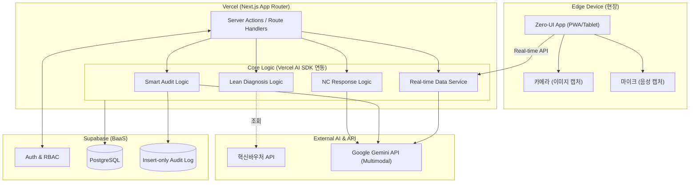
```mermaid
flowchart TB
    subgraph Edge["Edge Device (현장)"]
        UI["Zero-UI App (PWA/Tablet)"]
        Vis_Eng["카메라 (이미지 캡처)"]
        Mic_Eng["마이크 (음성 캡처)"]
        
        UI --> Vis_Eng
        UI --> Mic_Eng
    end
    
    subgraph Cloud["Vercel (Next.js App Router)"]
        API["Server Actions / Route Handlers"]
        
        subgraph CoreEngines["Core Logic (Vercel AI SDK 연동)"]
            AuditEng["Smart Audit Logic"]
            NCEng["NC Response Logic"]
            LeanEng["Lean Diagnosis Logic"]
            SyncServ["Real-time Data Service"]
        end
        
        API --> SyncServ
        API --> AuditEng
        API --> NCEng
        API --> LeanEng
    end
    
    subgraph DB["Supabase (BaaS)"]
        Auth["Auth & RBAC"]
        RDBMS[(PostgreSQL)]
        AuditLog[(Insert-only Audit Log)]
    end
    
    subgraph External["External AI & API"]
        Gov["혁신바우처 API"]
        Gemini["Google Gemini API (Multimodal)"]
    end
    
    UI --Real-time API--> SyncServ
    API <--> Auth
    CoreEngines --> RDBMS
    AuditEng --> AuditLog
    
    SyncServ --> Gemini
    AuditEng --> Gemini
    NCEng --> Gemini
    LeanEng -.조회.-> Gov
```

#### 3.4.2 Use Case Diagram
주요 액터들과 시스템 간의 핵심 과업 상호작용.

```mermaid
usecaseDiagram
    actor "오반장 (현장 반장)" as OB
    actor "박품질 (품질팀장)" as PQ
    actor "정태식 (대표이사)" as CE
    actor "원청 심사관" as EA
    
    rectangle "PRO ILI SMART System" {
        usecase "음성/비전 데이터 수집" as UC1
        usecase "실시간 클라우드 전송" as UC1_1
        
        usecase "Smart Audit 리포트 생성" as UC2
        usecase "ISO 커스텀 양식 선택" as UC2_1
        
        usecase "NC 사유 등록" as UC3
        usecase "긴급 시정 계획 초안 생성" as UC3_1
        
        usecase "COPQ 진단 대시보드 조회" as UC4
        usecase "ROI 트렌드 PDF 출력" as UC5
    }
    
    OB --> UC1
    UC1 ..> UC1_1 : <<include>>
    
    PQ --> UC2
    UC2 ..> UC2_1 : <<extend>>
    PQ --> UC3
    UC3 ..> UC3_1 : <<include>>
    PQ --> UC4
    
    CE --> UC5
    PQ --> UC5
    
    EA --> UC2 : 감사 리포트 수령
    EA --> UC3 : 시정 보고서 수령
```

#### 3.4.3 Entity-Relationship Diagram (ERD)

시스템의 주요 데이터 엔터티와 그들 간의 논리적 관계를 나타냅니다. TENANT → SITE → 업무 엔티티 계층 구조를 따릅니다.

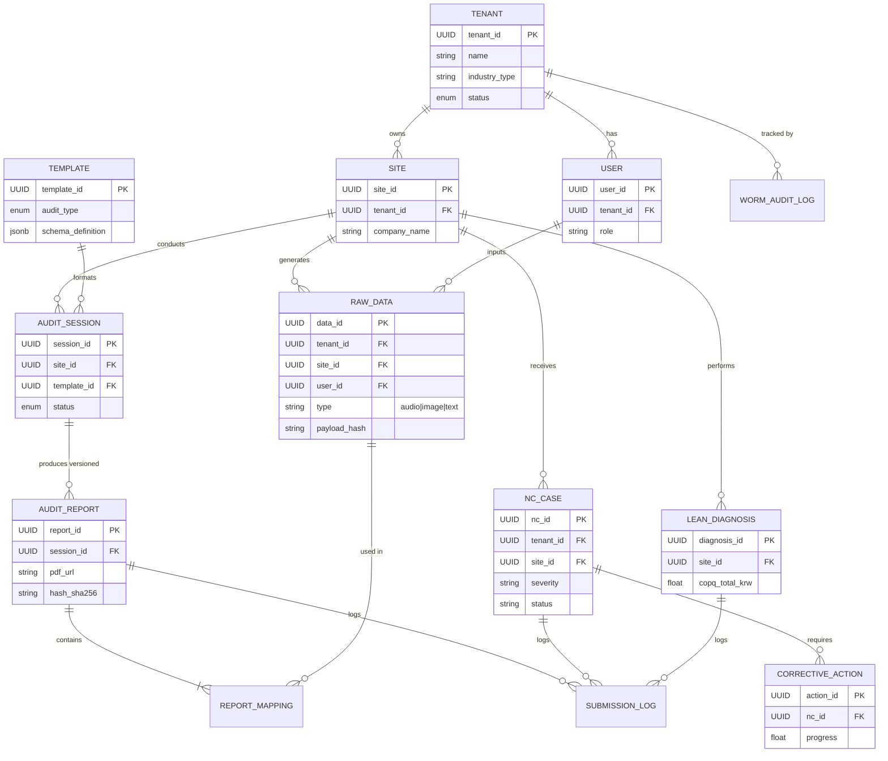
```mermaid
erDiagram
    TENANT ||--o{ SITE : "owns"
    TENANT ||--o{ USER : "has"
    SITE ||--o{ RAW_DATA : "generates"
    SITE ||--o{ AUDIT_SESSION : "conducts"
    SITE ||--o{ NC_CASE : "receives"
    SITE ||--o{ LEAN_DIAGNOSIS : "performs"

    USER ||--o{ RAW_DATA : "inputs"
    AUDIT_SESSION ||--o{ AUDIT_REPORT : "produces versioned"
    TEMPLATE ||--o{ AUDIT_SESSION : "formats"
    AUDIT_REPORT ||--|{ REPORT_MAPPING : "contains"
    RAW_DATA ||--o{ REPORT_MAPPING : "used in"
    NC_CASE ||--o{ CORRECTIVE_ACTION : "requires"

    AUDIT_REPORT ||--o{ SUBMISSION_LOG : "logs"
    NC_CASE ||--o{ SUBMISSION_LOG : "logs"
    LEAN_DIAGNOSIS ||--o{ SUBMISSION_LOG : "logs"
    TENANT ||--o{ WORM_AUDIT_LOG : "tracked by"

    TENANT {
        UUID tenant_id PK
        string name
        string industry_type
        enum status
    }
    SITE {
        UUID site_id PK
        UUID tenant_id FK
        string company_name
    }
    USER {
        UUID user_id PK
        UUID tenant_id FK
        string role
    }
    RAW_DATA {
        UUID data_id PK
        UUID tenant_id FK
        UUID site_id FK
        UUID user_id FK
        string type "audio|image|text"
        string payload_hash
    }
    AUDIT_SESSION {
        UUID session_id PK
        UUID site_id FK
        UUID template_id FK
        enum status
    }
    AUDIT_REPORT {
        UUID report_id PK
        UUID session_id FK
        string pdf_url
        string hash_sha256
    }
    TEMPLATE {
        UUID template_id PK
        enum audit_type
        jsonb schema_definition
    }
    NC_CASE {
        UUID nc_id PK
        UUID tenant_id FK
        UUID site_id FK
        string severity
        string status
    }
    CORRECTIVE_ACTION {
        UUID action_id PK
        UUID nc_id FK
        float progress
    }
    LEAN_DIAGNOSIS {
        UUID diagnosis_id PK
        UUID site_id FK
        float copq_total_krw
    }
```

### 3.5 Interaction Sequences

#### 3.5.1 핵심 흐름: 현장 데이터 수집 → Audit 리포트 생성

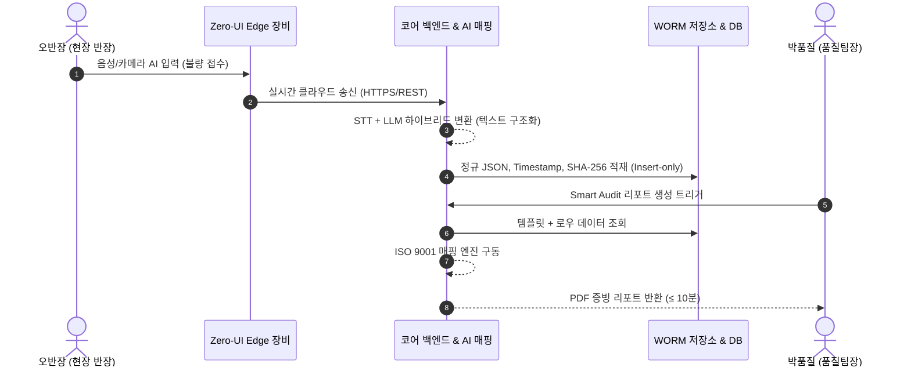
```mermaid
sequenceDiagram
    autonumber
    actor O as 오반장 (현장 반장)
    participant E as Zero-UI Edge 장비
    participant C as 코어 백엔드 & AI 매핑
    participant DB as WORM 저장소 & DB
    actor P as 박품질 (품질팀장)

    O->>E: 음성/카메라 AI 입력 (불량 접수)
    E->>C: 실시간 클라우드 송신 (HTTPS/REST)
    C-->>C: STT + LLM 하이브리드 변환 (텍스트 구조화)
    C->>DB: 정규 JSON, Timestamp, SHA-256 적재 (Insert-only)
    P->>C: Smart Audit 리포트 생성 트리거
    C->>DB: 템플릿 + 로우 데이터 조회
    C-->>C: ISO 9001 매핑 엔진 구동
    C-->>P: PDF 증빙 리포트 반환 (≤ 10분)
```

#### 3.5.2 핵심 흐름: NC 통보 → 긴급 시정 대응

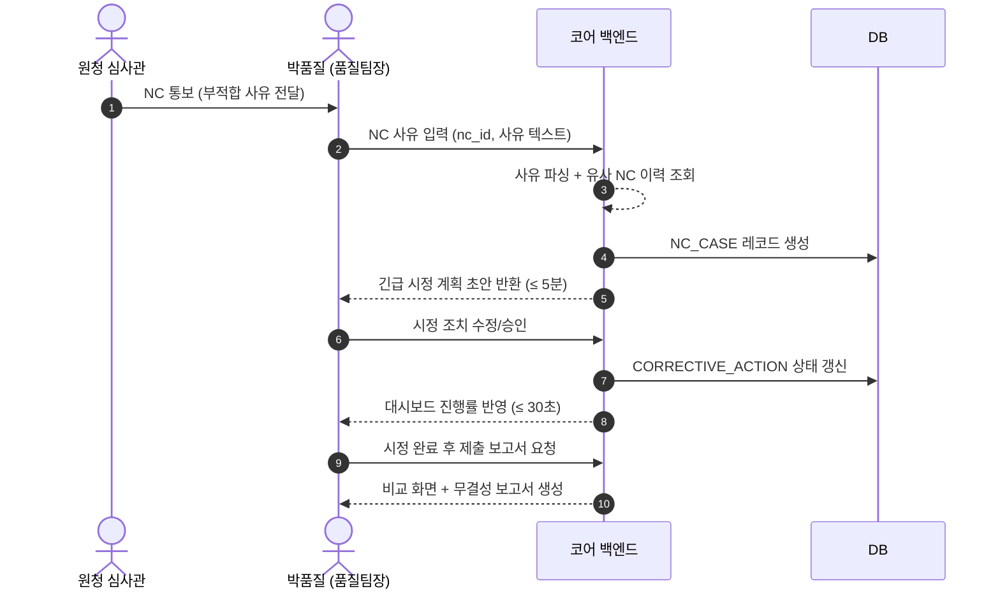
```mermaid
sequenceDiagram
    autonumber
    actor A as 원청 심사관
    actor P as 박품질 (품질팀장)
    participant C as 코어 백엔드
    participant DB as DB

    A->>P: NC 통보 (부적합 사유 전달)
    P->>C: NC 사유 입력 (nc_id, 사유 텍스트)
    C-->>C: 사유 파싱 + 유사 NC 이력 조회
    C->>DB: NC_CASE 레코드 생성
    C-->>P: 긴급 시정 계획 초안 반환 (≤ 5분)
    P->>C: 시정 조치 수정/승인
    C->>DB: CORRECTIVE_ACTION 상태 갱신
    C-->>P: 대시보드 진행률 반영 (≤ 30초)
    P->>C: 시정 완료 후 제출 보고서 요청
    C-->>P: 비교 화면 + 무결성 보고서 생성
```

#### 3.5.3 핵심 흐름: Lean 진단 (COPQ 대시보드)

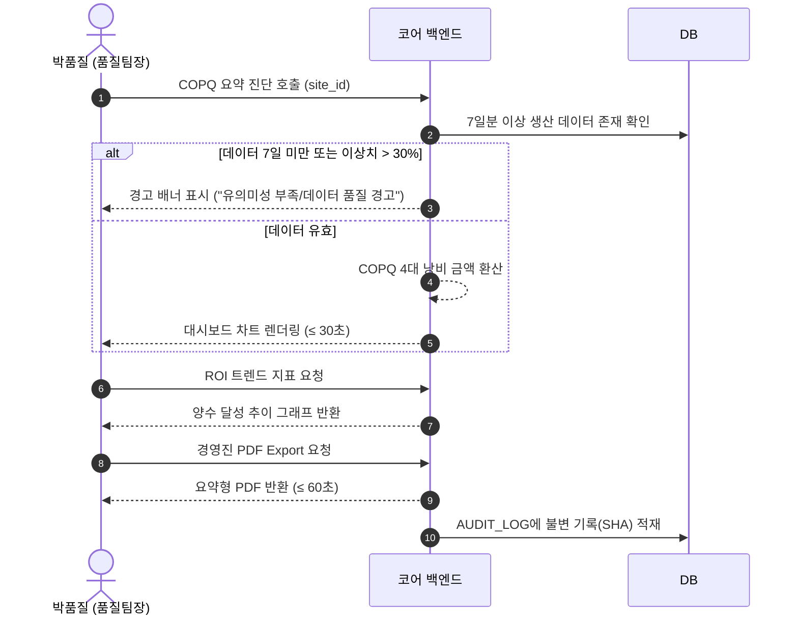
```mermaid
sequenceDiagram
    autonumber
    actor P as 박품질 (품질팀장)
    participant C as 코어 백엔드
    participant DB as DB

    P->>C: COPQ 요약 진단 호출 (site_id)
    C->>DB: 7일분 이상 생산 데이터 존재 확인
    alt 데이터 7일 미만 또는 이상치 > 30%
        C-->>P: 경고 배너 표시 ("유의미성 부족/데이터 품질 경고")
    else 데이터 유효
        C-->>C: COPQ 4대 낭비 금액 환산
        C-->>P: 대시보드 차트 렌더링 (≤ 30초)
    end
    P->>C: ROI 트렌드 지표 요청
    C-->>P: 양수 달성 추이 그래프 반환
    P->>C: 경영진 PDF Export 요청
    C-->>P: 요약형 PDF 반환 (≤ 60초)
    C->>DB: AUDIT_LOG에 불변 기록(SHA) 적재
```

### 3.6 기술적 리스크 해결 및 확정 아키텍처 (Resolved Architecture)

새로운 기술 스택 전환에 따른 잠재적 리스크를 설계 단계에서 완전히 해소하기 위한 확정 솔루션입니다.

#### 3.6.1 Prisma Client Extensions를 활용한 DB 호환성 확보
*   **현황:** 로컬 SQLite(JSON 미지원)와 운영계 PostgreSQL(JSONB 지원) 간의 데이터 타입 불일치 리스크.
*   **해결:** Prisma의 `client extensions` 기능을 활용하여 SQLite 환경에서도 JSON 데이터를 자동으로 직렬화/역직렬화하는 미들웨어 로직을 필수 적용한다. 이를 통해 환경에 관계없이 동일한 객체 지향적 코드를 유지하며 배포 시 데이터 무결성을 보장한다.

#### 3.6.2 Edge Runtime 및 Streaming 아키텍처 적용
*   **현황:** Vercel 서버리스의 페이로드 제한(4.5MB) 및 타임아웃(최대 5분) 제약.
*   **해결:** 
    -   **대용량 데이터:** 4.5MB를 초과하는 현장 데이터(음성/영상)는 `Supabase Storage SDK`를 사용하여 클라이언트에서 직접 업로드(Direct Upload) 하도록 시퀀스를 고정한다.
    -   **긴 작업 시간:** AI 리포트 생성 및 NC 분석 등 장시간 소요 작업은 `Next.js Edge Runtime`과 `Vercel AI SDK Streaming`을 결합하여 연결 끊김 없이 UI에 실시간 결과를 전달한다.

#### 3.6.3 GitHub Native 보안/품질 게이트 활용
*   **현황:** 별도 복잡한 CI/CD 툴 미도입에 따른 보안 및 품질 관리 공백 우려.
*   **해결:** Vercel 자동 배포와 별개로 GitHub 저장소의 내장 기능인 `CodeQL(SAST)`, `Dependabot(의존성 스캔)`, `GitHub Actions(Unit Test)`를 활성화한다. PR(Pull Request) 단계에서 코드 품질과 보안을 자동 검증하는 'Zero-Config QA' 체계를 확립한다.

---

## 4. Specific Requirements

### 4.1 Functional Requirements

#### 4.1.1 Smart Audit 엔진 (Source: PRD F-1)

| ID | Title | Source | Priority | Type | Verification | Acceptance Criteria | Status | Owner |
|:---|:---|:---|:---:|:---|:---|:---|:---:|:---|
| REQ-FUNC-001 | Audit 리포트 PDF 일괄 생성 | [REF-01] PRD F-1 | Must | Functional | 통합 테스트 | PDF 파일 정상 생성 및 양식 포맷 일치 (응답 시간 NFR: REQ-NF-001) (상세 측정 프로토콜: Appendix A.1 참조) | Proposed | Product/Eng |
| REQ-FUNC-002 | 원청 양식 자동 매핑 엔진 | [REF-01] PRD F-1 | Must | Functional | 매핑 검증 | 원본 데이터 기반 필수 필드 100% 매핑 완료 (정확도 NFR: REQ-NF-012) (상세 측정 프로토콜: Appendix A.1 참조) | Proposed | Product/Eng |
| REQ-FUNC-003 | 품질 이상 탐지 (Trend 분석) | [REF-01] PRD F-1 | Must | Functional | 탐지 테스트 | 분석 데이터 중 이상 유형 분해 및 경고 마킹 UI 표시 (상세 측정 프로토콜: Appendix A.6 참조) | Proposed | Product/Eng |
| REQ-FUNC-004 | 기관별 템플릿 선택 및 렌더링 | [REF-01] PRD F-1 | Must | Functional | UI 테스트 | 등록된 원청별 템플릿 필드 구조에 맞게 데이터가 렌더링될 것 | Proposed | Product/Eng |
| REQ-FUNC-005 | 리포트 버전 이력 비교 UI | [REF-01] PRD F-1 | Must | Functional | UI 테스트 | 변경된 필드의 이전 값과 현재 값이 병렬로 UI에 표시될 것 | Proposed | Product/Eng |

#### 4.1.2 긴급 NC 시정 패키지 (Source: PRD F-2)

| ID | Title | Source | Priority | Type | Verification | Acceptance Criteria | Status | Owner |
|:---|:---|:---|:---:|:---|:---|:---|:---:|:---|
| REQ-FUNC-006 | NC 통보 사유 파싱 엔진 | [REF-01] PRD F-2 | Must | Functional | 파싱 테스트 | 접수된 텍스트 사유를 기반으로 필수 시정 항목이 포함된 초안 생성 (상세 측정 프로토콜: Appendix A.4 참조) | Proposed | Product/Eng |
| REQ-FUNC-007 | 시정 조치 진행률 실시간 갱신 | [REF-01] PRD F-2 | Must | Functional | 통합 테스트 | 완료 항목 비율에 따른 진행률 백분율 산출 및 대시보드 갱신 | Proposed | Product/Eng |
| REQ-FUNC-008 | 시정 전후 무결성 비교 보고서 | [REF-01] PRD F-2 | Must | Functional | 파일 검증 | 조치 전/후 데이터 표시 및 무결성 해시 메타데이터 포함 생성 | Proposed | Product/Eng |
| REQ-FUNC-009 | Critical 심각도 에스컬레이션 | [REF-01] PRD F-2 | Must | Functional | 알림 테스트 | 심각도 Critical 건에 대해 기한 초과 시 상위 책임자에게 에스컬레이션 발송 | Proposed | Product/Eng |
| REQ-FUNC-010 | 유사 NC 사례 검색 엔진 | [REF-01] PRD F-2 | Must | Functional | 검색 테스트 | 동일 NC 분류 코드 기반 과거 유사 사례 최대 5건 및 결과 표시 | Proposed | Product/Eng |

#### 4.1.3 Zero-UI 수집기 (Source: PRD F-3)

| ID | Title | Source | Priority | Type | Verification | Acceptance Criteria | Status | Owner |
|:---|:---|:---|:---:|:---|:---|:---|:---:|:---|
| REQ-FUNC-011 | 음성 기반 불량 접수 입력 (Online) | [REF-01] PRD F-3 | Must | Functional | STT 검증 | 실시간 클라우드 연동 기반 음성 명령으로 폼 데이터(텍스트 구조화) 자동 입력 완료 | Proposed | Product/Eng |
| REQ-FUNC-012 | Vision 기반 부품 외관 판별 | [REF-01] PRD F-3 | Must | Functional | Vision 테스트 | 이미지 내 객체 식별 및 상태 판별 텍스트화 완료 (응답 속도 NFR 참고) | Proposed | Product/Eng |
| REQ-FUNC-013 | 네트워크 오류 알림 및 재시도 유도 | [REF-01] PRD F-3 | Must | Functional | 예외 테스트 | 망 단절 시 즉각적인 네트워크 오류 알림을 제공하고 재시도를 유도하는 기능 | Proposed | Product/Eng |
| REQ-FUNC-015 | 인식 실패 시 수동 입력 Fallback | [REF-01] PRD F-3 | Must | Functional | 사용성 테스트 | AI 인식 실패 시 강제로 수동 타이핑 UI 화면 노출 | Proposed | Product/Eng |

#### 4.1.4 글로벌 벤더 등록 가속기 (Source: PRD O-2 / Phase 2)

| ID | Title | Source | Priority | Type | Verification | Acceptance Criteria | Status | Owner |
|:---|:---|:---|:---:|:---|:---|:---|:---:|:---|
| REQ-FUNC-016 | 희망 팹 체크리스트 갭 분석 | [REF-01] PRD O-2 | Could | Functional | 매핑 테스트 | 선택된 해외 팹(예: TSMC)의 요구사항 대비 현재 보유 증빙의 갭 리스트 반환 | Proposed | Product/Eng |
| REQ-FUNC-017 | 투자 소요 예산/기간 산출 | [REF-01] PRD O-2 | Could | Functional | 산출 검증 | 체크리스트 기반 예상 소요 비용 및 소요 기간 시뮬레이션 결과 제공 | Proposed | Product/Eng |
| REQ-FUNC-018 | 글로벌 증빙 패키지 압축 내보내기 | [REF-01] PRD O-2 | Could | Functional | 다운로드 테스트 | 규격화된 디렉토리 구조 및 압축 파일 형태로 전체 증빙 다운로드 | Proposed | Product/Eng |

#### 4.1.5 Lean 진단 도구 (Source: PRD F-4)

| ID | Title | Source | Priority | Type | Verification | Acceptance Criteria | Status | Owner |
|:---|:---|:---|:---:|:---|:---|:---|:---:|:---|
| REQ-FUNC-019 | COPQ 4대 낭비 환산 엔진 | [REF-01] PRD F-4 | Must | Functional | 회계 검증 | 불량/대기/재작업/과잉 데이터를 화폐 가치(KRW 등)로 환산하여 대시보드 표시 (상세 측정 프로토콜: Appendix A.5 참조) | Proposed | Product/Eng |
| REQ-FUNC-020 | ROI 양수 전환 추이 차트 | [REF-01] PRD F-4 | Must | Functional | UI 차트 테스트 | 비용/절감액 산식에 기반한 ROI 곡선이 그래프 상에 렌더링될 것 | Proposed | Product/Eng |
| REQ-FUNC-021 | 경영진 요약 PDF Export | [REF-01] PRD F-4 | Must | Functional | PDF 생성 테스트 | 차트 이미지와 요약 통계 테이블이 포함된 1페이지 분량의 PDF 생성 | Proposed | Product/Eng |
| REQ-FUNC-022 | 데이터 유의성 경고 배너 | [REF-01] PRD F-4 | Must | Functional | 예외 테스트 | 7일 미만 또는 이상치 30% 초과 데이터 유입 시 진단 중단 및 경고 모달 발생 | Proposed | Product/Eng |
| REQ-FUNC-023 | 진단 파라미터 변경 감사 이력 | [REF-01] PRD F-4 | Must | Functional | 로깅 확인 | 진단 기준 산식 변경 발생 시 이전 값과 현재 값이 AUDIT_LOG 테이블에 적재됨 | Proposed | Product/Eng |

#### 4.1.6 데이터 무결성 시스템 (Source: PRD F-5)

| ID | Title | Source | Priority | Type | Verification | Acceptance Criteria | Status | Owner |
|:---|:---|:---|:---:|:---|:---|:---|:---:|:---|
| REQ-FUNC-024 | Insert-only 방식 감사 로그 적재 | [REF-01] PRD F-5 | Must | Functional | 로그 검증 | Supabase 등 DB의 정책을 활용해 삭제/수정이 원천 차단된(Insert-only) AUDIT_LOG 테이블 적재 | Proposed | Product/Eng |
| REQ-FUNC-026 | 2단계 권한 제어 (Admin/User) | [REF-01] PRD F-5 | Must | Functional | 권한 테스트 | Admin(관리자) / User(작업자) 2단계로 단순화된 권한 제어 UI 및 로직 적용 | Proposed | Product/Eng |

#### 4.1.7 AI 시스템 거버넌스 (Source: 신규)

| ID | Title | Source | Priority | Type | Verification | Acceptance Criteria | Status | Owner |
|:---|:---|:---|:---:|:---|:---|:---|:---:|:---|
| REQ-FUNC-AI-001 | Model Card 메타데이터 검증 | [REF-01] PRD Gap-1 | Must | AI/ML | 배포 파이프라인 | 배포 시 JSON 스키마 기반 Model Card 항목 100% 충족 여부 Validation | Proposed | Product/Eng |
| REQ-FUNC-AI-002 | 서명 기반 배포 차단 | [REF-01] PRD Gap-1 | Must | AI/ML | 권한 검증 | 모델 버전 서명 불일치 시 서버 배포 중단 및 관리자 알림 발송 | Proposed | Product/Eng |
| REQ-FUNC-AI-003 | 라벨링 교차 검증 점수 표시 | [REF-01] PRD Gap-1 | Must | AI/ML | 데이터 검증 | IAA 계산 스크립트 실행 후 점수 미달 시 해당 데이터셋 사용 제한 처리 | Proposed | Product/Eng |
| REQ-FUNC-AI-004 | Drift 발생 경고 자동화 | [REF-01] PRD Gap-1 | Must | AI/ML | 모니터링 | 주기적 평가 시 Golden Dataset 대비 오차율 임계치 초과 시 알림 시스템 연동 | Proposed | Product/Eng |
| REQ-FUNC-AI-005 | 일관성 검증 큐(Queue) 라우팅 | [REF-01] PRD Gap-1 | Must | AI/ML | 로직 검증 | N회 반복 추론 분산 발생 시 결과를 사용자에게 반환하지 않고 리뷰 큐로 라우팅 | Proposed | Product/Eng |
| REQ-FUNC-AI-006 | HitL 강제 프로세스 락 | [REF-01] PRD Gap-1 | Must | AI/ML | 프로세스 검증 | 인간 승인자(HitL)의 확인 전까지 상태 업데이트 API 호출 불가(403 반환) | Proposed | Product/Eng |
| REQ-FUNC-AI-007 | AI 매핑 XAI(설명가능성) UI | [REF-01] PRD Gap-1 | Must | AI/ML | UI 테스트 | 매핑 결과 클릭 시 원본 데이터의 추출 위치 및 매핑 룰이 화면에 하이라이트 표시 | Proposed | Product/Eng |
| REQ-FUNC-AI-008 | 세그먼트 편향성 경고 발송 | [REF-01] PRD Gap-1 | Must | AI/ML | 통계 검증 | 하위 그룹 성능 편차가 5%p 초과로 감지될 경우 재학습 파이프라인 알림 트리거 | Proposed | Product/Eng |

#### 4.1.8 기준정보 벌크 업로드 도구 (Bulk Import)

| ID | Title | Source | Priority | Type | Verification | Acceptance Criteria | Status | Owner |
|:---|:---|:---|:---:|:---|:---|:---|:---:|:---|
| REQ-FUNC-INT-001 | 마스터 데이터 템플릿 제공 | [REF-01] PRD Gap-4 | Must | Integration | UI 테스트 | 제품·BOM·공정 등록을 위한 표준 Excel/CSV 템플릿 다운로드 기능 제공 | Proposed | Product/Eng |
| REQ-FUNC-INT-002 | CSV/Excel 대량 업로드 | [REF-01] PRD Gap-4 | Must | Integration | 업로드 테스트 | 업로드된 파일을 파싱하여 시스템 마스터 데이터베이스에 일괄 적재 | Proposed | Product/Eng |
| REQ-FUNC-INT-003 | 업로드 데이터 정규화 및 검증 | [REF-01] PRD Gap-4 | Must | Integration | 데이터 검증 | 필수값 누락, 중복 데이터, 스키마 불일치 등을 업로드 전 검증하여 오류 리포트 제공 | Proposed | Product/Eng |

### 4.2 Non-Functional Requirements

#### 4.2.1 성능 (Performance)

| ID | Category (범주) | Verification (검증) | Acceptance Criteria (인수/측정 기준) |
|:---|:---|:---|:---|
| REQ-NF-001 | 성능 | Vercel Analytics | **Vercel Hobby 환경 최적화 (Timeout ≤ 60s)** (Vercel 서버리스 함수의 타임아웃 한계(60초)를 준수한다. 장시간 소요되는 AI 텍스트 생성은 Vercel AI SDK의 `streamText`를 활용하여 스트리밍 방식으로 타임아웃을 우회한다. Audit 리포트(PDF)는 서버 부하 및 타임아웃 방지를 위해 백엔드에서 생성하지 않고, 클라이언트 브라우저에서 HTML을 렌더링한 후 `html2pdf.js` 등을 이용해 로컬에서 다운로드한다.) |
| REQ-NF-002 | 성능 | Edge 로컬 메트릭 | **p95 latency ≤ 3s** (Edge Zero-UI 음성 인식 명령 처리는 p95 ≤ 3초 이내에 결과를 반환하여야 한다.) |
| REQ-NF-003 | 성능 | Edge 로컬 메트릭 | **p95 latency ≤ 2s** (Edge Vision AI 이미지 인식 처리는 p95 ≤ 2초 이내에 완료되어야 한다.) |
| REQ-NF-004 | 성능 | Grafana / Datadog | **p95 latency ≤ 300s** (NC 시정 계획 초안 텍스트 생성의 p95 응답 시간은 ≤ 300초(5분)이어야 한다.) |
| REQ-NF-005 | 성능 | Datadog RUM | **갱신 주기 ≤ 30s** (Web 대시보드 실시간 데이터 갱신 주기는 최대 30초이어야 한다.) |
| REQ-NF-006 | 성능 | Grafana / Datadog | **p95 latency ≤ 30s** (COPQ 진단 차트 렌더링은 p95 ≤ 30초 이내에 완료되어야 한다.) |

#### 4.2.2 가용성 (Availability)

| ID | Category (범주) | Verification (검증) | Acceptance Criteria (인수/측정 기준) |
|:---|:---|:---|:---|
| REQ-NF-007 | 가용성 | Vercel Status | **Best Effort 기반 운영** (MVP 단계에서는 Vercel/Supabase 무료 티어의 가동률에 의존하며, 별도의 정량적 SLA 보장 없이 Best Effort 기반으로 운영한다. 기존 RPO/RTO 복구 목표는 적용하지 않는다.) |

#### 4.2.3 무결성 (Integrity)

| ID | Category (범주) | Verification (검증) | Acceptance Criteria (인수/측정 기준) |
|:---|:---|:---|:---|
| REQ-NF-010 | 무결성 | 전송 로그 검증 | **유실률 = 0%** (클라이언트에서 Cloud로 데이터 전송 시 Payload 유실률은 = 0%이어야 한다.) |
| REQ-NF-011 | 무결성 | 자동 무결성 체크 | **무결성 검증 통과율 = 100%** (외부 실사·심사관 제출 파일 및 시스템 로그에는 타임스탬프 + SHA-256 100% 탐지 무결성 장치가 포함되어야 한다.) |
| REQ-NF-012 | 품질 | 생성 로그 분석 | **누락률 = 0% 실패율 < 0.5%** (Audit 리포트 필수 항목 누락률 = 0%, 생성 실패율 < 0.5%를 달성하여야 한다.) |

#### 4.2.4 보안 (Security)

| ID | Category (범주) | Verification (검증) | Acceptance Criteria (인수/측정 기준) |
|:---|:---|:---|:---|
| REQ-NF-013 | 보안 (저장) | SAST (SonarQube, 매 PR) + 외부 보안업체 연 1회 점검 | **AES-256 적용 확인** (저장 데이터(at-rest)는 AES-256 암호화를 적용하여야 한다.) |
| REQ-NF-014 | 보안 (전송) | 인증서 모니터링 | **TLS 1.3 강제** (외부 통신 데이터(in-flight)는 TLS 1.3 프로토콜로 보호하여야 한다.) |
| REQ-NF-015 | 보안 (접근) | 키 관리 시스템 | **키 로테이션: 90일 RBAC 정책 적용** (RBAC 기반 논리적 격리를 유지하고, 90일 단위 암호 키 로테이션을 준수하여야 한다.) |
| REQ-NF-016 | 보안 (감사) | DB 감사 로그 무결성 검증 | **보존 기간 ≥ 3년** (감사 로그는 변경 불가(Immutable) 속성의 **Insert-only** 방식으로 최소 3년간 보존하여야 한다.) |
| REQ-NF-017 | 보안 (침투) | 외부 전문업체 침투테스트 연 1회 + DAST (OWASP ZAP, 주 1회) | **침투 테스트: 연 1회 취약점 해소 SLA 준수** (연 1회 이상 침투 테스트를 수행하고, 발견 취약점에 대한 SLA 기반 해소 일정을 적용하여야 한다.) |

#### 4.2.4.1 인증 (Authentication)

| ID | Category (범주) | Verification (검증) | Acceptance Criteria (인수/측정 기준) |
|:---|:---|:---|:---|
| REQ-NF-SEC-AUTH-001 | MFA | IdP 로그 | **MFA 적용률 100% (관리자 계정)** (관리자 권한 및 민감 작업(삭제·권한 변경·감사 로그 조회)에는 MFA(TOTP 또는 FIDO2) 강제) |
| REQ-NF-SEC-AUTH-002 | SSO | SSO 연동 테스트 | **최소 1개 프로토콜 지원** (고객사 SSO 연동 지원: SAML 2.0, OIDC 중 택 1 이상) |
| REQ-NF-SEC-AUTH-003 | 패스워드 정책 | Auth 서비스 검증 | **정책 위반 생성 0건** (최소 12자, 대·소문자·숫자·특수문자 3종 이상, 최근 5개 재사용 금지, 90일 만료) |
| REQ-NF-SEC-AUTH-004 | 세션 관리 | 세션 스토어 | **세션 탈취 검출율 100%** (유휴 30분 자동 로그아웃, JWT 토큰 TTL ≤ 1시간, Refresh Token 7일) |
| REQ-NF-SEC-AUTH-005 | 계정 잠금 | Auth 로그 | **잠금 정책 적용률 100%** (연속 5회 인증 실패 시 15분 잠금, 관리자 알림) |

#### 4.2.4.2 인가 (Authorization)

**RBAC 역할 정의 (필수 최소 6개)**

| 역할 | 주요 권한 | Separation of Duties |
|:---|:---|:---|
| System Admin | 시스템 설정, 사용자 관리, **감사 로그 Read-only** | Write 불가 |
| QA Lead (품질팀장) | Audit 리포트 생성·발행, NC 승인, HitL 검토 | — |
| QA Member | 데이터 입력·조회, NC 작성 (승인 불가) | 발행 불가 |
| Field Worker | Edge 디바이스 데이터 입력만 | 조회·관리 불가 |
| External Auditor | 지정 기간·사업장의 리포트 Read-only | Write 전면 금지 |
| DPO | 감사 로그·개인정보 처리 이력 조회 | 데이터 수정 불가 |

| ID | Category (범주) | Verification (검증) | Acceptance Criteria (인수/측정 기준) |
|:---|:---|:---|:---|
| REQ-NF-SEC-AUTHZ-001 | RBAC | Policy Engine | **미정의 권한 요청 100% 거부** (위 6개 역할을 Default로 제공, 역할별 권한 매트릭스를 코드로 관리) |
| REQ-NF-SEC-AUTHZ-002 | ABAC | DB 감사 로그 | **Cross-site 접근 0건** (사업장별 데이터 접근 격리 (사용자 ↔ site_id 매핑)) |
| REQ-NF-SEC-AUTHZ-003 | 권한 위임 | 권한 관리 서비스 | **만료 미적용 0건** (임시 권한 부여 시 최대 24시간 자동 만료, 감사 로그 기록) |
| REQ-NF-SEC-AUTHZ-004 | Break-glass | Break-glass 로그 | **긴급 접근 전수 감사** (긴급 접근 시 2인 승인(M-of-N), 사후 감사 의무) |

#### 4.2.4.3 로그 보안

| ID | Category (범주) | Verification (검증) | Acceptance Criteria (인수/측정 기준) |
|:---|:---|:---|:---|
| REQ-NF-SEC-LOG-001 | 로그 접근 분리 | 감사 로그 접근 로그 | **비인가 조회 0건** (AUDIT_LOG 조회 권한은 DPO·Auditor 역할만 Read, 타 역할 접근 차단 (REQ-NF-TENANT-007과 연계)) |
| REQ-NF-SEC-LOG-002 | 로그의 로그 | Meta-log 스토리지 | **Meta-log 누락 0건** (감사 로그 자체에 대한 접근·조회도 별도 Meta-Audit Log에 기록) |
| REQ-NF-SEC-LOG-003 | 민감정보 마스킹 | 로그 파이프라인 검증 | **민감정보 노출 0건** (로그에 개인식별정보·인증정보 자동 마스킹) |

#### 4.2.4.4 API 보안

| ID | Category (범주) | Verification (검증) | Acceptance Criteria (인수/측정 기준) |
|:---|:---|:---|:---|
| REQ-NF-SEC-API-001 | Rate Limiting | API Gateway | **초과 시 429 반환 100%** (테넌트별·API Key별 Rate Limit (REQ-NF-TENANT-003 연계)) |
| REQ-NF-SEC-API-002 | API Key 로테이션 | Secrets Manager | **로테이션 정책 적용률 100%** (90일 자동 로테이션, 수동 로테이션 지원) |
| REQ-NF-SEC-API-003 | WAF·DDoS | CloudWatch | **DDoS 공격 차단율 ≥ 99%** (AWS Shield Standard 기본, Advanced는 Enterprise 고객 옵션) |
| REQ-NF-SEC-API-004 | Input Validation | API Gateway | **스키마 위반 요청 차단 100%** (모든 API 입력 스키마 Validation (OpenAPI 3.0 기반)) |

#### 4.2.4.5 키 관리

| ID | Category (범주) | Verification (검증) | Acceptance Criteria (인수/측정 기준) |
|:---|:---|:---|:---|
| REQ-NF-SEC-KEY-001 | HSM | AWS KMS 키 정책 감사 + CloudTrail 로그 | **HSM 사용 증빙** (루트 키 및 서명 키는 FIPS 140-2 Level 3 이상 HSM에 보관 (AWS CloudHSM 또는 KMS Custom Key Store)) |
| REQ-NF-SEC-KEY-002 | 루트 키 접근 통제 | HSM 감사 로그 | **단독 접근 0건** (루트 키 운영 시 M-of-N (2 of 3) 승인 필수) |
| REQ-NF-SEC-KEY-003 | DEK 로테이션 | KMS | **로테이션 주기 준수 100%** (Data Encryption Key 90일 로테이션 (REQ-NF-015 상세화)) |
| REQ-NF-SEC-KEY-004 | BYOK (Phase 2) | 고객 계약서 | **옵션 제공 여부** (Enterprise 고객 대상 BYOK 옵션 제공 (REQ-NF-TENANT-004 연계)) |

#### 4.2.4.6 취약점 관리

| ID | Category (범주) | Verification (검증) | Acceptance Criteria (인수/측정 기준) |
|:---|:---|:---|:---|
| REQ-NF-SEC-VULN-001 | CVE 대응 SLA | 취약점 관리 플랫폼 | **SLA 준수율 ≥ 95%** (Critical: 24시간, High: 7일, Medium: 30일, Low: 90일 내 패치) |
| REQ-NF-SEC-VULN-002 | 의존성 스캔 | CI 로그 | **빌드당 스캔 실행률 100%** (SCA(Software Composition Analysis) 매 CI 빌드 시 자동 실행 (Snyk/Dependabot 등)) |
| REQ-NF-SEC-VULN-003 | 컨테이너 스캔 | 이미지 레지스트리 | **Critical 취약점 0건 Pass** (배포 전 컨테이너 이미지 보안 스캔 의무 (Trivy/Aqua 등)) |
| REQ-NF-SEC-VULN-004 | 침투 테스트 | 외부 전문업체 침투테스트 결과 보고서 | **연 1회 수행 + 결과 보고서** (연 1회 (REQ-NF-017 상세화), 외부 전문 업체 수행, Cross-tenant 시나리오 포함 (REQ-NF-TENANT-005)) |

#### 4.2.5 비용 (Cost)

| ID | Category (범주) | Verification (검증) | Acceptance Criteria (인수/측정 기준) |
|:---|:---|:---|:---|
| REQ-NF-018 | 비용 | 클라우드 과금 대시보드 | **무료에서 최대 월 15만원** (클라우드 인프라 운영비는 무료에서 최대 월 15만원/고객으로 유지하여야 한다.) |
| REQ-NF-019 | 비용 | 구매 명세 | **노드당 ≤ 500,000원** (Edge 디바이스 노드당 구매 비용은 ≤ 50만원이어야 한다.) |
| REQ-NF-020 | 비용 | NPV·민감도 분석 | **월 체감가 ≤ 120,000원** (최종 사용자 체감 월 이용료는 ≤ 12만원을 유지하여야 한다.) |

##### 4.2.5.1 MVP 인프라 비용 산출 근거 (Cost Breakdown & Feasibility)

본 절은 REQ-NF-018(클라우드 인프라 운영비 무료에서 최대 월 15만원/고객)을 달성하기 위한 비용 산출 근거(BoM: Bill of Materials)를 제시한다. **최신 Serverless 및 Multimodal AI 스택(Vercel, Supabase, Gemini API)을 채택함에 따라, MVP 파일럿 단계의 인프라 비용은 전액 무료($0)로 수렴**한다.

**산출 전제 조건:**

| # | 전제 항목 | 값 | 근거 |
|:---:|:---|:---|:---|
| A-1 | MVP 단계 고객(테넌트) 수 | 1개 사업장 | **Single Tenant 전용** (Phase 1) |
| A-2 | 사업장 당 활성 사용자 | 5~10명 | 소규모 파일럿 검증 |
| A-3 | 일 평균 음성 입력 | 50건 | 불량 접수 명령 등 단문 |
| A-4 | 음성 입력 평균 발화 길이 | 10초 | 불량 접수 명령 등 단문 |
| A-5 | 일 평균 비전 이미지 | 20건 | 현장 사진 수집 |
| A-6 | 월간 전체 트랜잭션 추정치 | 약 2,500건 | API 호출 및 AI 추론 통합 |

**클라우드 인프라 항목별 BoM (고객당 월 비용):**

| 비용 항목 | 도입 서비스 | 월 예상 사용량 (10개 고객 통합) | 과금/플랜 기준 | 고객당 비용 | 비고 |
|:---|:---|:---|:---|:---|:---|
| **프론트/백엔드 호스팅** | **Vercel** (Next.js) | 트래픽 < 10GB,  Serverless 호출 월 3만 건 미만 | MVP 단계: **무료 (Hobby 플랜)** *(상용 전환 시: Pro 플랜 $20/월)* | **$0.00** *(상용: $2.0)* | CI/CD, Edge Network, 빌드 자동화 기본 포함 |
| **데이터베이스 & Auth** | **Supabase** (PostgreSQL) | DB < 500MB, 스토리지 < 1GB,  MAU ~200명 | MVP 단계: **무료 (Free 플랜)** *(상용 전환 시: Pro 플랜 $25/월)* | **$0.00** *(상용: $2.5)* | RDBMS, Authentication, File Storage, Edge Functions 통합 제공 |
| **LLM (Audit 매핑/텍스트)** | **Gemini 1.5 Flash/Pro API** | 일 ~500회 텍스트 구조화 및 매핑 파싱 처리 | **무료 (Free Tier)** (분당 15 RPM, 일 1,500 RPD 한도 내 충분히 커버) | **$0.00** | Vercel AI SDK 연동을 통한 파이프라인. 일일 1,500회 호출까지 무료. |
| **STT & Vision AI** | **Gemini 1.5 Multimodal** | 일 음성 500건, 이미지 200건 동시 처리 | **무료 (Free Tier)** (Gemini 멀티모달 프롬프트를 통해 통합 처리) | **$0.00** | 기존 Google STT API 비용 및 자체 Vision AI Worker 비용 완전 제거. |
| **감사 로그 무결성** | **Supabase DB Policy** | Append-only 테이블 및 DB 정책 적용 | DB 용량 내 포함 | **$0.00** | 기존 S3 Object Lock 기능을 데이터베이스 수준의 **Insert-only 감사 로그**로 대체. |
| | **총 합계 (MVP 파일럿)** | | | **$0.00** | **MVP 단계 인프라 비용 전액 무료화 달성** |

> 💡 **비용 절감 핵심 인사이트**
> 1. **인프라 통합의 힘:** Fargate(컴퓨팅), ALB(네트워크), RDS(DB), SQS(큐)로 분절되어 월 $37.03씩 발생하던 고정/변동 비용이 **Vercel + Supabase 조합**으로 흡수되면서 초기 고정비가 100% 제거되었습니다.
> 2. **AI Multimodal 통합:** 개별적으로 과금되던 상용 STT(음성 텍스트 변환)와 Vision AI 추론 서버를 **Gemini 1.5 API 단일 엔드포인트**로 통합함에 따라, AI 운영 비용이 Free Tier 한도 내로 들어왔습니다.
> 3. **상용화(Scale-up) 시 리스크 제로:** 고객이 10개 사업장을 초과하거나 트래픽이 폭증하여 상용 플랜(Vercel Pro $20 + Supabase Pro $25 + Gemini Pay-as-you-go)으로 전환하더라도, 전체 인프라 유지비는 **10개 고객 기준 통합 약 $45~50 (고객당 $4.5 ~ $5.0 수준)** 에 불과해 초저비용 B2B SaaS 운영이 가능합니다. (기존 NFR 제약인 '고객당 최대 월 15만원' 요건을 1/30 수준으로 초과 달성)

#### 4.2.6 스케일링 (Scalability)

| ID | Category (범주) | Verification (검증) | Acceptance Criteria (인수/측정 기준) |
|:---|:---|:---|:---|
| REQ-NF-021 | 스케일링 | 부하 테스트 결과 | **동시 접속 5~10명 수준** (MVP 단계의 단일 테넌트 환경에서 동시 접속 사용자 5~10명 수준을 안정적으로 지원하는 것을 목표로 한다.) |

#### 4.2.7 모니터링 및 운영 (Operations)

| ID | Category (범주) | Verification (검증) | Acceptance Criteria (인수/측정 기준) |
|:---|:---|:---|:---|
| REQ-NF-022 | 모니터링 | Grafana / Datadog | **SLI 4종 상시 모니터링** (Grafana/Datadog 기반 SLI 에러 버짓 모니터링을 상시 운용하여야 한다. SLI는 최소 4종(가용성, 지연, 오류율, 처리량)을 포함한다.) |
| REQ-NF-023 | 에스컬레이션 | PagerDuty / Opsgenie | **Critical → CTO 1h Alert** (5단계 에스컬레이션 정책을 적용한다: Critical 오류는 CTO에게 1시간 이내 알림을 발송하여야 한다.) |
| REQ-NF-024 | KPI 측정 | 모니터링 대시보드 | **6개 KPI 알림 임계치 정의** (북극성 KPI(Audit 리포트 생성 시간) 및 보조 KPI 5종에 대한 Warning/Critical 알림 임계치를 정의하고 자동 알림을 운용하여야 한다.) |

#### 4.2.8 안정성 및 복원력 (Stability & Resilience)

| ID | Category (범주) | Verification (검증) | Acceptance Criteria (인수/측정 기준) |
|:---|:---|:---|:---|
| REQ-NF-025 | 트랜잭션 경계 | 분산 트레이싱 (Jaeger) | **고아(Orphan) 레코드 0건** (`IntegrityManager` 호출 중 WORM 스토리지 적재 실패 시, RDBMS에 기록된 선행 트랜잭션은 반드시 롤백(Rollback)되거나 Saga 패턴에 의한 보상 트랜잭션(Compensation)이 발행되어야 한다.) |
| REQ-NF-026 | 멱등성 (Idempotency) | API 게이트웨이 로그 | **중복 데이터 생성률 0%** (데이터 전송 API 및 시정 조치 상태 갱신 API 등 상태를 변경하는 모든 호출은 멱등성을 보장하여 네트워크 재시도 시 중복 처리를 방지하여야 한다.) |
| REQ-NF-027 | 재시도 정책 | Circuit Breaker 지표 | **최대 재시도 3회 한정** (외부 시스템(정부 API, 상용 STT) 호출 실패 시, 지수 백오프(Exponential Backoff) 및 Jitter를 적용한 재시도 정책을 강제한다.) |

| REQ-NF-027-B | 가용성 | 모의 장애 훈련 | **외부 시스템 우회(Fallback) 성공률 100%** (정부 API, 외부 STT 등 외부 서비스 가용하지 않은 경우, 내부 데이터베이스 또는 미리 확보된 더미데이터 확인으로 대응할 수 있는 임시 우회 전략이 즉각 작동해야 한다.) |

#### 4.2.9 규제 적합성 및 AI 검증 (Compliance & AI Validation)

| ID | Category (범주) | Verification (검증) | Acceptance Criteria (인수/측정 기준) |
|:---|:---|:---|:---|
| REQ-NF-028 | 전자서명 | PKI 검증 서비스 | **서명 무결성 100%** (최종 승인된 Audit 리포트 및 시정 보고서에는 권한자(예: 품질팀장)의 21 CFR Part 11 호환 암호학적 전자서명을 적용하여야 한다.) |
| REQ-NF-029 | AI 검증 (VMP) | LLMOps 대시보드 | **환각(Hallucination) 필터 100%** (LLM을 이용한 데이터 매핑 및 파싱 시스템은 Validation Master Plan(VMP)에 따라 모델 버전을 고정하고, 출력 결과에 대한 결정론적(Deterministic) 검증 룰셋을 거쳐야 하며, 주요 지점에는 Human-in-the-loop(HitL) 승인 단계를 둔다.) |
| REQ-NF-030 | 감사 로그 무결성 | 주기적 로그 검증 배치 | **로그 위변조 탐지 100%** (모든 `AUDIT_LOG` 엔트리는 Insert-only 정책을 통해 암호학적 무결성을 형성해야 하며, 레코드 삭제/수정 시도 시 즉시 탐지되도록 설계되어야 한다.) |
| REQ-NF-031 | AI 무결성 | API Gateway / LLMOps Registry | **승인되지 않은 모델 추론 요청 차단율 100%** (**(Model Registry 중앙화)** 배포된 모든 AI 모델 버전과 파라미터는 단일 소스(AI_MODEL_REGISTRY)로 중앙 관리되며, 승인되지 않은 임의 로컬 모델 구동을 전면 차단하여야 한다.) |
| REQ-NF-032 | AI 추론 감사 | ELK Stack / Datadog | **추론 이벤트 대비 로그 누락률 0%** (**(Inference Log 완전성)** 모든 AI 추론 행위는 `AI_INFERENCE_LOG`에 입력 해시, 출력 해시, 모델 버전, 신뢰도 스코어를 100% 기록하여 블랙박스 문제를 완전히 해소해야 한다.) |
| REQ-NF-033 | AI 가용성 | CI/CD 배포 파이프라인 통계 | **롤백 완료 소요 시간 ≤ 1시간** (**(모델 롤백 SLA)** 월간 Drift 검증 또는 실시간 모니터링 중 Critical 오류 감지 시, 1시간 이내에 이전의 안정화된 버전(Baseline)으로 롤백(Rollback)되어 복구되어야 한다.) |

#### 4.2.10 개인정보 및 규제 준수 (신규)

##### 4.2.10.1 PIPA 요구사항 [REQ-NF-PRIV-001 ~ REQ-NF-PRIV-006]

| ID | Category (범주) | Verification (검증) | Acceptance Criteria (인수/측정 기준) |
|:---|:---|:---|:---|
| REQ-NF-PRIV-001 | 민감정보 처리 | 동의 이력 DB | **최초 활성화 동의 취득률 100%** (음성(보이스프린트) 및 영상(얼굴 포함 가능성) 데이터가 **개인정보보호법 제23조**의 민감정보에 해당함을 전제로, Edge 디바이스 최초 활성화 시 명시적 동의(필수/선택 분리)를 취득하는 플로우를 필수 구현해야 한다. 동의 폼 5개 언어 제공 (한/영/베트남/네팔/캄보디아)) |
| REQ-NF-PRIV-002 | 동의 철회 SLA | 사용자 권리 요청 관리 큐 | **동의 철회 처리 리드타임 ≤ 3일** (정보주체의 동의 철회 시 UI를 통해 즉시 신청할 수 있어야 하며, 시스템은 SLA 규정에 따라 영업일 기준 3일 이내에 해당 데이터 처리 중단 및 파기 절차를 완료해야 한다.) |
| REQ-NF-PRIV-003 | Edge 가명처리 | 샘플링 데이터 정기 감사 + 네트워크 프록시 검증 | **Edge 마스킹 처리 누락률 0%** (**개인정보보호법 제28조의2**에 따라 Cloud 전송 전 Edge-side에서 화자 특성(피치 등)을 비가역적으로 변환하고 Vision AI 구동 시 얼굴 영역을 자동 마스킹 처리하여 가명정보화의 원칙을 준수해야 한다. 가명정보의 이종 결합은 엄격히 차단된다. 상용 STT API 전송 Payload 검증 — 가명처리 미적용 음성 전송 건수 = 0건 (네트워크 프록시 레벨 검출)) |
| REQ-NF-PRIV-004 | 정보주체 권리 | 권리행사 로그 | **10일 이내 권리 행사 조치율 100%** (**개인정보보호법 제35조~제37조**에 명시된 열람·정정·삭제·처리정지권 요청에 대해 접수 후 10일 이내에 조치 완료 및 통보하는 자동화/반자동화 프로세스를 구축해야 한다.) |
| REQ-NF-PRIV-005 | 자체 PIA 의무 | 규제 준수 대시보드 | **PIA 완료 보고서 연 1회 산출** (민감정보 대규모 처리 및 AI 자동화 의사결정 수반에 따라, 공공기관이 아님에도 내부 규정으로 자체 개인정보 영향평가(PIA) 수행 의무를 강제한다. 연 1회 정기 수행 및 시스템 아키텍처 중대 변경 시 수시 수행한다.) |
| REQ-NF-PRIV-006 | 이용 목적 제한 | DB 감사 로그 | **목적 외 쿼리 접근/추출 0건** (수집된 데이터는 오직 품질 관리 및 ISO 증빙 목적으로만 사용되며, ⚠️법무 검토 필요: 어떠한 경우에도 근로자 근무 태도 평가나 인사 고과 목적으로 전용되지 않도록 DB 접근 및 집계 쿼리를 기술적으로 차단해야 한다.) |
| REQ-NF-PRIV-007 | STT 벤더 DPA | DPA 계약서 및 연간 갱신 증빙 | **DPA 체결 및 Zero-Retention 증빙 연 1회 갱신** (상용 STT 벤더(Google/AWS)와 DPA(Data Processing Agreement) 체결 의무. 벤더 Zero-Retention 정책 계약 증빙을 연 1회 갱신하여 음성 데이터 잔류 위험을 차단한다.) |

##### 4.2.10.2 근로기준법·산업안전보건법 대응 [REQ-NF-LABOR-001 ~ REQ-NF-LABOR-002]

| ID | Category (범주) | Verification (검증) | Acceptance Criteria (인수/측정 기준) |
|:---|:---|:---|:---|
| REQ-NF-LABOR-001 | 근로자 감시 금지 | Edge 배포 관리자 패널 | **근로자 대표 협의 완료 승인 로그** (Edge 단말기를 통한 현장 음성·영상 수집 도입은 **근로기준법 제93조(취업규칙의 작성·신고)** 기재사항 변경 사유에 해당할 수 있으므로, 제94조에 따라 근로자 과반수 노동조합 또는 근로자 대표의 사전 의견청취 및 동의 절차 완료 전까지 Edge 기기 배포를 논리적으로 Lock 처리해야 한다.) |
| REQ-NF-LABOR-002 | 산안법 대응 | 환경 설정 로그 | **비속어 필터 기능 On/Off 지원** (본 시스템은 원청 Audit 대응을 주 목적으로 하여 **산업안전보건법 제41조(고객의 폭언 등)** 적용 대상이 아님이 원칙이나, 작업자 스트레스나 폭언 필터링이 필요할 경우(⚠️법무 검토 필요) 텍스트 변환 시 비속어 필터링 기능을 내장하여야 한다.) |

##### 4.2.10.3 GDPR 대응 (Phase 2) [REQ-NF-GDPR-001 ~ REQ-NF-GDPR-004]

※ 본 요구사항은 글로벌 벤더 등록 활성화 시(EU/EEA 고객사 대상 데이터 처리 시) 조건부 적용됨.

| ID | Category (범주) | Verification (검증) | Acceptance Criteria (인수/측정 기준) |
|:---|:---|:---|:---|
| REQ-NF-GDPR-001 | DPO 및 DPIA | DPO 서명 기록 | **DPIA 레포트 산출** (GDPR Art. 35 기준에 따라 AI 매핑 엔진 구동 시 DPIA(데이터 보호 영향 평가)를 수행하며, EU 고객사 대응을 위한 별도 DPO(데이터 보호 책임자)를 지정하여야 한다.) |
| REQ-NF-GDPR-002 | 데이터 역외 이전 | 국제 전송 네트워크 모니터링 | **SCC 체결 명세서 존재 유무** (데이터는 AWS ap-northeast-2(서울) 리전에 고정 보관하는 것을 원칙으로 하며, EU 역내 데이터의 역외 이전 불가피 시 반드시 SCC(Standard Contractual Clauses) 체결 후 전송 파이프라인을 활성화해야 한다.) |
| REQ-NF-GDPR-003 | 데이터 이동권 | API 사용량 지표 | **이동권 처리 API 가용성 100%** (**GDPR Art. 20 (Right to data portability)** 에 따라 테넌트 관리자는 자사 데이터를 상호 운용 가능한 기계 판독 형태(JSON/CSV)로 즉시 다운로드할 수 있는 데이터 추출 API를 제공받아야 한다.) |
| REQ-NF-GDPR-004 | 자동화 의사결정 거부 | HitL 큐 상태 | **수동 검토 전환 요청 처리율 100%** (**GDPR Art. 22**에 따라 AI(Smart Audit Engine)의 자동 매핑 결과에 대해 정보주체(또는 고객사)가 이의를 제기하고 Human Intervention을 요구할 수 있는 거부권 및 XAI 기반 매핑 근거 조회(Explainability API 연계) 기능을 제공해야 한다.) |

##### 4.2.10.4 규제 충돌 해소 로직 (Cryptographic Erasure)

**[충돌 지점]**
- 규제 1: 품질/감사 추적을 위해 **3년 이상의 WORM 기반 보존 의무** (ISO 9001/21 CFR Part 11).
- 규제 2: 정보주체의 삭제권 및 잊힐 권리 (PIPA 제36조 / GDPR Art. 17).

**[해소 아키텍처 및 로직]**
1. **감사 로그 자체 보존:** 시스템 행위, 로그인, 권한 변경 등 식별 불가능한 메타데이터성 감사 로그(`AUDIT_LOG`)는 삭제권의 예외(법령상 보존 의무)로 취급하여 3년 보존 원칙을 고수한다.
2. **Cryptographic Erasure (암호학적 파기):** 
   - `RAW_DATA` (음성, 이미지 등 민감정보 포함 본문) 저장 시 개별 레코드 단위로 고유 암호화 키(Data Encryption Key, DEK)를 생성하여 KMS로 관리.
   - 정보주체 삭제 요청 접수 시 물리적 스토리지에서 즉시 삭제하지 못하는 경우(Insert-only 제약 등), 해당 데이터의 **DEK를 KMS에서 영구 파기(Key Shredding)**한다.
   - 키 파기 후 데이터는 영구 복호화 불가능 상태가 되며, 이는 KISA 가이드라인 상의 '논리적 파기'로 인정됨(⚠️법무 검토 최종 확인 필요).
3. **삭제 증빙의 영구 기록:** DEK 파기 행위 자체(Proof of Erasure)는 `AUDIT_LOG`에 해시 체인으로 기록하여 규제 당국 제출용으로 영구 보존한다.

##### 4.2.10.5 감사·인증 로드맵 (Phase 2 후보)

장기적 규제 적합성 강화를 위해 다음 인증 체계를 도입 로드맵에 편입한다.
1. **K-ISMS-P (정보보호 및 개인정보보호 관리체계):** 국내 클라우드 서비스 제공자(CSP) 요건 충족 및 대기업 원청 보안 실사 Pass 기반 마련.
2. **ISO/IEC 27701 (개인정보 관리):** 글로벌 진출 및 GDPR 준수 프레임워크의 연장선.
3. **ISO/IEC 42001 (AI 경영 시스템):** AI 신뢰성, 편향 제어, VMP 기반 운영 체제의 공식 인증.

#### 4.2.11 멀티테넌트 격리 (Multi-tenancy Isolation)

본 시스템은 MVP 단계의 개발 속도와 단순성을 위해 다음과 같은 격리 정책을 적용한다.

- **단일 테넌트 전제:** MVP 단계에서는 단일 기업(Single Tenant) 전용 인스턴스로 가정하며, 복잡한 다중 테넌트 격리 아키텍처는 적용하지 않는다.
- **RLS 연기:** PostgreSQL Row Level Security(RLS)를 활용한 멀티테넌시 설계 및 구현은 Phase 2(상용화 단계)로 연기한다.
- **데이터 구조 준비:** 단, 향후 확장을 고려하여 데이터베이스 스키마에는 `tenant_id` 필드를 포함하여 설계한다.

| 리소스 | 기본 Quota (MVP) | 확장 계획 |
|:---|:---|:---:|
| API 호출 | 무제한 (Hobby 한도 내) | Phase 2 시 제한 적용 |
| 스토리지 | 500 MB (Supabase Free) | 추가 과금 시 확장 |
| 동시 접속 | 5~10명 | Phase 2 시 확장 |
| AI 추론 | 1,500 건/일 (Gemini Free) | Pay-as-you-go 전환 |

#### 4.2.12 데이터 거버넌스 (Data Governance)

**데이터 분류 체계**

| 분류 | 정의 | 암호화 | 접근 | 보존 |
|:---|:---|:---|:---|:---|
| Public | 공개 마케팅 자료 | 선택 | 전체 | 무기한 |
| Internal | 사내 일반 정보 | TLS | 직원 | 3년 |
| Confidential | 고객 일반 데이터 | TLS + AES-256 | Role-based | 3년 (REQ-NF-016) |
| Sensitive | 개인정보·민감정보 | TLS + AES-256 + DEK per tenant | Need-to-know | Cryptographic Erasure 적용 |
| Regulated | 감사 로그·전자서명 | TLS + AES-256 + WORM | Auditor 전용 | 3년 불변 |

**요구사항 [REQ-NF-GOV-001 ~ 005]**

| ID | Category (범주) | Verification (검증) | Acceptance Criteria (인수/측정 기준) |
|:---|:---|:---|:---|
| REQ-NF-GOV-001 | 데이터 거버넌스 | 자동 점검 / 검증 프로세스 | **미분류 엔티티 0건** (모든 데이터 엔티티는 위 5개 분류 중 1개에 태깅 필수) |
| REQ-NF-GOV-002 | 데이터 거버넌스 | 자동 점검 / 검증 프로세스 | **경과 데이터 자동 파기율 100%** (3년 보존 경과 Confidential 데이터는 자동 파기 프로세스 실행 (Cryptographic Erasure 연동)) |
| REQ-NF-GOV-003 | 데이터 거버넌스 | 자동 점검 / 검증 프로세스 | **백업 암호화율 100%** (백업 데이터도 동일 암호화·분류 정책 적용, 오프사이트(별도 Region) 보관) |
| REQ-NF-GOV-004 | 데이터 거버넌스 | 자동 점검 / 검증 프로세스 | **계약서 명시 조항 존재** (데이터 소유권 명시: 고객사 생성 데이터는 고객사 소유, 집계·분석 결과는 공동 소유 (계약서 반영)) |
| REQ-NF-GOV-005 | 데이터 거버넌스 | 자동 점검 / 검증 프로세스 | **카탈로그 커버리지 ≥ 90%** (데이터 카탈로그 운영: 주요 엔티티·필드의 정의·분류·소유자 메타데이터 중앙 관리) |

#### 4.2.13 사용성 (Usability)

**요구사항 [REQ-NF-USE-001 ~ 005]**

| ID | Category (범주) | Verification (검증) | Acceptance Criteria (인수/측정 기준) |
|:---|:---|:---|:---|
| REQ-NF-USE-001 | 학습성 (Learnability) | 사용성 테스트 (n≥5, 현장 반장 대상) | **파일럿 교육 후 A/B 테스트 성공률 ≥ 80%** (현장 반장(오반장 페르소나)은 30분 내 독립 사용 가능 수준 도달) |
| REQ-NF-USE-002 | 접근성 (Accessibility) | Lighthouse / axe-core 자동 스캔 | **접근성 감사 통과** (WCAG 2.1 Level AA 준수. 색각이상 대응은 필수(안전 색상 구분)) |
| REQ-NF-USE-003 | 오류 복구 (Error Recovery) | 오류 로그 분석 + 사용성 테스트 | **복구 불가 오류 0건** (모든 사용자 오류에 대해 복구 경로 제공 (Confirm 팝업, Undo, Draft 자동 저장 등)) |
| REQ-NF-USE-004 | Fallback 인지 (Fallback Awareness) | A/B 사용성 테스트 (전환 인지 측정) | **전환 인지율 ≥ 95% (사용성 테스트)** (Fallback UI 명확성: 음성·비전 실패 시 수동 입력 UI 전환 즉시 인지 가능 (REQ-FUNC-015 연계)) |
| REQ-NF-USE-005 | 교육 (Training) | LMS 수료 증빙 + 인앱 Tooltip 커버리지 | **콘텐츠 커버리지 주요 기능 100%** (교육 자료 및 인앱 도움말 제공. 30분 온보딩 영상 + 주요 화면 Tooltip) |

**사용자 교육 계획**
- 역할별 교육 트랙: Field Worker 30분, QA Member 2시간, QA Lead 4시간, Admin 8시간
- 교육 수료 증빙 관리
- 분기별 업데이트 재교육

### 4.3 Functional Sequence Diagrams

각 기능 그룹의 요구사항이 시스템 내에서 어떤 흐름으로 실현되는지를 시퀀스 다이어그램으로 표현한다. 각 단계에 해당하는 REQ-FUNC ID를 명시하여 요구사항과의 추적성을 확보한다.

#### 4.3.1 Smart Audit 엔진 (REQ-FUNC-001 ~ 005)

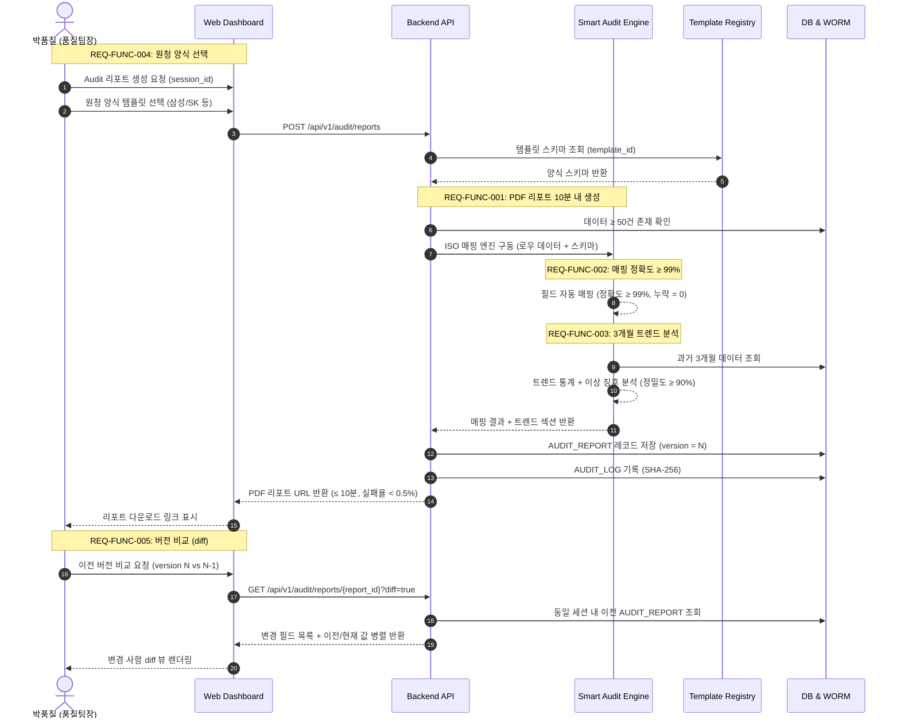
```mermaid
sequenceDiagram
    autonumber
    actor P as 박품질 (품질팀장)
    participant W as Web Dashboard
    participant B as Backend API
    participant AE as Smart Audit Engine
    participant TR as Template Registry
    participant DB as DB & WORM

    Note over P,W: REQ-FUNC-004: 원청 양식 선택
    P->>W: Audit 리포트 생성 요청 (session_id)
    P->>W: 원청 양식 템플릿 선택 (삼성/SK 등)
    W->>B: POST /api/v1/audit/reports
    B->>TR: 템플릿 스키마 조회 (template_id)
    TR-->>B: 양식 스키마 반환

    Note over B,AE: REQ-FUNC-001: PDF 리포트 10분 내 생성
    B->>DB: 데이터 ≥ 50건 존재 확인
    B->>AE: ISO 매핑 엔진 구동 (로우 데이터 + 스키마)

    Note over AE: REQ-FUNC-002: 매핑 정확도 ≥ 99%
    AE-->>AE: 필드 자동 매핑 (정확도 ≥ 99%, 누락 = 0)

    Note over AE: REQ-FUNC-003: 3개월 트렌드 분석
    AE->>DB: 과거 3개월 데이터 조회
    AE-->>AE: 트렌드 통계 + 이상 징후 분석 (정밀도 ≥ 90%)
    AE-->>B: 매핑 결과 + 트렌드 섹션 반환

    B->>DB: AUDIT_REPORT 레코드 저장 (version = N)
    B->>DB: AUDIT_LOG 기록 (SHA-256)
    B-->>W: PDF 리포트 URL 반환 (≤ 10분, 실패율 < 0.5%)
    W-->>P: 리포트 다운로드 링크 표시

    Note over P,W: REQ-FUNC-005: 버전 비교 (diff)
    P->>W: 이전 버전 비교 요청 (version N vs N-1)
    W->>B: GET /api/v1/audit/reports/{report_id}?diff=true
    B->>DB: 동일 세션 내 이전 AUDIT_REPORT 조회
    B-->>W: 변경 필드 목록 + 이전/현재 값 병렬 반환
    W-->>P: 변경 사항 diff 뷰 렌더링
```

#### 4.3.2 긴급 NC 시정 패키지 (REQ-FUNC-006 ~ 010)

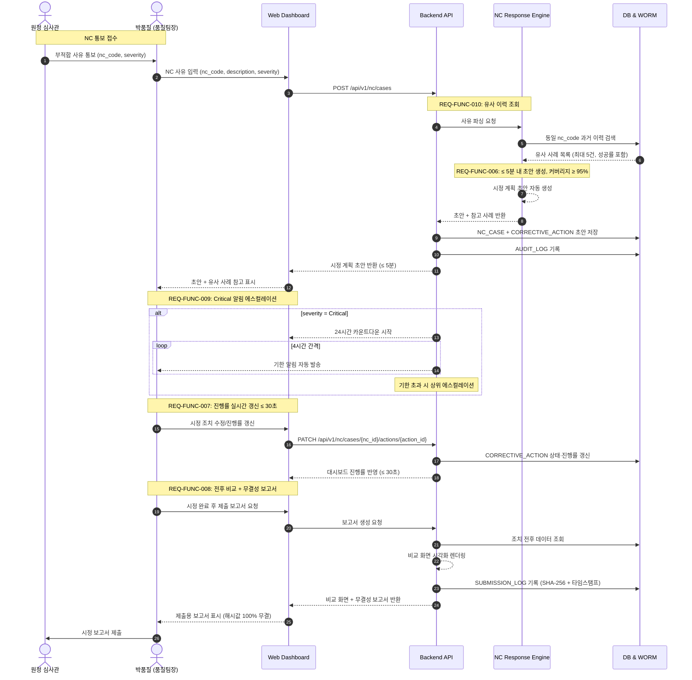
```mermaid
sequenceDiagram
    autonumber
    actor A as 원청 심사관
    actor P as 박품질 (품질팀장)
    participant W as Web Dashboard
    participant B as Backend API
    participant NC as NC Response Engine
    participant DB as DB & WORM

    Note over A,P: NC 통보 접수
    A->>P: 부적합 사유 통보 (nc_code, severity)
    P->>W: NC 사유 입력 (nc_code, description, severity)
    W->>B: POST /api/v1/nc/cases

    Note over B,NC: REQ-FUNC-010: 유사 이력 조회
    B->>NC: 사유 파싱 요청
    NC->>DB: 동일 nc_code 과거 이력 검색
    DB-->>NC: 유사 사례 목록 (최대 5건, 성공률 포함)

    Note over NC: REQ-FUNC-006: ≤ 5분 내 초안 생성, 커버리지 ≥ 95%
    NC-->>NC: 시정 계획 초안 자동 생성
    NC-->>B: 초안 + 참고 사례 반환
    B->>DB: NC_CASE + CORRECTIVE_ACTION 초안 저장
    B->>DB: AUDIT_LOG 기록
    B-->>W: 시정 계획 초안 반환 (≤ 5분)
    W-->>P: 초안 + 유사 사례 참고 표시

    Note over P,W: REQ-FUNC-009: Critical 알림 에스컬레이션
    alt severity = Critical
        B-->>W: 24시간 카운트다운 시작
        loop 4시간 간격
            B-->>P: 기한 알림 자동 발송
        end
        Note over B: 기한 초과 시 상위 에스컬레이션
    end

    Note over P,W: REQ-FUNC-007: 진행률 실시간 갱신 ≤ 30초
    P->>W: 시정 조치 수정/진행률 갱신
    W->>B: PATCH /api/v1/nc/cases/{nc_id}/actions/{action_id}
    B->>DB: CORRECTIVE_ACTION 상태·진행률 갱신
    B-->>W: 대시보드 진행률 반영 (≤ 30초)

    Note over P,W: REQ-FUNC-008: 전후 비교 + 무결성 보고서
    P->>W: 시정 완료 후 제출 보고서 요청
    W->>B: 보고서 생성 요청
    B->>DB: 조치 전후 데이터 조회
    B-->>B: 비교 화면 시각화 렌더링
    B->>DB: SUBMISSION_LOG 기록 (SHA-256 + 타임스탬프)
    B-->>W: 비교 화면 + 무결성 보고서 반환
    W-->>P: 제출용 보고서 표시 (해시값 100% 무결)
    P->>A: 시정 보고서 제출
```

#### 4.3.3 Zero-UI 수집기 (REQ-FUNC-011 ~ 015)

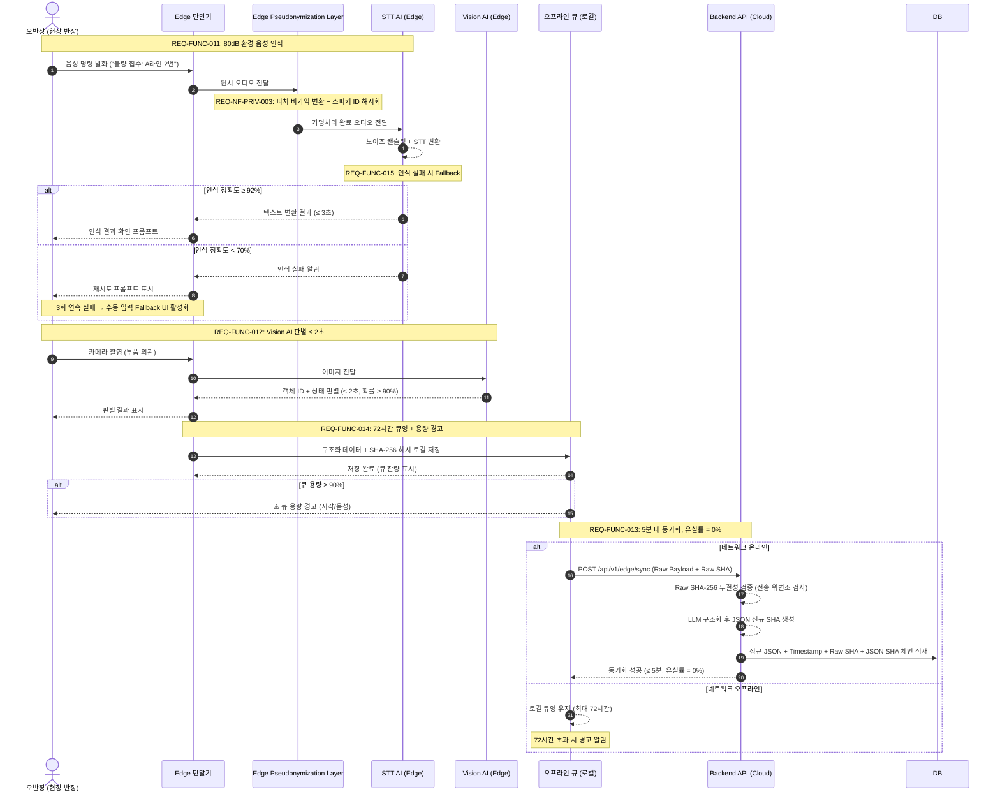
```mermaid
sequenceDiagram
    autonumber
    actor O as 오반장 (현장 반장)
    participant E as Edge 단말기
    participant EP as Edge Pseudonymization Layer
    participant STT as STT AI (Edge)
    participant VIS as Vision AI (Edge)
    participant Q as 오프라인 큐 (로컬)
    participant B as Backend API (Cloud)
    participant DB as DB

    Note over O,STT: REQ-FUNC-011: 80dB 환경 음성 인식
    O->>E: 음성 명령 발화 ("불량 접수: A라인 2번")
    E->>EP: 원시 오디오 전달
    Note over EP: REQ-NF-PRIV-003: 피치 비가역 변환 + 스피커 ID 해시화
    EP->>STT: 가명처리 완료 오디오 전달
    STT-->>STT: 노이즈 캔슬링 + STT 변환

    Note over STT: REQ-FUNC-015: 인식 실패 시 Fallback
    alt 인식 정확도 ≥ 92%
        STT-->>E: 텍스트 변환 결과 (≤ 3초)
        E-->>O: 인식 결과 확인 프롬프트
    else 인식 정확도 < 70%
        STT-->>E: 인식 실패 알림
        E-->>O: 재시도 프롬프트 표시
        Note over O,E: 3회 연속 실패 → 수동 입력 Fallback UI 활성화
    end

    Note over O,VIS: REQ-FUNC-012: Vision AI 판별 ≤ 2초
    O->>E: 카메라 촬영 (부품 외관)
    E->>VIS: 이미지 전달
    VIS-->>E: 객체 ID + 상태 판별 (≤ 2초, 확률 ≥ 90%)
    E-->>O: 판별 결과 표시

    Note over E,Q: REQ-FUNC-014: 72시간 큐잉 + 용량 경고
    E->>Q: 구조화 데이터 + SHA-256 해시 로컬 저장
    Q-->>E: 저장 완료 (큐 잔량 표시)
    alt 큐 용량 ≥ 90%
        Q-->>O: ⚠️ 큐 용량 경고 (시각/음성)
    end

    Note over Q,B: REQ-FUNC-013: 5분 내 동기화, 유실률 = 0%
    alt 네트워크 온라인
        Q->>B: POST /api/v1/edge/sync (Raw Payload + Raw SHA)
        B-->>B: Raw SHA-256 무결성 검증 (전송 위변조 검사)
        B-->>B: LLM 구조화 후 JSON 신규 SHA 생성
        B->>DB: 정규 JSON + Timestamp + Raw SHA + JSON SHA 체인 적재
        B-->>Q: 동기화 성공 (≤ 5분, 유실률 = 0%)
    else 네트워크 오프라인
        Q-->>Q: 로컬 큐잉 유지 (최대 72시간)
        Note over Q: 72시간 초과 시 경고 알림
    end
```

#### 4.3.4 글로벌 벤더 등록 가속기 (REQ-FUNC-016 ~ 018, Phase 2)

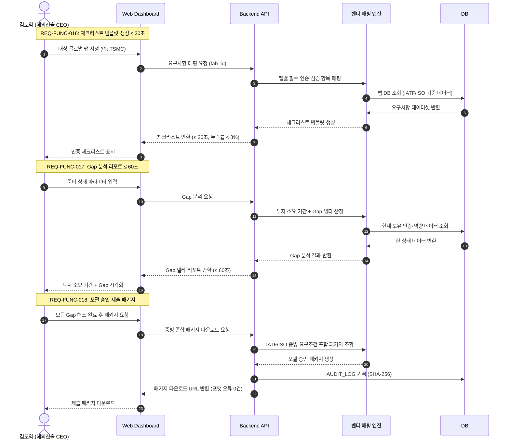
```mermaid
sequenceDiagram
    autonumber
    actor K as 김도약 (해외진출 CEO)
    participant W as Web Dashboard
    participant B as Backend API
    participant VE as 벤더 매핑 엔진
    participant DB as DB

    Note over K,W: REQ-FUNC-016: 체크리스트 템플릿 생성 ≤ 30초
    K->>W: 대상 글로벌 팹 지정 (예: TSMC)
    W->>B: 요구사항 매핑 요청 (fab_id)
    B->>VE: 팹별 필수 인증·점검 항목 매핑
    VE->>DB: 팹 DB 조회 (IATF/ISO 기준 데이터)
    DB-->>VE: 요구사항 데이터셋 반환
    VE-->>B: 체크리스트 템플릿 생성
    B-->>W: 체크리스트 반환 (≤ 30초, 누락률 < 3%)
    W-->>K: 인증 체크리스트 표시

    Note over K,W: REQ-FUNC-017: Gap 분석 리포트 ≤ 60초
    K->>W: 준비 상태 파라미터 입력
    W->>B: Gap 분석 요청
    B->>VE: 투자 소요 기간 + Gap 델타 산정
    VE->>DB: 현재 보유 인증·역량 데이터 조회
    DB-->>VE: 현 상태 데이터 반환
    VE-->>B: Gap 분석 결과 반환
    B-->>W: Gap 델타 리포트 반환 (≤ 60초)
    W-->>K: 투자 소요 기간 + Gap 시각화

    Note over K,W: REQ-FUNC-018: 포괄 승인 제출 패키지
    K->>W: 모든 Gap 해소 완료 후 패키지 요청
    W->>B: 증빙 종합 패키지 다운로드 요청
    B->>VE: IATF/ISO 증빙 요구조건 포함 패키지 조합
    VE-->>B: 포괄 승인 패키지 생성
    B->>DB: AUDIT_LOG 기록 (SHA-256)
    B-->>W: 패키지 다운로드 URL 반환 (포맷 오류 0건)
    W-->>K: 제출 패키지 다운로드
```

#### 4.3.5 Lean 진단 도구 (REQ-FUNC-019 ~ 023)

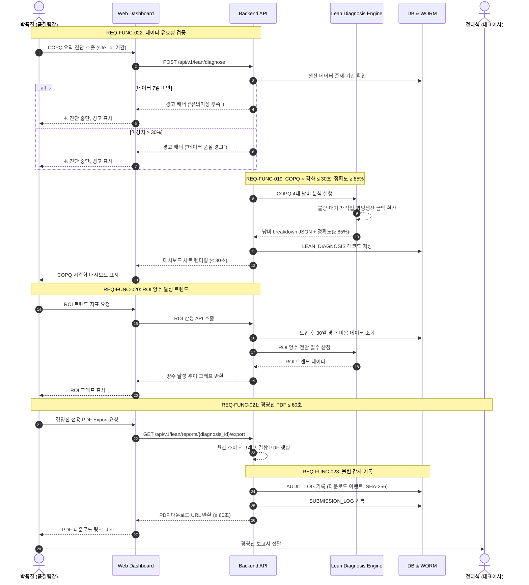
```mermaid
sequenceDiagram
    autonumber
    actor P as 박품질 (품질팀장)
    participant W as Web Dashboard
    participant B as Backend API
    participant LE as Lean Diagnosis Engine
    participant DB as DB & WORM
    actor CEO as 정태식 (대표이사)

    Note over P,B: REQ-FUNC-022: 데이터 유효성 검증
    P->>W: COPQ 요약 진단 호출 (site_id, 기간)
    W->>B: POST /api/v1/lean/diagnose
    B->>DB: 생산 데이터 존재·기간 확인

    alt 데이터 7일 미만
        B-->>W: 경고 배너 ("유의미성 부족")
        W-->>P: ⚠️ 진단 중단, 경고 표시
    else 이상치 > 30%
        B-->>W: 경고 배너 ("데이터 품질 경고")
        W-->>P: ⚠️ 진단 중단, 경고 표시
    end

    Note over B,LE: REQ-FUNC-019: COPQ 시각화 ≤ 30초, 정확도 ≥ 85%
    B->>LE: COPQ 4대 낭비 분석 실행
    LE-->>LE: 불량·대기·재작업·과잉생산 금액 환산
    LE-->>B: 낭비 breakdown JSON + 정확도(≥ 85%)
    B->>DB: LEAN_DIAGNOSIS 레코드 저장
    B-->>W: 대시보드 차트 렌더링 (≤ 30초)
    W-->>P: COPQ 시각화 대시보드 표시

    Note over P,B: REQ-FUNC-020: ROI 양수 달성 트렌드
    P->>W: ROI 트렌드 지표 요청
    W->>B: ROI 산정 API 호출
    B->>DB: 도입 후 30일 경과 비용 데이터 조회
    B->>LE: ROI 양수 전환 일수 산정
    LE-->>B: ROI 트렌드 데이터
    B-->>W: 양수 달성 추이 그래프 반환
    W-->>P: ROI 그래프 표시

    Note over P,CEO: REQ-FUNC-021: 경영진 PDF ≤ 60초
    P->>W: 경영진 전용 PDF Export 요청
    W->>B: GET /api/v1/lean/reports/{diagnosis_id}/export
    B-->>B: 월간 추이 + 그래프 결합 PDF 생성

    Note over B,DB: REQ-FUNC-023: 불변 감사 기록
    B->>DB: AUDIT_LOG 기록 (다운로드 이벤트, SHA-256)
    B->>DB: SUBMISSION_LOG 기록
    B-->>W: PDF 다운로드 URL 반환 (≤ 60초)
    W-->>P: PDF 다운로드 링크 표시
    P->>CEO: 경영진 보고서 전달
```

#### 4.3.6 데이터 무결성 시스템 (REQ-FUNC-024 ~ 026)

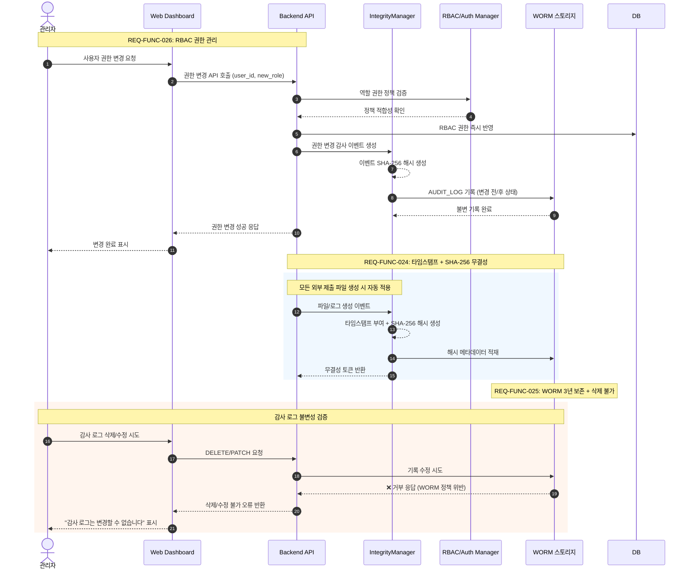
```mermaid
sequenceDiagram
    autonumber
    actor Admin as 관리자
    participant W as Web Dashboard
    participant B as Backend API
    participant IM as IntegrityManager
    participant RBAC as RBAC/Auth Manager
    participant WORM as WORM 스토리지
    participant DB as DB

    Note over Admin,B: REQ-FUNC-026: RBAC 권한 관리
    Admin->>W: 사용자 권한 변경 요청
    W->>B: 권한 변경 API 호출 (user_id, new_role)
    B->>RBAC: 역할 권한 정책 검증
    RBAC-->>B: 정책 적합성 확인
    B->>DB: RBAC 권한 즉시 반영
    B->>IM: 권한 변경 감사 이벤트 생성
    IM-->>IM: 이벤트 SHA-256 해시 생성
    IM->>WORM: AUDIT_LOG 기록 (변경 전/후 상태)
    WORM-->>IM: 불변 기록 완료
    B-->>W: 권한 변경 성공 응답
    W-->>Admin: 변경 완료 표시

    Note over B,WORM: REQ-FUNC-024: 타임스탬프 + SHA-256 무결성
    rect rgb(240, 248, 255)
        Note over B,IM: 모든 외부 제출 파일 생성 시 자동 적용
        B->>IM: 파일/로그 생성 이벤트
        IM-->>IM: 타임스탬프 부여 + SHA-256 해시 생성
        IM->>WORM: 해시 메타데이터 적재
        IM-->>B: 무결성 토큰 반환
    end

    Note over WORM: REQ-FUNC-025: WORM 3년 보존 + 삭제 불가
    rect rgb(255, 245, 238)
        Note over Admin,WORM: 감사 로그 불변성 검증
        Admin->>W: 감사 로그 삭제/수정 시도
        W->>B: DELETE/PATCH 요청
        B->>WORM: 기록 수정 시도
        WORM-->>B: ❌ 거부 응답 (WORM 정책 위반)
        B-->>W: 삭제/수정 불가 오류 반환
        W-->>Admin: "감사 로그는 변경할 수 없습니다" 표시
    end
```

---

#### 4.3.7 외부 시스템 장애 시 임시 우회(Fallback) 전략 및 기존 시스템 연동

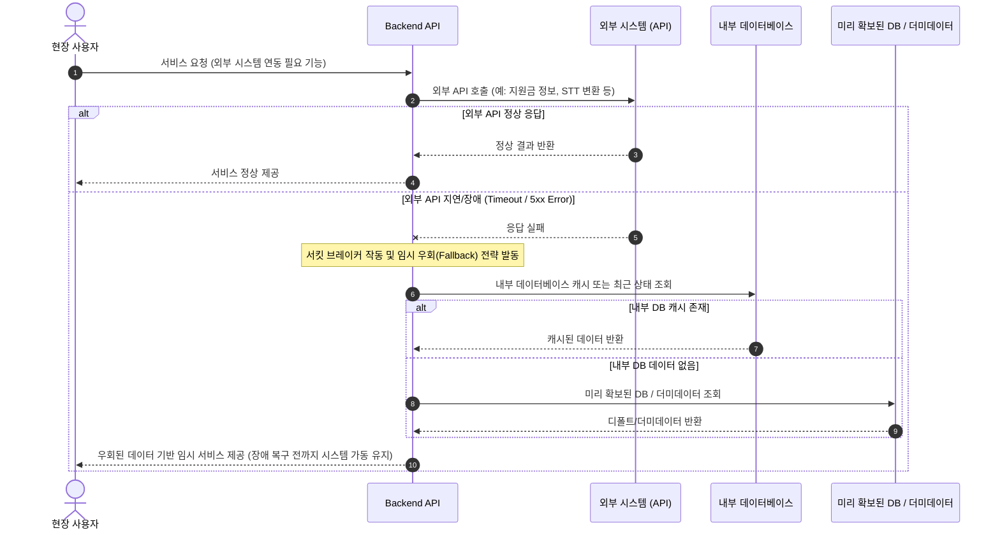
```mermaid
sequenceDiagram
    autonumber
    actor P as 현장 사용자
    participant B as Backend API
    participant Ext as 외부 시스템 (API)
    participant DB as 내부 데이터베이스
    participant Dummy as 미리 확보된 DB / 더미데이터

    P->>B: 서비스 요청 (외부 시스템 연동 필요 기능)
    B->>Ext: 외부 API 호출 (예: 지원금 정보, STT 변환 등)
    
    alt 외부 API 정상 응답
        Ext-->>B: 정상 결과 반환
        B-->>P: 서비스 정상 제공
    else 외부 API 지연/장애 (Timeout / 5xx Error)
        Ext--xB: 응답 실패
        Note over B: 서킷 브레이커 작동 및 임시 우회(Fallback) 전략 발동
        B->>DB: 내부 데이터베이스 캐시 또는 최근 상태 조회
        
        alt 내부 DB 캐시 존재
            DB-->>B: 캐시된 데이터 반환
        else 내부 DB 데이터 없음
            B->>Dummy: 미리 확보된 DB / 더미데이터 조회
            Dummy-->>B: 디폴트/더미데이터 반환
        end
        
        B-->>P: 우회된 데이터 기반 임시 서비스 제공 (장애 복구 전까지 시스템 가동 유지)
    end
```

## 5. Traceability Matrix

### 5.1 Story ↔ Requirement ↔ Test Case 추적 매트릭스

| Source Story | Feature | Requirement IDs | Test Case IDs |
|:---|:---|:---|:---|
| Story 3.1 (Smart Audit) | F-1 | REQ-FUNC-001, REQ-FUNC-002, REQ-FUNC-003, REQ-FUNC-004, REQ-FUNC-005 | TC-SA-001 ~ TC-SA-005 |
| Story 3.2 (NC 시정) | F-2 | REQ-FUNC-006, REQ-FUNC-007, REQ-FUNC-008, REQ-FUNC-009, REQ-FUNC-010 | TC-NC-001 ~ TC-NC-005 |
| Story 3.3 (Zero-UI) | F-3 | REQ-FUNC-011, REQ-FUNC-012, REQ-FUNC-013, REQ-FUNC-014, REQ-FUNC-015 | TC-UI-001 ~ TC-UI-005 |
| Story 3.4 (벤더 등록, Phase 2) | O-2 | REQ-FUNC-016, REQ-FUNC-017, REQ-FUNC-018 | TC-VD-001 ~ TC-VD-003 |
| Story 3.5 (Lean 진단) | F-4 | REQ-FUNC-019, REQ-FUNC-020, REQ-FUNC-021, REQ-FUNC-022, REQ-FUNC-023 | TC-LN-001 ~ TC-LN-005 |
| 공통 (데이터 무결성) | F-5 | REQ-FUNC-024, REQ-FUNC-025, REQ-FUNC-026 | TC-DI-001 ~ TC-DI-003 |

### 5.2 Non-Functional Requirements ↔ Test Case 추적 매트릭스

| NFR 범주 | Requirement IDs | Test Case IDs |
|:---|:---|:---|
| 성능 | REQ-NF-001 ~ REQ-NF-006 | TC-NFR-PERF-001 ~ TC-NFR-PERF-006 |
| 가용성 | REQ-NF-007 ~ REQ-NF-009 | TC-NFR-AVAIL-001 ~ TC-NFR-AVAIL-003 |
| 무결성 | REQ-NF-010 ~ REQ-NF-012 | TC-NFR-INTG-001 ~ TC-NFR-INTG-003 |
| 보안 | REQ-NF-013 ~ REQ-NF-017 | TC-NFR-SEC-001 ~ TC-NFR-SEC-005 |
| 비용 | REQ-NF-018 ~ REQ-NF-020 | TC-NFR-COST-001 ~ TC-NFR-COST-003 |
| 스케일링 | REQ-NF-021 | TC-NFR-SCALE-001 |
| 모니터링/운영 | REQ-NF-022 ~ REQ-NF-024 | TC-NFR-OPS-001 ~ TC-NFR-OPS-003 |

### 5.3 AI 시스템 거버넌스 추적 매트릭스 (신규 갱신분)

| 신규 요구사항 ID | 기존 연계 요구사항 | 비고 (보완 목적) |
|:---|:---|:---|
| **REQ-FUNC-AI-001 ~ 004** | REQ-FUNC-002, 011, 012, 019 | [REF-01] PRD 정확도(99%) 및 인식률(92%) 등 성능 지표 달성을 담보하기 위한 데이터 검증 및 Drift 모니터링 체계 구체화 |
| **REQ-FUNC-AI-005, 006** | REQ-FUNC-006, 008 | [REF-01] PRD NC 시정 초안 등 민감 작업 시 환각 제어(Hallucination Filter) 및 HitL (Human-in-the-loop) 개입 의무화 |
| **REQ-FUNC-AI-007** | REQ-FUNC-002 | [REF-01] PRD 매핑 정확도 달성에 대한 사후 설명 가능성(역추적 XAI MVP) 보장 |
| **REQ-FUNC-AI-008** | REQ-FUNC-011 | [REF-01] PRD Zero-UI 소음 환경 인식률 달성에 있어 소수 그룹(사투리/성별 등) 계층별 편향성 통제 |
| **REQ-NF-031 ~ 033** | REQ-NF-029 | AI 검증(VMP) 선언 사항을 아키텍처 수준의 로깅/배포 체계(Inference Log, Model Registry)로 실행 가능하도록 구현 |

### 5.4 컴플라이언스 및 규제 대응 추적 매트릭스 (신규 갱신분)

| 신규 요구사항 ID | 기존 연계 대상 | 비고 (보완 목적) |
|:---|:---|:---|
| **REQ-NF-PRIV-001 ~ 006** | 개인정보보호법 (PIPA) | 제15조, 제23조, 제28조의2, 제35~37조 요구사항을 시스템 NFR로 명세화. 민감정보 처리 근거와 정보주체 권리 보장. |
| **REQ-NF-LABOR-001 ~ 002** | 근로기준법/산안법 | 근로자 감시 방지 및 동의 체계 강제. 목적 외 전용 차단 아키텍처 수립. |
| **REQ-NF-GDPR-001 ~ 004** | GDPR (Phase 2) | DPO, SCC 체결 의무, 데이터 이동권, 자동화 의사결정 거부권 적용. |
| **Cryptographic Erasure** | CON-03, REQ-NF-016 | WORM 3년 보존 의무와 정보주체 삭제권(잊힐 권리) 간의 법적 충돌을 논리적 파기 기법으로 기술적 우회 해소. |

### 5.5 측정 프로토콜 ↔ 요구사항 추적 (신규)

| REQ-ID | 개정 여부 | Appendix 참조 | Golden Dataset ID | 책임 조직 | 측정 주기 |
|:---|:---:|:---|:---|:---|:---|
| REQ-FUNC-001 | 개정 | [REF-01] PRD A.1 (간접) | audit_mapping@v1 | AI팀/QA | 월 1회 |
| REQ-FUNC-002 | 개정 | [REF-01] PRD A.1 | audit_mapping@v1 | AI팀/QA | 릴리즈+월 |
| REQ-FUNC-003 | 개정 | [REF-01] PRD A.6 | anomaly@v1 | AI팀/품질팀 | 주+월 |
| REQ-FUNC-006 | 개정 | [REF-01] PRD A.4 | nc_parsing@v1 | AI팀/품질팀 | 릴리즈+월 |
| REQ-FUNC-011 | 개정 | [REF-01] PRD A.2 | stt@v1 | AI팀/현장QA | 릴리즈+월 |
| REQ-FUNC-012 | 개정 | [REF-01] PRD A.3 | vision@v1 | AI팀/현장QA | 릴리즈+월 |
| REQ-FUNC-019 | 개정 | [REF-01] PRD A.5 | copq@v1 | AI팀/재무팀 | 월+분기 |

### 5.6 Test Case 갱신 영향 (신규 주석)

위 개정으로 인해 기존 TC-SA-001~005, TC-NC-001~005, TC-UI-001~005, TC-LN-001~005의 Test 시나리오가 Appendix A 프로토콜 준수 방향으로 재작성되어야 함. (QA팀 담당, v0.5 예정)

### 5.7 멀티테넌트 격리 추적 매트릭스 (신규)

| 신규 요구사항 ID | 기존 연계 대상 | 비고 (보완 목적) |
|:---|:---|:---|
| **REQ-NF-TENANT-001 ~ 007** | REQ-NF-015(RBAC), REQ-NF-017(침투 테스트) | 공유 인프라 환경에서의 Cross-tenant 누출 리스크(R-10) 해소 및 논리적 격리 담보 |

---

## 6. Appendix

### 6.1 API Endpoint List

| # | API 이름 | HTTP Method | Endpoint Path | 설명 | 주요 입력 파라미터 | 주요 응답 | 제약 사항 |
|:---:|:---|:---:|:---|:---|:---|:---|:---|
| 1 | Audit Report API | POST | `/api/v1/audit/reports` | 수집 데이터 기반 ISO 양식 PDF 리포트 생성 | `session_id`, `data_filter`, `template_id` | PDF 파일 URL, 메타데이터 JSON | Payload ≤ 50MB, 생성 대기 ≤ 600초 |
| 2 | Audit Report API (조회) | GET | `/api/v1/audit/reports/{report_id}` | 기생성 리포트 조회 및 다운로드 | `report_id` | PDF 파일, 생성 시간, 매핑 정확도 | — |
| 3 | Zero-UI Edge API (동기화) | POST | `/api/v1/edge/sync` | Edge → Cloud 데이터 동기화 | `device_id`, `payload[]` (WAV, 이미지, JSON) | 동기화 결과, processed_count | 오프라인 72시간 큐 허용 |
| 4 | Zero-UI Edge API (상태) | GET | `/api/v1/edge/devices/{device_id}/status` | Edge 디바이스 연결 상태 조회 | `device_id` | 연결 상태, 큐 잔량, 마지막 동기화 시간 | — |
| 5 | NC Response API (생성) | POST | `/api/v1/nc/cases` | NC 케이스 등록 및 시정 계획 초안 생성 | `nc_code`, `description`, `severity` | 시정 계획 초안, nc_id | Critical: 24h 내 제출 프로세스 |
| 6 | NC Response API (조회) | GET | `/api/v1/nc/cases/{nc_id}` | NC 케이스 상세 및 시정 진행 상태 조회 | `nc_id` | NC 상세, 시정 조치 목록, 진행률 | — |
| 7 | NC Response API (시정 갱신) | PATCH | `/api/v1/nc/cases/{nc_id}/actions/{action_id}` | 시정 조치 상태·진행률 갱신 | `action_id`, `status`, `completion_pct` | 갱신 결과 | 갱신 반영 ≤ 30초 |
| 8 | Lean Diagnosis API (진단) | POST | `/api/v1/lean/diagnose` | COPQ 진단 실행 및 ROI 산정 | `site_id`, `period_start`, `period_end` | COPQ 통계 JSON, ROI 트렌드 | 최소 7일 데이터. 정확도 ≥ 85% |
| 9 | Lean Diagnosis API (Export) | GET | `/api/v1/lean/reports/{diagnosis_id}/export` | 경영진 보고용 PDF 내보내기 | `diagnosis_id`, `format` | PDF 파일 | 생성 ≤ 60초 |
| 10 | Template Registry API (목록) | GET | `/api/v1/templates` | 원청 Audit 양식 템플릿 목록 조회 | `audit_type` (ISO9001, 14001 등) | 템플릿 ID·이름·버전 목록 | — |
| 11 | Template Registry API (상세) | GET | `/api/v1/templates/{template_id}` | 특정 템플릿 상세 조회 | `template_id` | 템플릿 JSON/XML 구조 | — |
| 12 | Template Registry API (등록) | POST | `/api/v1/templates` | 신규 커스텀 템플릿 등록 | 템플릿 JSON/XML, `audit_type`, `org_name` | `template_id` | 관리자 권한 필요 |

### 6.2 Data Model & Enum

#### 6.2.0 Entity-Relationship Diagram (ERD)
상세 스키마 진입용 ERD. 통합 ERD는 §3.4.3 참조. 아래는 6.2.1~6.2.13 테이블 정의의 관계를 요약한다.

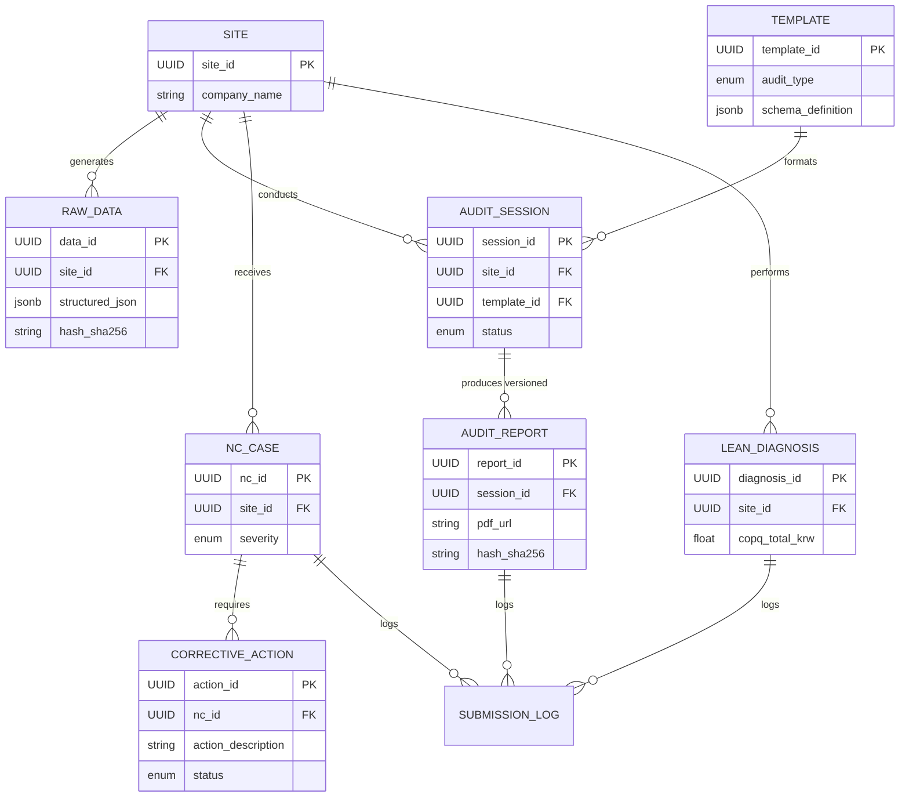
```mermaid
erDiagram
    SITE ||--o{ RAW_DATA : generates
    SITE ||--o{ AUDIT_SESSION : conducts
    SITE ||--o{ NC_CASE : "receives"
    SITE ||--o{ LEAN_DIAGNOSIS : performs
    
    AUDIT_SESSION ||--o{ AUDIT_REPORT : "produces versioned"
    TEMPLATE ||--o{ AUDIT_SESSION : "formats"
    
    NC_CASE ||--o{ CORRECTIVE_ACTION : requires
    
    AUDIT_REPORT ||--o{ SUBMISSION_LOG : logs
    NC_CASE ||--o{ SUBMISSION_LOG : logs
    LEAN_DIAGNOSIS ||--o{ SUBMISSION_LOG : logs
    
    SITE {
        UUID site_id PK
        string company_name
    }
    RAW_DATA {
        UUID data_id PK
        UUID site_id FK
        jsonb structured_json
        string hash_sha256
    }
    AUDIT_SESSION {
        UUID session_id PK
        UUID site_id FK
        UUID template_id FK
        enum status
    }
    AUDIT_REPORT {
        UUID report_id PK
        UUID session_id FK
        string pdf_url
        string hash_sha256
    }
    TEMPLATE {
        UUID template_id PK
        enum audit_type
        jsonb schema_definition
    }
    NC_CASE {
        UUID nc_id PK
        UUID site_id FK
        enum severity
    }
    CORRECTIVE_ACTION {
        UUID action_id PK
        UUID nc_id FK
        string action_description
        enum status
    }
    LEAN_DIAGNOSIS {
        UUID diagnosis_id PK
        UUID site_id FK
        float copq_total_krw
    }
```

#### 6.2.1 SITE (사업장)

| 필드 | 타입 | 설명 | 제약 조건 |
|:---|:---|:---|:---|
| site_id | UUID | 사업장 고유 식별자 | **PK** |
| company_name | string(200) | 기업명 | NOT NULL |
| employee_count | int | 직원 수 | ≥ 1 |
| industry_sector | string(100) | 산업 분야 | NOT NULL |
| certifications | array[string] | 보유 인증 목록 (ISO 9001, 14001 등) | — |
| created_at | timestamp | 등록 일시 | NOT NULL, DEFAULT NOW() |
| updated_at | timestamp | 최종 수정 일시 | NOT NULL |

#### 6.2.2 RAW_DATA (원본 수집 데이터)

| 필드 | 타입 | 설명 | 제약 조건 |
|:---|:---|:---|:---|
| data_id | UUID | 데이터 고유 식별자 | **PK** |
| site_id | UUID | 사업장 참조 | **FK → SITE.site_id**, NOT NULL |
| source_type | enum | 수집 유형: `voice`, `vision`, `sensor`, `manual` | NOT NULL |
| payload | blob | 원본 데이터 바이너리 | NOT NULL |
| structured_json | jsonb | AI 변환 후 구조화 데이터 | — |
| collected_at | timestamp | 수집 일시 | NOT NULL |
| synced_at | timestamp | Cloud 동기화 완료 일시 | — |
| device_id | string(100) | 수집 디바이스 식별자 | NOT NULL |
| hash_sha256 | string(64) | SHA-256 무결성 해시 | NOT NULL |

#### 6.2.3 AUDIT_SESSION (Audit 세션)

| 필드 | 타입 | 설명 | 제약 조건 |
|:---|:---|:---|:---|
| session_id | UUID | Audit 세션 고유 식별자 | **PK** |
| site_id | UUID | 사업장 참조 | **FK → SITE.site_id**, NOT NULL |
| audit_type | enum | Audit 유형: `ISO9001`, `ISO14001`, `ISO45001`, `IATF16949` | NOT NULL |
| auditor_org | string(200) | 심사 기관명 | — |
| template_id | UUID | 적용 템플릿 참조 | **FK → TEMPLATE.template_id** |
| scheduled_date | date | 심사 예정일 | NOT NULL |
| status | enum | 세션 상태: `draft`, `in_progress`, `completed` | NOT NULL, DEFAULT `draft` |
| created_at | timestamp | 생성 일시 | NOT NULL |

#### 6.2.4 AUDIT_REPORT (Audit 리포트)

| 필드 | 타입 | 설명 | 제약 조건 |
|:---|:---|:---|:---|
| report_id | UUID | 리포트 고유 식별자 | **PK** |
| session_id | UUID | Audit 세션 참조 | **FK → AUDIT_SESSION.session_id**, NOT NULL |
| version | int | 리포트 버전 번호 | NOT NULL, DEFAULT 1 |
| pdf_url | string(500) | PDF 파일 저장 경로/URL | NOT NULL |
| generation_time_sec | int | 생성 소요 시간(초) | NOT NULL |
| mapping_accuracy_pct | float | 매핑 정확도(%) | NOT NULL, CHECK ≥ 0 AND ≤ 100 |
| missing_field_count | int | 누락 필드 수 | NOT NULL, DEFAULT 0 |
| generated_at | timestamp | 생성 일시 | NOT NULL |
| hash_sha256 | string(64) | 리포트 파일 SHA-256 해시 | NOT NULL |

#### 6.2.5 NC_CASE (부적합 사례)

| 필드 | 타입 | 설명 | 제약 조건 |
|:---|:---|:---|:---|
| nc_id | UUID | NC 고유 식별자 | **PK** |
| site_id | UUID | 사업장 참조 | **FK → SITE.site_id**, NOT NULL |
| nc_code | string(50) | NC 분류 코드 | NOT NULL |
| description | text | 부적합 사유 상세 | NOT NULL |
| severity | enum | 심각도: `critical`, `major`, `minor`, `observation` | NOT NULL |
| notified_at | date | NC 통보일 | NOT NULL |
| deadline | date | 시정 기한 | NOT NULL |
| status | enum | 상태: `open`, `in_progress`, `resolved`, `closed` | NOT NULL, DEFAULT `open` |
| created_at | timestamp | 등록 일시 | NOT NULL |

#### 6.2.6 CORRECTIVE_ACTION (시정 조치)

| 필드 | 타입 | 설명 | 제약 조건 |
|:---|:---|:---|:---|
| action_id | UUID | 시정 조치 고유 식별자 | **PK** |
| nc_id | UUID | NC 사례 참조 | **FK → NC_CASE.nc_id**, NOT NULL |
| action_description | text | 시정 조치 상세 내용 | NOT NULL |
| assignee | string(100) | 담당자 | NOT NULL |
| status | enum | 상태: `pending`, `in_progress`, `completed`, `verified` | NOT NULL, DEFAULT `pending` |
| completion_pct | float | 진행률(%) | CHECK ≥ 0 AND ≤ 100 |
| evidence_url | string(500) | 근거 자료 URL | — |
| started_at | timestamp | 착수 일시 | — |
| completed_at | timestamp | 완료 일시 | — |
| updated_at | timestamp | 최종 갱신 일시 | NOT NULL |

#### 6.2.7 LEAN_DIAGNOSIS (Lean 진단)

| 필드 | 타입 | 설명 | 제약 조건 |
|:---|:---|:---|:---|
| diagnosis_id | UUID | 진단 고유 식별자 | **PK** |
| site_id | UUID | 사업장 참조 | **FK → SITE.site_id**, NOT NULL |
| period_start | date | 분석 시작일 | NOT NULL |
| period_end | date | 분석 종료일 | NOT NULL |
| copq_total_krw | float | COPQ 총 금액(원) | NOT NULL |
| waste_breakdown | jsonb | 4대 낭비 항목별 금액 분해 | NOT NULL |
| roi_days | float | ROI 양수 전환 소요 일수 | — |
| accuracy_pct | float | 산출 정확도(%) | CHECK ≥ 0 AND ≤ 100 |
| data_quality_flag | enum | 데이터 품질: `valid`, `insufficient`, `outlier_warning` | NOT NULL |
| diagnosed_at | timestamp | 진단 일시 | NOT NULL |

#### 6.2.8 TEMPLATE (Audit 양식 템플릿)

| 필드 | 타입 | 설명 | 제약 조건 |
|:---|:---|:---|:---|
| template_id | UUID | 템플릿 고유 식별자 | **PK** |
| audit_type | enum | `ISO9001`, `ISO14001`, `ISO45001`, `IATF16949` | NOT NULL |
| org_name | string(200) | 원청 기관명 (예: 삼성, SK) | NOT NULL |
| template_name | string(200) | 템플릿 표시명 | NOT NULL |
| version | int | 버전 번호 | NOT NULL, DEFAULT 1 |
| schema_definition | jsonb | 필드 매핑 스키마 정의 | NOT NULL |
| is_active | boolean | 활성 여부 | NOT NULL, DEFAULT true |
| created_at | timestamp | 등록 일시 | NOT NULL |
| updated_at | timestamp | 최종 수정 일시 | NOT NULL |

#### 6.2.9 AUDIT_LOG (감사 로그)

| 필드 | 타입 | 설명 | 제약 조건 |
|:---|:---|:---|:---|
| log_id | UUID | 로그 고유 식별자 | **PK** |
| event_type | enum | 이벤트 유형: `create`, `update`, `delete`, `download`, `login`, `permission_change` | NOT NULL |
| actor_id | string(100) | 수행자 식별자 | NOT NULL |
| target_entity | string(100) | 대상 엔터티명 | NOT NULL |
| target_id | UUID | 대상 레코드 식별자 | NOT NULL |
| before_state | jsonb | 변경 전 상태 (해당 시) | — |
| after_state | jsonb | 변경 후 상태 (해당 시) | — |
| ip_address | string(45) | 요청 IP 주소 | NOT NULL |
| timestamp | timestamp | 이벤트 발생 일시 | NOT NULL |
| hash_sha256 | string(64) | 현재 로그 엔트리의 SHA-256 해시 | NOT NULL |
| previous_hash | string(64) | 직전 로그의 SHA-256 해시 (Merkle 체인 형성) | NOT NULL |
| storage_type | string(20) | 저장 유형: `WORM` 고정 | NOT NULL, DEFAULT `WORM` |

#### 6.2.10 SUBMISSION_LOG (제출 로그)

| 필드 | 타입 | 설명 | 제약 조건 |
|:---|:---|:---|:---|
| submission_id | UUID | 제출 로그 고유 식별자 | **PK** |
| report_type | enum | `audit_report`, `nc_report`, `lean_report` | NOT NULL |
| report_id | UUID | 대상 보고서 식별자 | NOT NULL |
| submitted_by | string(100) | 제출자 | NOT NULL |
| submitted_at | timestamp | 제출 일시 | NOT NULL |
| recipient | string(200) | 수신자/기관 | NOT NULL |
| file_hash_sha256 | string(64) | 제출 파일 SHA-256 해시 | NOT NULL |
| storage_type | string(20) | 저장 유형: `WORM` 고정 | NOT NULL, DEFAULT `WORM` |

#### 6.2.11 AI_MODEL_REGISTRY (신규)

| 필드 | 타입 | 설명 | 제약 조건 |
|:---|:---|:---|:---|
| model_id | UUID | 모델 고유 식별자 | **PK** |
| model_type | enum | `stt`, `vision`, `llm_mapping`, `llm_nc_parsing`, `copq_ml` | NOT NULL |
| version | string(50) | 시맨틱 버전 (예: 2.1.3) | NOT NULL |
| container_image_hash | string(64) | 배포 컨테이너 해시 | NOT NULL |
| inference_params | jsonb | Temperature, Top-p, Seed 등 고정 파라미터 값 | NOT NULL |
| golden_dataset_id | UUID | 성능 검증용 기준 데이터셋 참조 | **FK** → GOLDEN_DATASET.dataset_id |
| baseline_metrics | jsonb | 배포 시점의 성능 지표 스냅샷 | NOT NULL |
| deployed_at | timestamp | 모델 운영 환경 배포 일시 | NOT NULL |
| deprecated_at | timestamp | 모델 폐기 또는 롤백 일시 | — |
| model_card_url | string(500) | 작성된 Model Card 문서 링크 | NOT NULL |

#### 6.2.12 AI_INFERENCE_LOG (신규)

| 필드 | 타입 | 설명 | 제약 조건 |
|:---|:---|:---|:---|
| inference_id | UUID | 개별 추론 행위 식별자 | **PK** |
| model_id | UUID | 추론에 사용된 모델 참조 | **FK** → AI_MODEL_REGISTRY.model_id |
| input_hash | string(64) | 입력 데이터 페이로드 해시 | NOT NULL |
| output_hash | string(64) | 출력 결과 데이터 해시 | NOT NULL |
| confidence_score | float | AI가 자체 평가한 신뢰도(Confidence) | — |
| hitl_required | boolean | Human-in-the-loop 리뷰 필요 여부 | NOT NULL |
| hitl_reviewer_id | string(100) | 검토를 수행한 관리자 식별자 | — |
| hitl_decision | enum | `approved`, `rejected`, `modified` | — |
| inferred_at | timestamp | 추론 발생 일시 | NOT NULL |

#### 6.2.13 GOLDEN_DATASET (신규 요약)
*(상세 스키마는 Appendix B.6 참조)*

| 필드 | 타입 | 설명 | 제약 조건 |
|:---|:---|:---|:---|
| dataset_id | UUID | 기준 데이터셋 식별자 | **PK** |
| purpose | enum | 용도 (`audit_mapping`, `stt`, `vision` 등) | NOT NULL |
| record_count | int | 데이터셋 포함 레코드 수량 | NOT NULL |
| iaa_score | float | 라벨러 간 교차 검증 신뢰도 (Cohen's Kappa 등) | CHECK ≥ 0.8 |
| updated_at | timestamp | 데이터셋 최신화 일시 | NOT NULL |

### 6.3 Detailed Interaction Models

#### 6.3.1 상세 시퀀스: Zero-UI 데이터 수집 → 실시간 전송 → Audit 리포트 생성

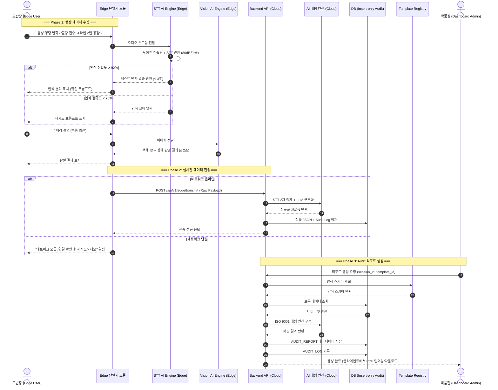
```mermaid
sequenceDiagram
    autonumber
    actor O as 오반장 (Edge User)
    participant E as Edge 단말기 모듈
    participant STT as STT AI Engine (Edge)
    participant VIS as Vision AI Engine (Edge)
    participant B as Backend API (Cloud)
    participant AI as AI 매핑 엔진 (Cloud)
    participant DB as DB (Insert-only Audit)
    participant TMP as Template Registry
    actor P as 박품질 (Dashboard Admin)

    Note over O,E: === Phase 1: 현장 데이터 수집 ===
    O->>E: 음성 명령 발화 ("불량 접수: A라인 2번 공정")
    E->>STT: 오디오 스트림 전달
    STT-->>STT: 노이즈 캔슬링 + STT 변환 (80dB 대응)
    alt 인식 정확도 ≥ 92%
        STT-->>E: 텍스트 변환 결과 반환 (≤ 3초)
        E-->>O: 인식 결과 표시 (확인 프롬프트)
    else 인식 정확도 < 70%
        STT-->>E: 인식 실패 알림
        E-->>O: 재시도 프롬프트 표시
    end

    O->>E: 카메라 촬영 (부품 외관)
    E->>VIS: 이미지 전달
    VIS-->>E: 객체 ID + 상태 판별 결과 (≤ 2초)
    E-->>O: 판별 결과 표시

    Note over E,B: === Phase 2: 실시간 데이터 전송 ===
    alt 네트워크 온라인
        E->>B: POST /api/v1/edge/transmit (Raw Payload)
        B->>AI: STT 2차 정제 + LLM 구조화
        AI-->>B: 정규화 JSON 반환
        B->>DB: 정규 JSON + Audit Log 적재
        B-->>E: 전송 성공 응답
    else 네트워크 단절
        E-->>O: "네트워크 오류: 연결 확인 후 재시도하세요" 알림
    end

    Note over P,B: === Phase 3: Audit 리포트 생성 ===
    P->>B: 리포트 생성 요청 (session_id, template_id)
    B->>TMP: 양식 스키마 조회
    TMP-->>B: 양식 스키마 반환
    B->>DB: 로우 데이터 조회
    DB-->>B: 데이터셋 반환
    B->>AI: ISO 9001 매핑 엔진 구동
    AI-->>B: 매핑 결과 반환
    B->>DB: AUDIT_REPORT 메타데이터 저장
    B->>DB: AUDIT_LOG 기록
    B-->>P: 생성 완료 (클라이언트에서 PDF 렌더링/다운로드)
```

#### 6.3.2 상세 시퀀스: NC 통보 → 시정 → 제출

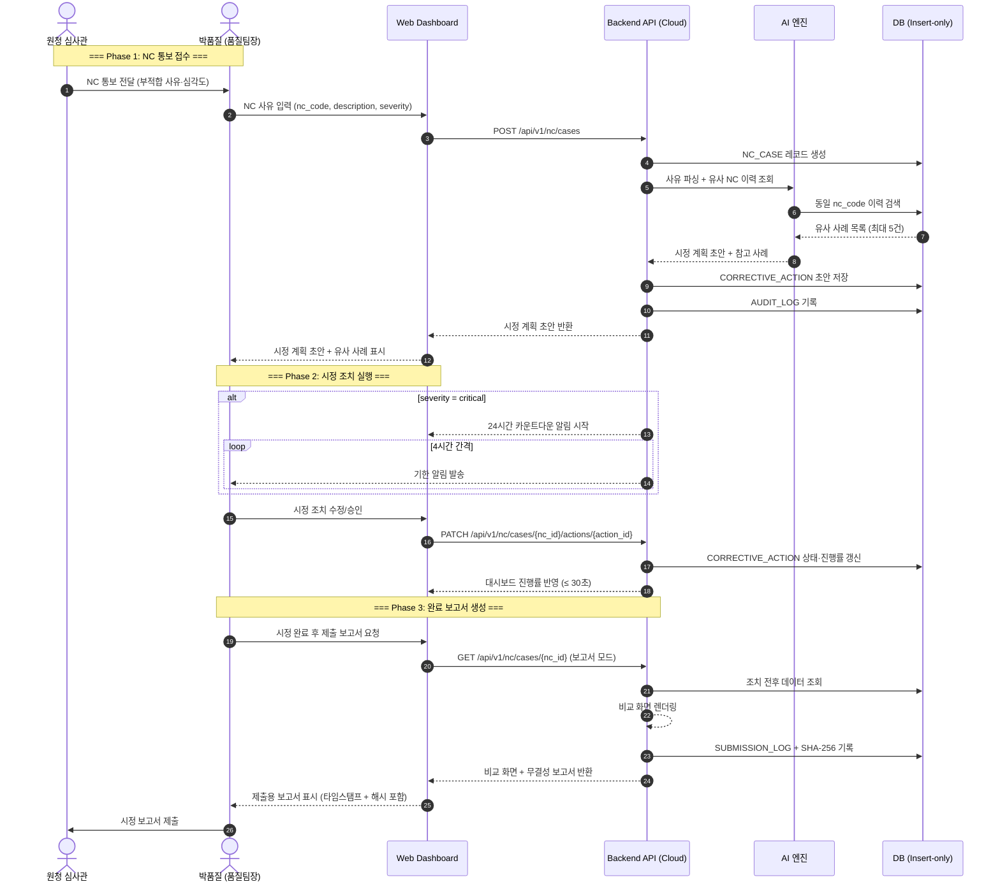
```mermaid
sequenceDiagram
    autonumber
    actor A as 원청 심사관
    actor P as 박품질 (품질팀장)
    participant W as Web Dashboard
    participant B as Backend API (Cloud)
    participant AI as AI 엔진
    participant DB as DB (Insert-only)

    Note over A,P: === Phase 1: NC 통보 접수 ===
    A->>P: NC 통보 전달 (부적합 사유·심각도)
    P->>W: NC 사유 입력 (nc_code, description, severity)
    W->>B: POST /api/v1/nc/cases
    B->>DB: NC_CASE 레코드 생성
    B->>AI: 사유 파싱 + 유사 NC 이력 조회
    AI->>DB: 동일 nc_code 이력 검색
    DB-->>AI: 유사 사례 목록 (최대 5건)
    AI-->>B: 시정 계획 초안 + 참고 사례
    B->>DB: CORRECTIVE_ACTION 초안 저장
    B->>DB: AUDIT_LOG 기록
    B-->>W: 시정 계획 초안 반환
    W-->>P: 시정 계획 초안 + 유사 사례 표시

    Note over P,W: === Phase 2: 시정 조치 실행 ===
    alt severity = critical
        B-->>W: 24시간 카운트다운 알림 시작
        loop 4시간 간격
            B-->>P: 기한 알림 발송
        end
    end
    P->>W: 시정 조치 수정/승인
    W->>B: PATCH /api/v1/nc/cases/{nc_id}/actions/{action_id}
    B->>DB: CORRECTIVE_ACTION 상태·진행률 갱신
    B-->>W: 대시보드 진행률 반영 (≤ 30초)

    Note over P,B: === Phase 3: 완료 보고서 생성 ===
    P->>W: 시정 완료 후 제출 보고서 요청
    W->>B: GET /api/v1/nc/cases/{nc_id} (보고서 모드)
    B->>DB: 조치 전후 데이터 조회
    B-->>B: 비교 화면 렌더링
    B->>DB: SUBMISSION_LOG + SHA-256 기록
    B-->>W: 비교 화면 + 무결성 보고서 반환
    W-->>P: 제출용 보고서 표시 (타임스탬프 + 해시 포함)
    P->>A: 시정 보고서 제출
```

#### 6.3.3 상세 시퀀스: Lean 진단 (COPQ 분석 → 경영진 보고)

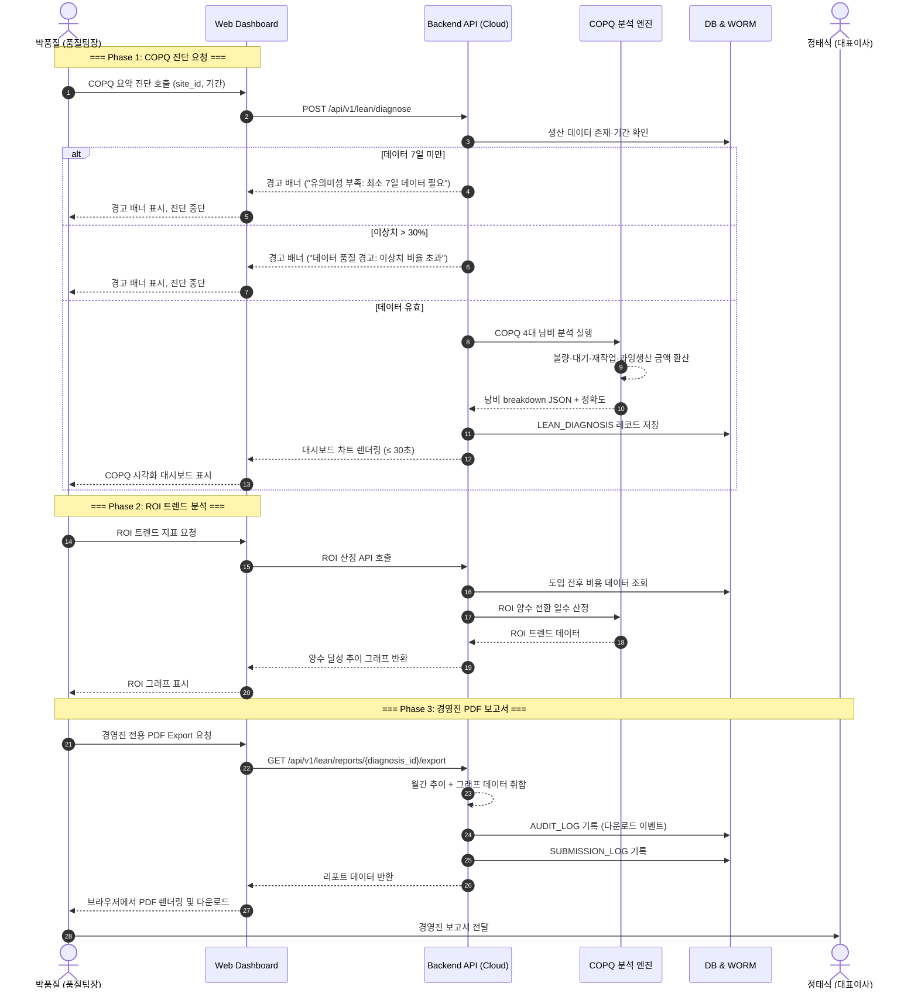
```mermaid
sequenceDiagram
    autonumber
    actor P as 박품질 (품질팀장)
    participant W as Web Dashboard
    participant B as Backend API (Cloud)
    participant AI as COPQ 분석 엔진
    participant DB as DB & WORM
    actor CEO as 정태식 (대표이사)

    Note over P,W: === Phase 1: COPQ 진단 요청 ===
    P->>W: COPQ 요약 진단 호출 (site_id, 기간)
    W->>B: POST /api/v1/lean/diagnose
    B->>DB: 생산 데이터 존재·기간 확인

    alt 데이터 7일 미만
        B-->>W: 경고 배너 ("유의미성 부족: 최소 7일 데이터 필요")
        W-->>P: 경고 배너 표시, 진단 중단
    else 이상치 > 30%
        B-->>W: 경고 배너 ("데이터 품질 경고: 이상치 비율 초과")
        W-->>P: 경고 배너 표시, 진단 중단
    else 데이터 유효
        B->>AI: COPQ 4대 낭비 분석 실행
        AI-->>AI: 불량·대기·재작업·과잉생산 금액 환산
        AI-->>B: 낭비 breakdown JSON + 정확도
        B->>DB: LEAN_DIAGNOSIS 레코드 저장
        B-->>W: 대시보드 차트 렌더링 (≤ 30초)
        W-->>P: COPQ 시각화 대시보드 표시
    end

    Note over P,W: === Phase 2: ROI 트렌드 분석 ===
    P->>W: ROI 트렌드 지표 요청
    W->>B: ROI 산정 API 호출
    B->>DB: 도입 전후 비용 데이터 조회
    B->>AI: ROI 양수 전환 일수 산정
    AI-->>B: ROI 트렌드 데이터
    B-->>W: 양수 달성 추이 그래프 반환
    W-->>P: ROI 그래프 표시

    Note over P,CEO: === Phase 3: 경영진 PDF 보고서 ===
    P->>W: 경영진 전용 PDF Export 요청
    W->>B: GET /api/v1/lean/reports/{diagnosis_id}/export
    B-->>B: 월간 추이 + 그래프 데이터 취합
    B->>DB: AUDIT_LOG 기록 (다운로드 이벤트)
    B->>DB: SUBMISSION_LOG 기록
    B-->>W: 리포트 데이터 반환
    W-->>P: 브라우저에서 PDF 렌더링 및 다운로드
    P->>CEO: 경영진 보고서 전달
```

### 6.4 Validation Plan (검증 계획)

PRD의 검증 계획(실험 방식)에 기반한 검증 프레임워크:

| # | 실험 | 검증 대상 | 방법 | 성공 기준 | 시점 |
|:---:|:---|:---|:---|:---|:---|
| V-1 | 파일럿 사업장 A/B 테스트 | Smart Audit 시간 단축 효과 | 1개 사업장, 30일 운영 | Audit 리포트 생성 ≤ 10분 달성 (**REQ-NF-001**) | Sprint 1 완료 후 |
| V-2 | Zero-UI 채택률 검증 | 현장 데이터 입력 거부율 감소 | 현장 반장 5명 대상 30일 | 입력 거부율 ≤ 20% (대조군 대비 75% 감소) (**REQ-NF-USE-001**) | Sprint 1 완료 후 |
| V-3 | COPQ 절감 효과 검증 | Lean 진단 도구 ROI | 재무 데이터 비교 (n≥3 사업장) | 30일 내 ROI 양수 전환 (**REQ-FUNC-020**) | Sprint 1 W3 이후 |
| V-4 | NC 대응 시간 검증 | 긴급 시정 속도 향상 | 시정 계획 생성 소요 시간 측정 | 시정 계획 생성 ≤ 5분 (기존 대비 90% 감소) (**REQ-NF-004**) | Sprint 1 완료 후 |
| V-5 | LTV:CAC 비율 검증 | 비즈니스 모델 지속 가능성 | 3단계 프레임워크 적용 (Stage 1→2→3) | LTV:CAC ≥ 3:1 (6개월 내) | Phase 2 |

### 6.5 Backend System Class Models
핵심 처리 엔진의 주요 클래스 및 메소드 설계도.

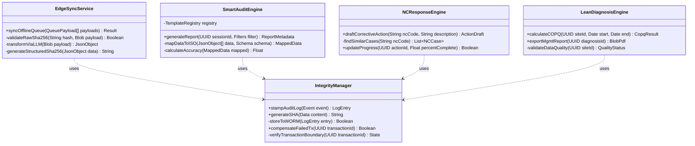
```mermaid
classDiagram
    class EdgeSyncService {
        +syncOfflineQueue(QueuePayload[] payloads) Result
        -validateRawSha256(String hash, Blob payload) Boolean
        -transformViaLLM(Blob payload) JsonObject
        -generateStructuredSha256(JsonObject data) String
    }
    
    class SmartAuditEngine {
        -TemplateRegistry registry
        +generateReport(UUID sessionId, Filters filter) ReportMetadata
        -mapDataToISO(JsonObject[] data, Schema schema) MappedData
        -calculateAccuracy(MappedData mapped) Float
    }
    
    class NCResponseEngine {
        +draftCorrectiveAction(String ncCode, String description) ActionDraft
        -findSimilarCases(String ncCode) List~NCCase~
        +updateProgress(UUID actionId, Float percentComplete) Boolean
    }
    
    class LeanDiagnosisEngine {
        +calculateCOPQ(UUID siteId, Date start, Date end) CopqResult
        +exportMgmtReport(UUID diagnosisId) BlobPdf
        -validateDataQuality(UUID siteId) QualityStatus
    }
    
    class IntegrityManager {
        +stampAuditLog(Event event) LogEntry
        +generateSHA(Data content) String
        -storeToWORM(LogEntry entry) Boolean
        +compensateFailedTx(UUID transactionId) Boolean
        -verifyTransactionBoundary(UUID transactionId) State
    }

    EdgeSyncService ..> IntegrityManager : uses
    SmartAuditEngine ..> IntegrityManager : uses
    NCResponseEngine ..> IntegrityManager : uses
    LeanDiagnosisEngine ..> IntegrityManager : uses
```

---

### 6.6 Appendix A: Measurement Protocols

정량적 요구사항의 불확실성을 제거하고 검증 가능성을 보장하기 위한 공식 측정 프로토콜을 정의한다.

#### A.1 Audit 매핑 정확도 측정 (REQ-FUNC-002 대응)

1. **지표 정의 (Metric Definition)**
   - 매핑 정확도 = (정확히 매핑된 필드 수) / (전체 필드 수) × 100
   - "정확히 매핑" 3단계 판정:
     - Level 1 (완전 일치): 필드값 완전 동일
     - Level 2 (의미적 동치): 독립 검토자 2명 판정 + IAA ≥ 0.8
     - Level 3 (오류): 위 둘 모두 불충족
2. **Ground Truth / Golden Dataset**
   - 최소 300건 ISO 9001 샘플 리포트 + 원본 데이터 페어
   - 원청 다양성: 최소 5개 기관(삼성, SK 등) 커버
   - 갱신 주기: 분기 1회, 버전 관리 수행
3. **측정 환경**
   - 하드웨어: 프로덕션 동일 Fargate 2vCPU/4GB
   - 동시 요청: 1건 (정확도 측정 목적)
   - LLM 파라미터: Temperature 0 고정 (재현성 확보)
4. **측정 방법**
   - 자동화 Test Suite 기반 구동
   - 표본: 전체 Golden Dataset 대상 전수 평가
   - 반복: 3회 수행 후 평균치 산출
5. **통과 기준 (Pass Criteria)**
   - 본 임계치: 정확도 ≥ 99%
   - 누락률: 필수 필드 누락 = 0%
   - 허용 오차: ±0.5%p (최저 98.5%까지 허용)
   - 연속 3회 실패 시 실패로 확정
6. **실패 시 대응**
   - 원인 분석: 실패 필드 유형 분류 (템플릿 매칭 오류 / 데이터 파싱 오류 / LLM 매핑 오류)
   - 재학습 혹은 규칙 엔진 보강 결정 후 24시간 내 재측정
7. **측정 주기 및 책임자**
   - 주기: 릴리즈 전 필수, 월 1회 정기 측정, 모델 업데이트 시 수시
   - 책임: AI팀(주), QA팀(검증)

#### A.2 STT 인식률 측정 — 80dB 환경 (REQ-FUNC-011 대응)

1. **지표 정의 (Metric Definition)**
   - 이중 지표 채택
     - WER (Word Error Rate) ≤ 8%
     - CSR (Command Success Rate) ≥ 92%
       * CSR = (의도된 명령이 정확히 실행된 건수) / (전체 발화 건수)
2. **Ground Truth / Golden Dataset (Test Corpus)**
   - 발화자: 최소 20명 (성별 균형, 연령 20~60대, 방언 분포: 표준어 50% + 경상/전라/충청 각 15~20%)
   - 명령어: 최소 50종 (불량 접수, 공정 변경, 조회 등)
   - 환경 녹음: 실제 현장 환경 70% + 시뮬레이션(소음 룸) 30%
   - 소음 레벨: 75dB, 80dB, 85dB 3단계 분할 평가
3. **측정 환경**
   - Edge 디바이스: IP65+ 산업용 태블릿, 지정 마이크 모델 사용
   - 네트워크: 오프라인 (Edge 로컬 STT 모듈 단독 측정)
   - 응답 시간: p95 ≤ 3초 요건 별도 모니터링
4. **측정 방법**
   - 자동화 Script + Word-level alignment 도구 활용
   - 표본: 코퍼스 전체 (샘플링 배제)
   - 신뢰구간: 95% CI 동반 보고
5. **통과 기준 (Pass Criteria)**
   - WER ≤ 8% 및 CSR ≥ 92% 요건 동시 충족
   - 세그먼트별 편차: 하위 10% 세그먼트(예: 여성 사투리 그룹)의 성능이 전체 평균 대비 -5%p 이내 유지 (REQ-FUNC-AI-008 편향성 연계)
6. **실패 시 대응**
   - 실패 세그먼트 식별 및 해당 음성 데이터 집중 보강
   - 도메인 파인튜닝 재학습 후 재측정 수행
   - Fallback: 기준 미달 시 수동 입력 UI 강제 활성화 (REQ-FUNC-015)
7. **측정 주기 및 책임자**
   - 주기: 릴리즈 전 필수, 월 1회 Drift 측정, 현장 피드백 10건 누적 시 수시
   - 책임: AI팀(주), 현장 QA(검증)

#### A.3 Vision AI 판별 측정 (REQ-FUNC-012 대응)

1. **지표 정의 (Metric Definition)**
   - Precision ≥ 90% (주 지표, 오경보 최소화)
   - Recall ≥ 85% (보조 지표)
   - F1 Score ≥ 87% (종합 지표)
   - Confusion Matrix 공개 의무 포함
2. **Ground Truth / Golden Dataset**
   - 최소 1,000장 이상의 검증 이미지 구성
   - 변수 커버리지: 조명(형광등/LED/자연광), 각도 3종, 오염 정도 3단계, 부품 유형 최소 10종
   - 라벨링 신뢰성: 독립 검토자 IAA ≥ 0.8
3. **측정 환경**
   - Edge 디바이스: 동일 스펙의 카메라 모듈 고정
   - 추론 엔진: ONNX Runtime 또는 TensorRT (버전 고정)
4. **측정 방법**
   - 자동화 Evaluator 스크립트를 통한 클래스별 지표 산출
   - 표본: 전체 데이터셋 전수 검사
5. **통과 기준 (Pass Criteria)**
   - 본 임계치: Precision ≥ 90%, Recall ≥ 85%
   - 허용 오차: ±1%p
   - 응답 시간: 추론 p95 지연 ≤ 2초 충족 (REQ-FUNC-012 연계)
6. **실패 시 대응**
   - Confusion Matrix 분석으로 혼동 발생 클래스 식별
   - 특정 각도/조명 데이터 증강(Augmentation) 보강 및 모델 구조 최적화
7. **측정 주기 및 책임자**
   - 주기: 릴리즈 전 필수, 월 1회, 신규 부품군(클래스) 추가 시 수시
   - 책임: AI팀(주), 현장 QA(샘플 검수)

#### A.4 NC 시정 계획 커버리지 ≥ 95% (REQ-FUNC-006 대응)

1. **지표 정의 (Metric Definition)**
   - 커버리지 = (초안에 포함된 필수 시정 항목 수) / (해당 NC 유형의 필수 시정 항목 총수) × 100
   - **필수 시정 항목 기준**:
     - Base: ISO 9001 Clause 10.2.1 기반 10대 표준 체크리스트 (원인 파악, 영향 평가, 조치, 책임자, 기한, 재발 방지, 검증, 문서 개정, 교육, 타 공정 검토)
     - Custom: 원청별 Custom 항목은 Template Registry 연동
     - 위 두 항목의 합집합을 분모로 설정
2. **Ground Truth / Golden Dataset**
   - 과거 NC 사례 최소 100건과 품질팀장이 직접 검수·수정한 최종 시정 계획 쌍
3. **측정 환경**
   - 하드웨어: 프로덕션과 동일 구성
   - 심각도 분포: Critical 30%, Major 50%, Minor 20%
4. **측정 방법**
   - 모델 출력 초안 텍스트를 파싱하여 항목 추출 로직 구동
   - 체크리스트 대비 항목별 매칭 유무 판별 후 전체 커버리지 산출
5. **통과 기준 (Pass Criteria)**
   - 전체 커버리지 ≥ 95%
   - Critical 심각도 NC 건에 한하여 커버리지 ≥ 98% 적용 (강화 기준)
6. **실패 시 대응**
   - 누락 항목 유형 분석 수행
   - 파싱 프롬프트 엔지니어링 미세 조정 혹은 RAG 지식 검색 범위 확장
7. **측정 주기 및 책임자**
   - 주기: 릴리즈 전 필수, 월 1회, 신규 NC 유형(코드) 발생 시 수시
   - 책임: AI팀(주), 품질팀(도메인 검증)

#### A.5 COPQ 정확도 ≥ 85% (REQ-FUNC-019 대응)

1. **지표 정의 (Metric Definition)**
   - 정확도 = 1 - (\|AI 산출값 - Ground Truth\| / Ground Truth) (절대 오차율의 보수)
2. **Ground Truth / Golden Dataset**
   - 재무팀의 수작업 COPQ 산출 결과물 (공식 재무 감사 산식 기준)
   - 표본: 최소 3개 단위 사업장 × 최소 3개월 누적 데이터
   - 기준 산식: 제조원가 명세서 기반 ±15% 오차 허용분 포함
   - 분해 항목: 불량, 대기, 재작업, 과잉생산 등 4대 낭비
3. **측정 환경**
   - 입력: 운영계 실 생산 데이터 (최소 7일분 이상 적재분)
   - 필터링: 이상치 비율 ≤ 30%를 충족하는 정상 데이터 한정
4. **측정 방법**
   - 사업장/월별 AI 자동 산출값과 수작업 산출 결과 비교 대조
   - 4대 낭비 세부 항목 각각의 정확도 산출 후, 전체 가중 평균 정확도 계산
5. **통과 기준 (Pass Criteria)**
   - 전체 가중 평균 정확도 ≥ 85%
   - 세부 4대 항목 단일 정확도 최저선 ≥ 80%
   - (데이터 품질 경고 배너가 발생한 데이터셋은 측정에서 자동 제외)
6. **실패 시 대응**
   - 금액 환산 룰 편차 발생 원인 분석 (분류 오류, 단가 환산 오류, 원시 데이터 누락 판별)
   - 재무 부서와 협의하여 환산 룰셋 조정 혹은 ML 예측 모델 재학습
7. **측정 주기 및 책임자**
   - 주기: 월 1회 샘플링 측정, 분기별 전수 검증
   - 책임: AI팀(주), 재무팀(Ground Truth 제공 및 검증)

#### A.6 이상 탐지 정밀도 ≥ 90% (REQ-FUNC-003 대응)

1. **지표 정의 (Metric Definition)**
   - 주 지표: Precision = TP / (TP + FP) ≥ 90%
   - 보조 지표: Recall (최하한선 70% 모니터링 목적)
   - 지표 선정 근거: 제조 현장에서는 오경보(False Positive)로 인한 생산 라인 불필요한 중단이 미탐지(False Negative)보다 치명적인 비용(운영 손실)을 유발하므로 Precision을 극대화
2. **Ground Truth / Golden Dataset**
   - 과거 3개월 치 품질 로그 + 전문가 라벨링 실제 이상 사례
   - 분포: 정상:이상 = 95:5 (실무 비율 반영)
   - 커버리지: 공정 파라미터 이탈, 부품 외관 결함, 수율 급락 등 최소 5개 이상 유형 포괄
3. **측정 환경**
   - 프로덕션 분석 파이프라인과 1:1 대응되는 분석 환경
4. **측정 방법**
   - Confusion Matrix를 통한 전수 평가 산출
   - 이상 징후 유형별로 Precision 점수를 분해하여 리포팅
5. **통과 기준 (Pass Criteria)**
   - 종합 Precision ≥ 90%, 종합 Recall ≥ 70%
   - 이상 유형별 세부 Precision 최저 하한선 ≥ 85%
6. **실패 시 대응**
   - FP(오경보) 다수 발생 유형 집중 분석
   - 경보 발송 임계치 상향 조정 혹은 예외 처리 규칙(Rule-based) 보강 후 도메인 전문가 검수 세션 수행
7. **측정 주기 및 책임자**
   - 주기: 주 1회 대시보드 모니터링, 월 1회 전수 평가
   - 책임: AI팀(주), 품질팀(현장 도메인 검증)

---

### 6.7 Appendix B: Golden Dataset 관리 체계

AI 성능 지표 검증의 기준이 되는 Golden Dataset의 형상 관리, 갱신 및 보안에 대한 정책을 명세한다.

#### B.1 데이터셋 버전 관리 정책
- **Semantic Versioning (MAJOR.MINOR.PATCH) 기반**
  - **MAJOR**: 데이터 스키마 및 구조가 변경될 때 적용
  - **MINOR**: 신규 데이터(레코드)가 추가될 때 적용
  - **PATCH**: 기존 데이터의 라벨 오류 수정 시 적용
- **불변성 보장**: 버전별 스냅샷은 WORM 스토리지에 아카이빙되어 불변 보관됨.
- **Regression Protocol**: 버전이 변경될 경우(MINOR 이상) 해당 데이터셋에 의존하는 기능(요구사항)에 대해 전면 재측정 의무화.

#### B.2 갱신 트리거
- **정기 갱신**: 분기 1회 (각 도메인 데이터셋별 일괄 최신화)
- **수시 갱신 (Event-driven)**:
  - 현장 추론 실패 케이스 10건 이상 누적 시 ( Drift 징후 )
  - 신규 원청(예: 인텔, 현대차) Audit 템플릿 추가 시 (Audit Mapping 데이터셋)
  - 신규 공정 및 부품군이 생산 라인에 추가 시 (Vision 데이터셋)
  - 신규 NC 심각도 또는 전례 없는 부적합 유형 발생 시 (NC Parsing 데이터셋)

#### B.3 라벨링 프로토콜
- **라벨러 자격 요건**: 해당 도메인(품질/재무) 경력 3년 이상 또는 사내 공식 인증 라벨러 과정 수료자
- **품질 임계치**: IAA (Inter-annotator Agreement) ≥ 0.8 (Cohen's Kappa 적용)
- **중재 프로세스**: 교차 라벨링 불일치 시 제3의 선임 검토자에 의한 중재 판정 수행
- **교차 검증**: 라벨링된 전체 데이터의 20%를 랜덤 샘플링하여 2차 교차 검증 필수

#### B.4 데이터셋 접근 권한 및 보안 (RBAC)
- **권한 체계**: 
  - AI팀: Read/Write 권한 보유
  - QA팀: Read 권한 한정
  - 기타 조직/외부망: 전면 차단 (Zero Trust)
- **개인정보 보호**: 사용자 음성/작업자 식별 가능 영상 등 민감정보 포함 시 가명처리 선행 (REQ-NF-PRIV-003 연계)
- **외부 유출 차단**: 데이터셋 조회 API 호출 시 WORM Tag 자동 적용 및 외부 반출(Export) 금지

#### B.5 Edge Case 수집 체계
- **자동 수집 파이프라인**: AI_INFERENCE_LOG 기반 추론 결과를 모니터링하여 Confidence Score < 임계치(예: 0.7)인 Edge Case를 자동 플래깅 및 분리 저장
- **월간 리뷰**: 월 1회 플래깅된 실패/Edge 케이스 리뷰 회의 의무화
- **환류 체계**: 리뷰 결과 정제 → 라벨링 수행 → 차기 버전(MINOR/PATCH) 데이터셋에 정식 편입

#### B.6 Dataset Registry 스키마

(6.2.13 GOLDEN_DATASET 엔터티 확장 상세 정의)

| 필드 | 타입 | 설명 | 제약 조건 |
|:---|:---|:---|:---|
| dataset_id | UUID | 데이터셋 식별자 | **PK** |
| purpose | enum | `audit_mapping`, `stt`, `vision`, `nc_parsing`, `copq`, `anomaly` | NOT NULL |
| version | string(20) | Semantic Version (예: 1.2.0) | NOT NULL |
| record_count | int | 레코드 수 | NOT NULL |
| iaa_score | float | 라벨러 간 교차 검증 신뢰도 (Cohen's Kappa) | CHECK ≥ 0.8 |
| label_protocol_url | string(500) | 적용된 라벨링 가이드 문서 경로 | NOT NULL |
| source_diversity | jsonb | 데이터 출처 및 분포 메타데이터 (예: 소음 3단계 분포율) | NOT NULL |
| created_at | timestamp | 생성 일시 | NOT NULL |
| deprecated_at | timestamp | 폐기 일시 | — |
| hash_sha256 | string(64) | 전체 데이터셋에 대한 무결성 검증 해시 | NOT NULL |

---

### 6.8 Appendix C: Constraints, Assumptions, and Risks Detail

**제약 사항 (Constraints):**

| ID | 제약 유형 | 설명 |
|:---|:---|:---|
| **CON-01** | 아키텍처 (ADR-1) | **Next.js (App Router) 기반 단일 풀스택 프레임워크** 적용. 백엔드 분리 없이 Server Actions / Route Handlers 이용 (C-TEC-001, 002) |
| **CON-02** | 아키텍처 (ADR-2) | **LLM & Multimodal AI 통합 (Gemini API + Vercel AI SDK).** 별도 Python 서버 없이 Next.js 내부 연동 및 STT/Vision/텍스트 처리 통합 수행 (C-TEC-005, 006) |
| **CON-03** | 아키텍처 (ADR-3) | 데이터베이스 및 인증 인프라는 **Supabase (PostgreSQL)** 기반으로 구축. WORM 요건은 DB 레벨 Append-only 테이블 및 암호학적 해시 체인으로 논리적 대체 (C-TEC-003) |
| **CON-04** | 인프라 예산 | 클라우드 운영비 **무료(MVP) ~ 상용 확장 시에도 월 초저비용(Vercel/Supabase Pro)** 유지. (C-TEC-007) |
| **CON-10** | UI/UX 제약 | **Tailwind CSS + shadcn/ui** 사용을 강제하여 AI 코드 생성 시 일관된 디자인 시스템 도출 (C-TEC-004) |
| CON-05 | 팀 규모 | Slice-1 기준 2주 내 완료 (REQ-FUNC-001,002,011,013,024,025,026). 전체 Must는 Sprint 4 종료 시점까지 완결 (§1.2.1 참조) |
| CON-06 | 규제 | ISO 9001/14001/45001 양식 적합성 유지. 감사 추적 3년 보존 의무 |
| CON-07 | 법적 근거 | PIPA 제15조·제23조 기반 민감정보(음성/비전) 처리 근거 법적 확보 의무 |
| CON-08 | 노동법 | 근로자 대표 사전 협의 필수 (근로기준법 제93조, 제94조 현장 Zero-UI 도입) |
| CON-09 | 글로벌 규제 | 데이터 국외 이전 시 SCC 체결 (GDPR Phase 2 활성화 시) |
| CON-11 | 아키텍처/연동 | ERP/MES 연동은 고객사별 환경 상이로 **고객 온보딩 시점에 어댑터 커스터마이징** 필수. 표준 어댑터는 SAP S/4HANA, 더존 iCUBE, 대표 MES 3종(지멘스·Rockwell·삼성SDS)에 한정. |

**가정 사항 (Assumptions):**

| ID | 가정 | 검증 방법 |
|:---|:---|:---|
| ASM-01 | 반도체 소부장 SME의 기존 Audit 수기 작업은 120시간 이상 소요된다 | 파일럿 사전 인터뷰(n≥5) |
| ASM-02 | 현장 작업자는 장갑/오염 환경에서 키보드 입력 거부율이 80% 이상이다 | 현장 관찰 조사 |
| ASM-03 | COPQ가 영업이익의 20~30%를 잠식한다 | 재무 데이터 분석(n≥3 사업장) |
| ASM-04 | 음성 기반 입력이 키보드 기반 대비 현장 채택률을 유의미하게 향상시킨다 | A/B 테스트(파일럿 30일) |
| ASM-05 | 시스템 도입 30일 이내 ROI 양수 전환이 달성 가능하다 | LTV:CAC 3단계 프레임워크 검증 |
| ASM-06 | 대상 고객사의 ERP/MES는 REST 또는 표준 프로토콜(OPC UA/MQTT) 연동 가능하다고 가정. 비표준 시스템은 별도 어댑터 개발(Out-of-scope). | 고객 온보딩 전 사전 연동 실사 |
| ASM-07 | AI 모델 초기 학습은 **Sprint 0 (1주)** 에 별도 진행. Sprint 1은 튜닝·통합에 집중. | Sprint 0 산출물 점검 |
| ASM-08 | 파일럿 사업장 Edge 디바이스 프로비저닝은 **Sprint 0 병행**. | 하드웨어 입고 내역 확인 |

**리스크 (Risks):**

| ID | 리스크 | 영향도 | 확률 | 완화 전략 |
|:---|:---|:---:|:---:|:---|
| R-1 | 소음 환경 STT 정확도 미달 | 높음 | 중간 | 도메인 파인튜닝 + 노이즈 캔슬링 전처리. Fallback: 수동 확인 UI |
| R-2 | 원청별 양식 다양성으로 매핑 엔진 커버리지 부족 | 높음 | 중간 | 템플릿 레지스트리 확장 구조 + 커스텀 매핑 룰 엔진 |
| R-3 | Edge 디바이스 환경(온도, 습도) 내구성 이슈 | 중간 | 낮음 | IP65+ 등급 디바이스 선정. Phase 2에서 하드웨어 규격 NFR 상세화 |
| R-4 | 오프라인-온라인 동기화 시 데이터 충돌 | 높음 | 중간 | CRDT 기반 충돌 해결 + Idempotent API 설계 |
| R-5 | 파일럿 사업장 데이터 부족으로 AI 모델 정확도 저하 | 중간 | 높음 | 최소 7일 데이터 기반 경고 배너 + 점진적 정확도 개선 |
| R-6 | 규제 변경에 의한 ISO 양식 구조 변동 | 낮음 | 낮음 | 템플릿 버전 관리(Template Registry API) |
| R-7 | 노사 합의 지연 | 높음 | 중간 | 현장 도입 일정 영향, 노사 협의체 설명회 선행 |
| R-8 | PIPA 위반 과징금 리스크 | 최고 | 중간 | 최근 제조업 위반 사례 참조하여 DPIA 수행 및 법무 검토 |
| R-9 | WORM 보존 vs. 삭제권 충돌 시 법적 해석 불확실성 | 높음 | 낮음 | Cryptographic Erasure(논리적 삭제) 적용 및 규제 샌드박스 자문 |
| R-10 | Cross-tenant 데이터 누출 리스크 | 최고 | 낮음 | 다층 격리 아키텍처(RLS 등) 도입 및 정기 침투 테스트(연 1회) 수행 |
| R-11 | 고객사별 ERP 커스터마이징으로 온보딩 지연 | 높음 | 높음 | 표준 어댑터 우선 확보 + 온보딩 SOW 템플릿화 |

### 6.9 Appendix D: Logical Data Schema

시스템 데이터 구조(논리 스키마) 명세입니다. 관리용 데이터 무결성 및 테넌트 격리를 보장합니다.

| 엔터티명 (Table) | 주요 필드 (Columns) | 설명 및 제약사항 |
|:---|:---|:---|
| `TENANT` | `tenant_id` (PK), `name`, `status` | (Phase 2) 멀티테넌트 격리용. MVP는 Single Tenant 전용. |
| `SITE` | `site_id` (PK), `tenant_id` (FK), `company_name` | 테넌트 하위 사업장 단위. (tenant_id는 Phase 2 대응용) |
| `USER` | `user_id` (PK), `tenant_id` (FK), `role_id`, `email` | RBAC 관리를 위한 사용자 정보. |
| `RAW_DATA` | `data_id` (PK), `tenant_id` (FK), `user_id` (FK), `type`, `s3_key`, `kms_dek_id` | Edge 수집 원본 데이터 메타데이터. |
| `AUDIT_REPORT` | `report_id` (PK), `tenant_id` (FK), `template_id`, `file_hash` | 완성된 심사 증빙 메타데이터 및 무결성 해시. |
| `REPORT_MAPPING` | `mapping_id` (PK), `report_id` (FK), `data_id` (FK), `iso_clause` | AI 매핑 추적 이력. |
| `NC_CASE` | `nc_id` (PK), `tenant_id` (FK), `site_id` (FK), `nc_code`, `severity`, `status` | 부적합(NC) 케이스 정보. |
| `CORRECTIVE_ACTION` | `action_id` (PK), `nc_id` (FK), `description`, `progress_percent` | NC 시정 조치 계획 및 상태. |
| `AUDIT_SESSION` | `session_id` (PK), `site_id` (FK), `template_id` (FK), `status` | 심사 세션 관리. |
| `TEMPLATE` | `template_id` (PK), `audit_type`, `schema_definition`, `version` | 심사 양식 템플릿 정보. |
| `LEAN_DIAGNOSIS` | `diagnosis_id` (PK), `site_id` (FK), `copq_total_krw`, `analyzed_at` | Lean 진단 분석 결과. |
| `SUBMISSION_LOG` | `submission_id` (PK), `site_id` (FK), `report_id` (FK), `hash_sha256` | 최종 결과물 제출 이력. |
| `AUDIT_LOG` | `log_id` (PK), `tenant_id` (FK), `actor_id`, `action`, `timestamp` | 수정/삭제가 불가능한(Insert-only) 감사 로그 테이블. |
| `GOLDEN_DATASET` | `dataset_id` (PK), `purpose`, `version`, `hash_sha256` | AI 모델 검증용 데이터셋 메타데이터. |

### 6.10 Appendix E: Traceability Matrix (Requirements to Tests)

비즈니스 목표(PRD) - 시스템 기능/비기능 요구사항(SRS) - 테스트 플랜(AC) 간의 추적성을 나타내는 매트릭스입니다. 이를 통해 시스템 구현 후 동작 테스팅 누락을 방지합니다.

| 기능 영역 | PRD Source | REQ IDs | NFR | Measurement Protocol | Test Plan | Validator 승인 |
|:---|:---|:---|:---|:---|:---|:---|
| **Smart Audit** | [REF-01] PRD F-1 | REQ-FUNC-001 ~ 005 | REQ-NF-001, 012 | Appendix A.1 (매핑 정밀도) | - PDF 생성 10분 내 완료 - 필수 필드 매핑 99% 이상 | 내부:S-2(정태식) / 외부:S-7(원청) |
| **NC 시정** | [REF-01] PRD F-2 | REQ-FUNC-006 ~ 010 | REQ-NF-004 | Appendix A.4 (파싱 성공률) | - NC 사유 초안 생성 커버리지 95% 이상 - Critical 건 에스컬레이션 검증 | 내부:S-2(정태식) / 외부:S-7(원청) |
| **Zero-UI** | [REF-01] PRD F-3 | REQ-FUNC-011 ~ 015 | REQ-NF-002, 003, USE-001 | Appendix A.2 (WER), A.3 (Precision) | - WER ≤ 8%, Precision ≥ 90% - 오프라인 72시간 큐잉 및 복구 동기화 | 내부:S-2(정태식) / 외부:S-7(원청) |
| **Lean 진단** | [REF-01] PRD F-4 | REQ-FUNC-019 ~ 023 | REQ-NF-006 | Appendix A.5 (회계 정확도) | - 4대 낭비 환산 정확도 ≥ 85% - 7일 미만 데이터 인입 시 경고 발생 | 내부:S-2(정태식) / 외부:S-7(원청) |
| **데이터 무결성** | [REF-01] PRD F-5 | REQ-FUNC-024 ~ 026 | REQ-NF-010, 011, 016 | — | - 파일 위변조 시 즉각 탐지 - RBAC 역할 외 접근 100% 차단 | 내부:S-2(정태식) / 외부:S-7(원청) |
| **시스템 연동** | [REF-01] PRD Gap-4 | REQ-FUNC-INT-001 ~ 005 | REQ-NF-027 | — | - MES 타임아웃 시 지수 백오프 재시도 | 내부:S-2(정태식) / 외부:S-7(원청) |
| **AI 거버넌스** | [REF-01] PRD Gap-1 | REQ-FUNC-AI-001 ~ 008 | REQ-NF-031, 032 | Appendix A.6 (이상 탐지) | - Drift 모니터링 및 배포 서명 검증 - 추론 이벤트 로그 완전성 확인 | 내부:S-2(정태식) / 외부:S-7(원청) |

## 7. References

| ID | 문서명 | 설명 |
|:---|:---|:---|
| REF-01 | PRD_v0.1.md | PRO ILI SMART 최종 품질 게이트 검토 보고서 및 원본 PRD 문서 통합본 |

**— END OF DOCUMENT —**
