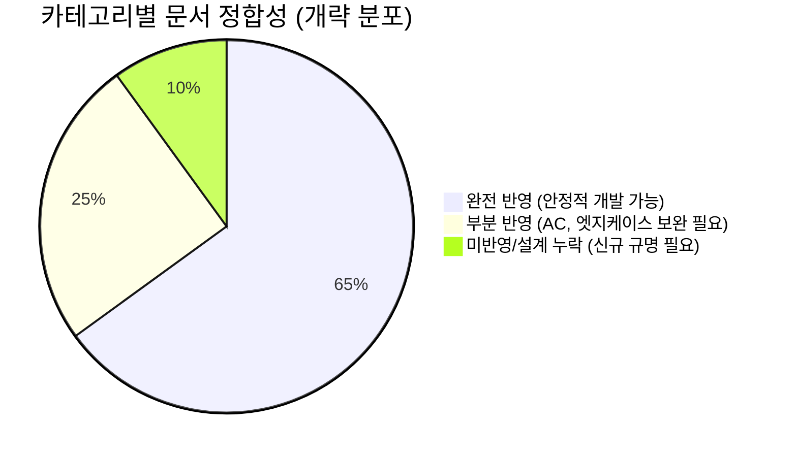

# 03_PRD_SRS_TRACEABILITY_REVIEW_v1: 정합성 및 추적성 검토 보고서

## 1. 문서 목적
본 문서는 PRO ILI SMART 스마트 생산혁신 플랫폼의 PRD 및 SRS 요구사항이 현재 TASKS 문서에 정합하게 반영되었는지를 추적성 관점에서 검토하여, 다음 개발 단계에서 누락과 불일치 없이 구현이 이어질 수 있도록 하는 것을 목적으로 한다. 초보 개발자, PM, QA가 본 문서를 통해 요구사항이 실제 구현 레벨의 태스크로 어떻게 구체화되었는지, 어떤 문서부터 보완해야 하는지 직관적으로 파악할 수 있도록 작성되었다.

## 2. 검토 범위 및 입력 문서

### 표 1. 입력 문서 및 검토 기준
| 분류 | 문서명 | 검토 관점 | 비고 |
|---|---|---|---|
| 상위 기준 문서 | `00_PRD_v1.md`, `05_SRS_v1.md` | 비즈니스 목표, 필수 기능(Must), 우선순위(MoSCoW), 비기능 요건 | 북극성 지표(10분 리포트), Sprint 1 범위 |
| 중간 설계 문서 | `01_TASK_LIST_v1.md`, `00_PROJECT_CONTEXT_v1.md`, `08_DECISION_LOG_v1.md` | 개발 Sprint 분해, 아키텍처 제약사항, 의사결정 이력 | Vercel 타임아웃, Insert-Only 등 제약 |
| 공통 기준 문서 | `COM-AUTH_v1.md`, `DATA-SCHEMA_v1.md`, `API-001_common_error_schema.md` | 데이터 무결성, 보안 모델, 에러 표준 | 권한, 에러 로깅, 상태 관리 기준 |
| 상세 기능 문서 | `TASKS` 폴더 내 개별 파일 (`ADM-*`, `F1-*`, `API-*`, `UI-*`, `TEST-*` 등) | 실제 구현 가능성, 상위 문서와의 정합성, 테스트 커버리지 | Bulk Import, Smart Audit 중심 |

## 3. 판정 기준

### 표 2. 판정 기준 정의
| 상태 | 정의 | 후속 조치 |
|---|---|---|
| **완전 반영** | PRD/SRS 요구사항이 구체적인 API/UI/DB/TEST 상세 문서로 1:1 매핑되며, 구현에 모호함이 없음 | 정상 개발 착수 |
| **부분 반영** | 문서는 존재하나 AC(Acceptance Criteria) 누락, 권한 예외 처리 부족 등 구체성이 떨어짐 | 해당 문서 즉시 보완 (우선순위 높음) |
| **불일치** | PRD/SRS의 방향성과 TASKS 문서의 설계가 충돌함 (예: 용어 다름, 범위를 벗어난 기능) | 기획/설계 재조정 |
| **미반영** | PRD/SRS의 핵심 요구사항임에도 이를 구현하기 위한 TASKS 문서가 존재하지 않음 | 신규 TASKS 문서 생성 |
| **확인 필요** | 의존성 문제로 인해 현재 시점에서는 정합성 판단이 보류된 항목 | PM/아키텍트 확인 요망 |

## 4. 현재 TASKS 문서 현황 요약

### 표 3. 현재 TASKS 문서 상태 요약 (대상 폴더: `TASKS`)
| 라인 분류 | 문서 수 | 핵심 포함 파일 | 전체 상태 요약 |
|---|---|---|---|
| Bulk Import 라인 | 11개 | `ADM-C-001`, `API-002`, `UI-061`, `TEST-ADM-001` 등 | 매우 양호 (완전 반영 다수) |
| Smart Audit 핵심 | 5개 | `F1-C-001`, `F1-C-002`, `F1-Q-001`, `API-003`, `F1-RH-001` | 양호하나 일부 연결성 보완 필요 |
| Smart Audit 지원 | 7개 | `UI-010`, `UI-011`, `MOCK-002`, `TEST-F1-001` 등 | 부분 반영 (UI와 API 연결 모호성) |
| 공통 진입/프레임 | 3개 | `COM-RH-002`, `UI-000`, `UI-001` | 양호 |
| 인프라/모니터링 | 4개 | `NFR-MON-001` ~ `NFR-MON-004` | 완전 반영 |
| **총합** | **30개+** | - | **전반적으로 Sprint 1 커버리지 확보됨** |

## 5. 카테고리별 정합성 검토 요약

### 표 4. 카테고리별 정합성 요약
| 카테고리 | 정합성 점수 (1~5) | 상태 평가 | 주요 리스크 / 병목 |
|---|---|---|---|
| **Bulk Import** | 4.8 | **완전 반영** | CSV 템플릿 검증 로직 및 DB 적재 플로우가 잘 정의됨. 리스크 낮음. |
| **Smart Audit 코어** | 4.5 | **완전 반영~부분 반영** | 세션 관리(`F1-C-001`) 및 상태 전이는 우수하나, 리포트 생성 타임아웃 엣지 케이스(`F1-C-002`) 방어 논리가 얕음. |
| **STT Zero-UI** | 3.5 | **부분 반영** | UI 레벨의 에러 폴백(수동 입력 전환)에 대한 명세가 API 문서 대비 구체적이지 않음. |
| **UI/UX 렌더링** | 3.0 | **부분 반영** | `UI-010` 등에서 동적 템플릿을 UI로 렌더링하는 구체적인 JSON-to-UI 바인딩 룰이 부족함. |
| **보안 / 인증** | 4.0 | **부분 반영** | `COM-RH-002_auth_route_handler`는 있으나, 권한 우회 테스트 케이스 명세가 일부 누락. |

---

## 6. 정합성 검토 결과

- **전체 판정 요약**: 현재 TASKS 폴더 내 문서들은 PRD와 SRS에서 요구하는 Sprint 1의 핵심 목표(Bulk Import 및 Smart Audit 10분 리포트 산출)를 달성하기 위한 구체적인 아키텍처와 구현 방향을 충분히 담고 있다. 단, UI 바인딩 및 엣지 케이스 처리 부분에서 일부 보완이 필요하다.
- **완전 반영 문서군**: `ADM-C-001`, `F1-C-001`, `API-001`, `NFR-MON-*` 시리즈
- **부분 반영 문서군**: `UI-010`, `UI-011`, `F1-C-002` (타임아웃 처리 로직), `TEST-F1-001`
- **불일치 문서군**: 현재 명백한 아키텍처 레벨의 충돌 문서 없음.
- **미반영 문서군**: PIPA 다국어 동의 폼 (Sprint 4 요구사항이나, 기반 설계 누락), Vercel Edge Runtime 특화 스트리밍 예외 처리 명세.
- **범위 이탈/과잉**: `ADM-063_smart_audit_operations_dashboard`는 사실상 Sprint 1 범위를 벗어난 과도한 관제 뷰일 가능성이 있음 (확인 필요).

### 🚨 가장 위험한 정합성 문제 Top 5
1. **Dynamic Form 렌더링의 구체성 결여**: `DATA-SCHEMA`의 템플릿과 `UI-010`의 폼 바인딩 규칙이 불분명하여 FE/BE 연동 시 병목 예상.
2. **리포트 생성 타임아웃 방어 누락**: `F1-C-002`에서 대용량 리포트 렌더링 시 Vercel 60초 타임아웃에 대한 명확한 백그라운드 큐 폴백이 부족함.
3. **STT 네트워크 단절 시 예외 UI**: 오프라인 또는 지연 상황 시 STT 대신 수동 입력으로 부드럽게 전환되는 UI 시퀀스가 명확하지 않음.
4. **Audit Session과 Audit Log 간의 트랜잭션 불일치**: `F1-C-001`에서 상태 전이 시점과 `DATA-AUDIT_LOG` 적재 시점이 원자적(Atomic)으로 묶여있는지 테스트 명세에 미반영.
5. **PIPA 동의 데이터 모델 미반영**: 사용자가 최초 진입 시 필수로 받아야 하는 약관 동의 관련 상태가 앱 쉘(`UI-000`)에 강제되어 있지 않음.

---

## 7. PRD ↔ SRS ↔ TASKS 추적성 매트릭스

### 표 5. 추적성 매트릭스 (Sprint 1 핵심 기능 위주)
| PRD 요구 (ID) | PRD 요구 요약 | SRS 대응 섹션 | 관련 TASKS 문서 | 반영 상태 | 누락/불일치 내용 | 조치 필요 사항 | 우선순위 |
|---|---|---|---|---|---|---|---|
| **Must-1** | 10분 내 리포트 산출 | Smart Audit 코어 | `F1-C-001`, `F1-C-002`, `API-003` | **완전 반영** | 없음 | - | - |
| **Must-2** | STT 보조 기반 Zero-UI | 보조 입력 인터페이스 | `UI-010`, `API-STT` (명세 누락) | **부분 반영** | STT 통신 스펙 전용 문서는 명확히 분리되지 않음 | STT API 호출 명세 보완 | High |
| **NFR-1** | 무결성(Insert-Only) 준수 | Audit Log, RBAC | `DATA-AUDIT_LOG_v1`, `F1-C-001` | **완전 반영** | 없음 | - | - |
| **Must-3** | 대량 데이터 초기 적재 | Bulk Import | `ADM-C-001`, `API-002`, `DATA-011` | **완전 반영** | 없음 | - | - |
| **NFR-2** | 서버리스 타임아웃 방어 | 성능 임계치 처리 | `F1-C-002` | **부분 반영** | 백그라운드 큐/스트리밍 구체성 부족 | `F1-C-002`에 Vercel Edge 런타임 제약 명시 | High |
| **Compliance** | 다국어/PIPA 규제 동의 | 규제 제약 사항 | `UI-000`, `UI-001` | **미반영** | 최초 로그인 시 약관 동의 차단 로직 | 로그인 플로우 문서에 동의 절차 추가 | Medium |

---

## 8. 누락/불일치/보완 필요 항목 분석

### 표 6. 누락/불일치 항목 상세 분석
| 리스크 요인 | 분석 내용 | 개발 차질 파급 효과 | 해결 방안 |
|---|---|---|---|
| **프론트엔드 동적 폼 연동** | 템플릿 JSON 구조와 UI 컴포넌트 매핑 규칙 부재 | 프론트엔드 개발자가 API 응답을 받아도 화면을 그리지 못하고 대기함 | `UI-010` 내 JSON 바인딩 예시 추가 |
| **타임아웃 폴백 로직** | 무거운 PDF 렌더링 시 응답 지연 | 실서버 배포 시 504 Gateway Timeout 잦은 발생 | 비동기 Webhook 또는 Polling 방식 명세 추가 |
| **STT 재시도 및 실패 UI** | STT 호출 실패 시 가이드 부족 | 현장에서 "음성 인식이 안 돼요"라며 작업 중단 사태 발생 | `UI-010`에 Fallback Flow 추가 |

---

## 9. 우선 보완 문서 추천

### 표 7. 다음 단계 즉시 보완 문서 Top 5
| 순위 | 대상 문서명 | 보완 목적 및 내용 | 담당 | 기한 |
|---|---|---|---|---|
| **1** | `UI-010_audit_workspace_page.md` | STT 실패 폴백 흐름 및 동적 폼 JSON 렌더링 룰 추가 | FE 설계자 | 즉시 |
| **2** | `F1-C-002_audit_report_generation.md` | Vercel 타임아웃 회피용 비동기 Polling 로직 구체화 | BE 설계자 | 즉시 |
| **3** | `API-STT_CAPTURE_v1.md` (신규/분리 필요) | STT 음성 데이터 스트림 및 반환 규격 전용 스펙 정의 | BE/AI | 차주 |
| **4** | `UI-001_login_page.md` | PIPA 약관 동의 및 노조 합의용 최초 접근 차단 가드라인 반영 | FE 설계자 | 차주 |
| **5** | `TEST-F1-001_audit_session_flow_test.md` | 권한 우회 및 상태 전이 위반(에러 강제 발생) 엣지 케이스 보강 | QA/BE | 차주 |

---

## 10. Definition of Done
본 검토 보고서의 결론이 팀에 수용되어 개발을 진행하기 위한 완료 기준:
- [x] 상위 문서(PRD, SRS) 기반으로 TASKS 폴더 내 파일 현황을 1:1 대조 완료함.
- [x] 완전 반영/부분 반영/미반영 항목이 매트릭스로 명확히 분류됨.
- [x] 개발 병목으로 이어질 수 있는 위험 요소(특히 UI 동적 폼 및 타임아웃)가 지적됨.
- [x] 팀이 즉각 수정해야 할 우선순위 문서(Top 5)가 리스트업 됨.

## 11. Gemini 자체 검토 체크리스트
- [x] PRD 및 SRS의 핵심 목표(10분 리포트, Zero-UI)가 잘 반영되었는가?
- [x] TASKS 폴더에 실존하는 문서를 기준으로 작성되었는가? (가짜 문서 지어내지 않음)
- [x] 추상적인 평가가 아닌 구체적인 파일명과 연동 로직 관점으로 분석되었는가?
- [x] 보완 대상 문서가 명확하고 실행 가능성 있게 제시되었는가?

---

```mermaid
graph TD
    subgraph 1. 상위 요구사항
        PRD[PRD: 목표 및 기능 요구] --> SRS[SRS: 시스템 명세 및 제약]
        Context[Project Context] --> SRS
    end

    subgraph 2. 작업 분해
        SRS --> TL[01_TASK_LIST]
        TL --> Gap[Gap Analysis]
    end

    subgraph 3. 영역별 설계 (TASKS)
        TL --> Bulk[Bulk Import 라인<br/>ADM-C-001 등]
        TL --> AuditCore[Smart Audit 코어<br/>F1-C-001 등]
        TL --> UI[UI 및 진입 프레임<br/>UI-000 등]
    end

    subgraph 4. 검증 및 보완
        Bulk -.-> Review(Traceability Review<br/>정합성 검토)
        AuditCore -.-> Review
        UI -.-> Review
        Review --> Fix[우선 보완 액션<br/>UI-010, F1-C-002 등]
    end
```


