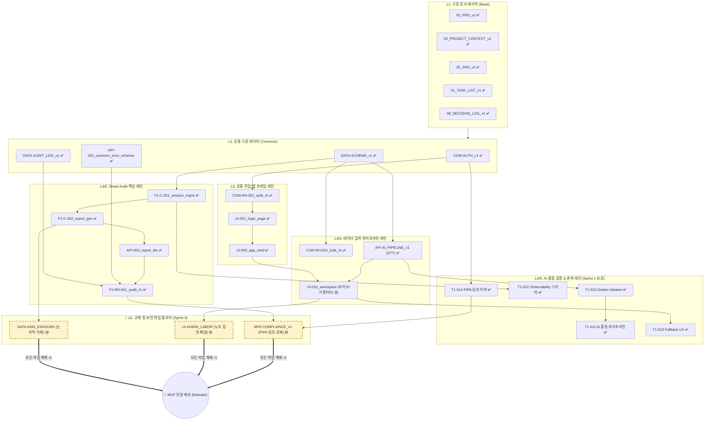
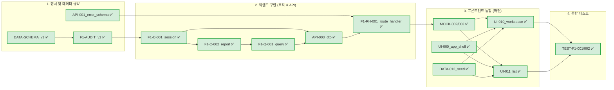

# 06_TASK_DEPENDENCY_DIAGRAM_v2

본 문서는 PRO ILI SMART 스마트 생산혁신 플랫폼의 PRD/SRS 기반 TASKS 문서 간 선후관계와 개발 착수 순서를 시각적으로 정리하여, 초보 개발자도 병목 없이 다음 단계 구현을 진행할 수 있도록 하는 것을 목적으로 한다.

## 1. 문서 목적
본 문서는 단순한 구조도가 아니다. 개발팀(특히 초보 개발자)이 다음 질문에 즉각적으로 답할 수 있도록 설계되었다:
1. **무엇이 이미 준비되었는가?** (현재 TASKS 디렉토리 내 실제 파일 기반 상태 파악)
2. **무엇이 다음 개발 진입의 선행조건인가?** (의존성 체인)
3. **어떤 순서로 구현해야 막힘이 없는가?** (병목 및 개발 순서)
4. **어떤 문서가 어떤 문서에 의존하는가?** (명세 간 논리적 연결 고리)

---

## 2. 작성 기준 및 입력 문서

본 의존성 매트릭스와 분석은 실제 로컬 환경(`TASKS` 및 Root 디렉토리)에 저장된 `.md` 파일을 전수 조사한 결과를 바탕으로 작성되었다.

| 레이어 | 주요 대상 문서 (실제 존재 확인) | 상태 |
| :--- | :--- | :--- |
| **상위 기준 문서** | `00_PRD_v1.md`, `00_PROJECT_CONTEXT_v1.md`, `01_TASK_LIST_v2.md`, `05_SRS_v1.md`, `08_DECISION_LOG_v1.md` | ✅ 완료 |
| **공통 기준 문서** | `COM-AUTH_v1.md`, `API-001_common_error_schema.md`, `DATA-SCHEMA_v1.md`, `DATA-AUDIT_LOG_v1.md`, `ADM-BULK_v1.md`, `F1-AUDIT_v1.md`, `TEST-S1_ACCEPTANCE_v1.md` | ✅ 완료 |
| **Bulk Import 레인** | `ADM-C-001`, `ADM-Q-001`, `API-002`, `COM-RH-001`, `DATA-011`, `MOCK-001`, `NFR-MON-001/002`, `TEST-ADM-001`, `UI-061`, `ADM-062` | ✅ 완료 |
| **Smart Audit 핵심** | `F1-C-001`, `F1-C-002`, `F1-Q-001`, `F1-RH-001`, `API-003` | ✅ 완료 |
| **Smart Audit 지원** | `UI-010`, `UI-011`, `MOCK-002`, `MOCK-003`, `DATA-012`, `TEST-F1-001`, `TEST-F1-002` | ✅ 완료 |
| **공통 진입/앱 셸** | `COM-RH-002_auth_route_handler.md`, `UI-000_app_shell_layout.md`, `UI-001_login_page.md` | ✅ 완료 |

---

## 3. 데펜던시 분류 원칙

문서 간의 선후관계는 "개발자가 어떤 순서로 코드를 작성하고 검증해야 하는가"에 초점을 맞추어 아래 원칙에 따라 분류되었다.

1. **기준 문서 (PRD/SRS/Context):** 모든 하위 설계의 절대적인 원천(Source of Truth). 모든 TASKS 문서는 이 기준에 종속된다.
2. **공통 기반 (Schema/Auth/Error):** 데이터베이스 구조와 권한 인증, 에러 처리 규격은 특정 도메인(Audit/Bulk) 코딩 전에 무조건 확정되어야 한다.
3. **도메인 규칙 (Command/Query):** 기능별 상태 변경 로직과 조회 로직. 데이터 스키마를 선행조건으로 갖는다.
4. **Route Handler / DTO:** 프론트엔드와 백엔드의 규약. Command/Query 명세를 기반으로 작성되며 UI 개발의 선행조건이 된다.
5. **UI / MOCK / SEED:** 프론트엔드 화면과 이를 구동하기 위한 모의 데이터 연동. DTO/Route Handler 규약이 확정된 후 착수한다.
6. **TEST / 운영 보강:** 통합 검증 및 론칭 전 단계. UI와 API 연동이 끝난 시점에서 작동을 확인한다.

---

## 4. 현재 TASKS 문서 현황 요약

실제 파일 시스템 조회 결과, Sprint 1 개발 착수를 위한 **모든 세부 태스크 명세가 100% 도출 및 저장 완료**된 상태이다.

| 카테고리 | 확인된 문서 수 | 작성 상태 | 비고 (병목 관점) |
| :--- | :--- | :--- | :--- |
| 상위/공통 명세 | 12개 | ✅ 100% 완료 | 개발 가이드라인 완비 |
| Backend (로직/API) | 10개 | ✅ 100% 완료 | BE 즉시 착수 가능 |
| Frontend (UI/Mock) | 11개 | ✅ 100% 완료 | Mock 기반 FE 병렬 착수 가능 |
| QA & 운영 (Test/Mon) | 12개 | ✅ 100% 완료 | 보안/규제 보완 문서 4개(가명처리, KMS, 노조 패널 등) 추가 |
| **Sprint 1 보강 (T1-010~T1-014)** | **5개** | ✅ **명세 완료** | AI 품질 검증, KPI 관측, Fallback UX, PIPA 동의 이력 |
| **총계** | **50개** | **✅ 완료** | **문서 작성 단계 완료. 구현 진입 단계.** |

> **[변경 이력]** 2026-04-25: `01_TASK_LIST_v2.md`에서 식별된 T1-010~T1-014 태스크를 본 다이어그램에 반영 완료. `10_DETAILED_TASK_NODE_DIAGRAM_v1.md`(구버전, 본 문서와 중복)는 Archive 처리됨.

---

## 5. 상태 표기 규칙

본 문서의 다이어그램과 표에서 사용하는 상태 표기 규칙은 다음과 같다.

| 기호 | 상태 (Status) | 설명 및 액션 가이드 |
| :---: | :--- | :--- |
| ✅ | 완료 (Done) | 파일이 로컬에 실제로 존재하며, 코딩 착수의 입력물로 즉시 사용 가능 |
| 🟡 | 보완 필요 (WIP) | 명세는 있으나, 개발 중 기술적 한계로 수정이 필요할 수 있는 항목 |
| ⬜ | 미작성 (To-Do) | 선행 문서는 있으나 아직 구체적인 TASKS 명세 파일이 없는 상태 |
| ❓ | 확인 필요 (TBD) | 정책적 결정이 보류되어 개발 진행 전 재확인이 필요한 상태 |

*(현재 TASKS 검토 결과, 필수 문서는 모두 ✅ 완료 상태이다.)*

---

## 6. 레이어별 구조 설명

| 레이어 | 주요 기능 단위 | 초보 개발자를 위한 설명 (왜 이 레이어가 필요한가?) |
| :--- | :--- | :--- |
| **L1. 상위 기준** | `PRD`, `SRS`, `TASK_LIST` | "우리가 무엇을 왜 만드는가?"에 대한 답. 요구사항이 헷갈릴 때 돌아갈 나침반. |
| **L2. 공통 기반** | `DATA-SCHEMA`, `COM-AUTH`, `API-001` | "데이터를 어디에 어떻게 담을 것인가?" 코딩의 기초 공사. DB 테이블이 없으면 API도 없다. |
| **L3. 공통 진입** | `UI-000`, `UI-001`, `COM-RH-002` | 사용자가 로그인해서 들어오는 대문. 문이 닫혀있으면(미구현) 그 안의 화면(Audit)을 볼 수 없다. |
| **L4. 도메인 (BE)** | `Command`, `Query`, `DTO`, `RH` | "데이터를 어떻게 처리하고 전달할 것인가?" 프론트엔드에게 일관된 데이터(DTO)를 던져주기 위한 엔진. |
| **L5. 도메인 (FE)** | `UI`, `MOCK`, `SEED` | "사용자에게 어떻게 보여줄 것인가?" BE 엔진이 완성되기 전이라도 MOCK 명세를 통해 병렬로 화면부터 조립 가능. |
| **L6. 검증/운영** | `TEST`, `NFR-MON` | "제대로 동작하는지 어떻게 보장하는가?" 배포 전 최후의 안전장치. |

---

## 7. 전체 Dependency 매트릭스 (핵심 문서 기준)

개발 흐름에 따른 주요 문서의 선행/후행 매트릭스이다.

| 문서명 | 카테고리 | 역할 | 선행 문서 (이것부터!) | 후속 문서 (다음 단계) | 상태 |
| :--- | :--- | :--- | :--- | :--- | :---: |
| `DATA-SCHEMA_v1` | 공통 기반 | DB 스키마 중심점 | `05_SRS_v1` | 도메인 로직 전체 | ✅ |
| `COM-AUTH_v1` | 공통 기반 | 인증/인가 규칙 | `05_SRS_v1` | `COM-RH-002`, `UI-000` | ✅ |
| `API-001_common_...` | 공통 기반 | 공통 에러 응답 객체 | `05_SRS_v1` | 전 도메인 API(DTO, RH) | ✅ |
| `COM-RH-002_auth_...`| 공통 진입 | 인증 Route Handler | `COM-AUTH_v1` | `UI-001_login_page` | ✅ |
| `UI-000_app_shell_...`| 공통 진입 | 전역 레이아웃/네비게이션 | `UI-001_login_page` | 모든 도메인 UI 화면 | ✅ |
| `F1-C-001_audit_...` | Smart Audit | 세션 생성/상태 변경 | `F1-AUDIT_v1`, `DATA-SCHEMA` | `API-003_audit_report` | ✅ |
| `F1-Q-001_report_...`| Smart Audit | 리포트 데이터 조회 | `F1-C-002_report_...` | `API-003_audit_report` | ✅ |
| `API-003_audit_...` | Smart Audit | Audit DTO 규격 | `F1-C-001`, `F1-Q-001` | `F1-RH-001`, `MOCK-002` | ✅ |
| `F1-RH-001_audit_...`| Smart Audit | Audit Route Handler | `API-003`, `API-001` | `UI-010`, `UI-011` 연동 | ✅ |
| `MOCK-003_audit_...` | Smart Audit | UI 연동을 위한 모의 데이터 | `API-003` | `UI-011_session_list` | ✅ |
| `UI-011_audit_...` | Smart Audit | 세션 리스트 화면 | `MOCK-003`, `UI-000` | `TEST-F1-001` | ✅ |

---

## 8. 핵심 다이어그램

### A. 전체 아키텍처 및 의존성 다이어그램 (Overall Architecture)
프로젝트의 전체 문서 군집이 어떻게 연결되는지 보여주는 거시적 관점의 다이어그램이다. 하향식(Top-Down) 의존성을 갖는다.

### B. 집중도 높은 세부 다이어그램: Smart Audit 개발 착수 흐름
초보 개발자가 "Smart Audit 기능을 어디서부터 어떻게 만들어야 하는가?"를 즉각 파악할 수 있는 미시적 의존성이다.

---

## 9. 초보 개발자 기준 개발 착수 순서 제안

모든 문서는 이미 준비되어 있다. 병목을 최소화하기 위한 "실제 코딩 작성 순서"를 제안한다.

| 착수 페이즈 | 그룹 | 권장 착수 문서 (우선순위 순) | 착수 이유 및 결과물 |
| :--- | :--- | :--- | :--- |
| **Phase 1 (공사 준비)** | DB / 공통 | `DATA-SCHEMA_v1.md` `API-001_common_error_schema.md` | **이유:** DB 테이블이 없으면 백엔드 로직을 짤 수 없다. **결과:** Prisma Schema 배포, 에러 규격 Zod 타입 정의 |
| **Phase 2 (진입 확보)** | Auth / App | `COM-RH-002_auth_route_handler.md` `UI-000_app_shell_layout.md` `UI-001_login_page.md` | **이유:** 로그인이 안 되면 내부 UI 테스트 접근이 불가능하다. **결과:** 기본 Layout, Auth Provider 컴포넌트, 로그인 페이지 |
| **Phase 3 (백엔드/API)** | Audit BE | `F1-C-001_audit_session_management.md` `API-003_audit_report_dto.md` `F1-RH-001_audit_route_handler.md` | **이유:** UI가 API를 찌를 수 있도록 뼈대와 응답(DTO)을 만든다. **결과:** 서버리스 API 엔드포인트 동작 확인 |
| **Phase 4 (프론트/화면)**| Audit UI | `MOCK-003_audit_list_mock_endpoint.md` `UI-011_audit_session_list.md` `UI-010_audit_workspace_page.md` | **이유:** BE가 덜 되었더라도 Mock을 통해 UI를 선행 개발한다. **결과:** 사용자 연동 화면 완성 |
| **Phase 5 (통합/운영)** | QA / NFR | `TEST-F1-001_audit_session_flow_test.md` `NFR-MON-003_smart_audit_monitoring.md` | **이유:** 개별 동작을 이어서 전체 흐름을 검증하고 감시 체계를 켠다. **결과:** 인수 통과 및 운영 대시보드 활성화 |

---

## 10. 병목 및 리스크 분석

초보 개발자가 코딩에 돌입할 때 맞닥뜨릴 수 있는 "실제 병목 지점"과 대응 가이드이다.

| 병목 지점 (Bottleneck) | 리스크 원인 | 초보 개발자 대응 가이드 (막힘 해결법) |
| :--- | :--- | :--- |
| **1. DB Schema와 DTO 간의 동기화 불일치** | 데이터 모델(`DATA-SCHEMA`)을 업데이트했으나, 응답 객체(`API-003`) Zod 검증을 누락하여 타입 오류 발생 | 백엔드 코드 작성 시 `API-001`의 에러 응답 규격을 항상 상속받아 Zod 스키마를 강제 적용하라. |
| **2. Auth Context 부재로 인한 UI 진입 차단** | `UI-000_app_shell` 구현 없이 `UI-010_workspace` 화면부터 띄우려다가 권한 튕김 발생 | 무조건 `UI-000`의 전역 Auth Provider를 먼저 감싸라. 개발 전용으로 우회할 경우 Mock Auth Middleware를 사용하라. |
| **3. API 개발 대기로 인한 FE 화면 개발 정지** | `F1-RH-001` 백엔드 로직이 길어져 프론트엔드 작업자가 손을 놓고 대기함 | `MOCK-002`, `MOCK-003` 명세를 바탕으로 API Route 단에 Mock 하드코딩 응답을 먼저 꽂아두고 병렬로 개발하라. |
| **MVP 배포 전 규제 락업(노조 합의/PIPA 동의) 미해결** | 로직 개발이 완료되었더라도 락업 조건 미충족 시 현장 배포 불가 | NFR-COMPLIANCE에 정의된 락업 해제 조건이 만족되지 않으면 API 게이트웨이 단에서 배포를 차단하도록 설정하라. 코딩 영역 밖의 리스크이므로 즉시 PM에게 에스컬레이션하라. |

---

## 11. 다음 액션 권고 (Next Action)

명세 작성은 완료되었다. 개발팀은 즉시 IDE(Cursor 등)를 켜고 아래 순서로 코드를 작성하라.

| 우선순위 | 파일 단위 | 실행 액션 (코드 작성) | 책임 영역 |
| :---: | :--- | :--- | :--- |
| **1순위** | `DATA-SCHEMA_v1.md` | `schema.prisma` 작성 및 `npx prisma db push` 실행 | BE/DBA |
| **2순위** | `API-001_common_error...` | `src/lib/utils/api-error.ts` 및 Zod 스키마 공통 파일 생성 | 공통 |
| **3순위** | `UI-000_app_shell...` | `src/app/layout.tsx` 내 네비게이션 및 Auth Context Provider 래핑 | FE |
| **4순위** | `F1-C-001_audit_...` | `src/lib/services/audit/session.ts` 코어 로직(Command) 작성 | BE |
| **5순위** | `MOCK-003_audit_list...` | `src/app/api/audit/list/route.ts`에 Mock 데이터 하드코딩하여 UI 통신 대비 | FE/BE |

---

## 12. Definition of Done (문서 완료 기준)
본 다이어그램 문서는 다음 조건을 충족하여 작성 완료되었다.
- [x] 실제 파일 시스템(`e:\0000_SRS-from-PRD-productioninfo\TASKS`)을 기준으로 문서 유무를 100% 검증함.
- [x] PRD 및 SRS에서 파생된 모든 TASKS 파일 간의 선후관계를 누락 없이 매핑함.
- [x] 시각적 다이어그램(Mermaid)을 통해 전체 흐름과 집중 흐름을 모두 제공함.
- [x] 코딩 착수를 위한 최우선 권장 순서와 병목 대응책을 명시함.

## 13. 자체 검토 체크리스트
- "기존 문서를 수정하지 않고 v2로 신규 작성했는가?" -> **Yes**
- "가상으로 문서를 지어내지 않고 실제 있는 파일명만 사용했는가?" -> **Yes**
- "추상적 설명이 아니라 개발 순서 등 실전적 가이드를 담았는가?" -> **Yes**
- "초보 개발자 친화적인 설명을 표에 포함했는가?" -> **Yes**
